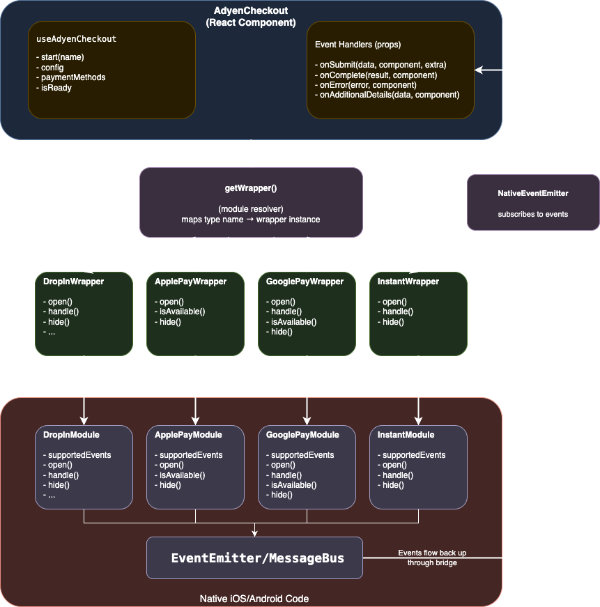

# Architecture

> [!IMPORTANT]
> **v6 Alpha Architecture Changes**
>
> This document describes the v5 architecture. The v6 alpha migration introduced significant changes to the native bridge layers:
>
> **iOS**: All delegate protocols (`PaymentComponentDelegate`, `ActionComponentDelegate`, `DropInComponentDelegate`, etc.) are removed. Entry points use `Checkout.setup()` returning `AdvancedCheckout` or `SessionCheckout` objects. Callbacks use closures (`.onSubmit`, `.onAdditionalDetails`, `.onComplete`, `.onFailure`) with `CheckedContinuation` bridging to the RN event model. `BaseModuleSender+Delegates.swift` is replaced by `BaseModuleSender+Callbacks.swift`.
>
> **Android**: `ComponentCallback<T>`, `SessionComponentCallback<T>`, and `ActionComponentCallback` interfaces are removed. Drop-in uses `AdvancedCheckoutService` with `suspend fun onSubmit(): SubmitResult`. Embedded components use `CheckoutController` + Compose `CheckoutPaymentFlow`. Per-method fragments (IdealFragment, TwintFragment, etc.) are replaced by a single `InstantFragment` with Compose. `AdyenCheckout` no longer holds a single component reference; redirect routing uses `CheckoutControllerRegistry`.
>
> **TypeScript**: Public API uses a unified `PaymentResultHandler` interface with `action()`, `completion()`, and `retry()` replacing the old `handle()`/`hide()` methods. `AdyenComponent` and `AdyenActionComponent` are removed. Unsupported alpha features (partial payments, stored payment removal) are annotated with TODO comments.
>
> See `docs/ios-bridge-migration-guide.md` and `docs/android-bridge-migration-guide.md` for complete details.

## Data Flow



## Directory Structure

```
src/
├── index.ts                              # Main entry point (barrel exports)
├── components/                           # React components
│   ├── index.ts
│   ├── AdyenCheckout.tsx                   # Main checkout component with context provider
│   ├── ApplePayButton.tsx                  # Apple Pay button component
│   ├── GooglePayButton.tsx                 # Google Pay button component
│   ├── CardView.tsx                        # Embedded card view (Fabric native component)
│   ├── utils/                              # Component utilities
│   │   ├── checkConfiguration.ts             # Configuration validation
│   │   ├── checkPaymentMethodsResponse.ts    # Payment methods validation
│   │   └── startEventListeners.ts            # Event listener setup for native components
│   └── common/
│       └── Styles.ts                         # Shared styles
├── core/                                 # Core types, constants, and configurations
│   ├── index.ts
│   ├── types.ts                            # Payment types and component interfaces
│   ├── constants.ts                        # Event enums, error codes, result codes
│   ├── components.ts                       # Payment method component mappings
│   └── configurations/                     # Configuration interfaces
│       ├── index.ts
│       ├── Configuration.ts
│       ├── AddressLookup.ts
│       ├── ApplePayConfiguration.ts
│       ├── CardsConfiguration.ts
│       ├── DropInConfiguration.ts
│       ├── GooglePayConfiguration.ts
│       ├── PartialPaymentConfiguration.ts
│       └── ThreeDSConfiguration.ts
├── hooks/                                # React hooks
│   ├── index.ts
│   ├── constants.ts                        # Error message constants
│   ├── useAdyenCheckout.ts                 # Context hook for checkout state
│   ├── useComponent.ts                     # Context hook for embedded component subscribe/unsubscribe
│   └── useSubscriptionManager.ts           # Manages event subscriptions for embedded components
├── plugin/                               # Expo config plugins
│   ├── withAdyen.ts                        # Main plugin entry
│   ├── withAdyenIos.ts                     # iOS-specific configuration
│   ├── withAdyenAndroid.ts                 # Android-specific configuration
│   └── ...                                 # Platform setup utilities
├── specs/                                # Fabric codegen specs
│   ├── NativeCardView.ts                    # CardView codegen spec (paymentMethod, configuration, onLayoutChange)
│   └── NativePlatformPayView.ts             # PlatformPayView codegen spec
└── modules/                              # Native module wrappers
    ├── index.ts
    ├── base/                               # Base wrapper classes
    │   ├── EventListenerWrapper.ts           # Abstract base for event handling
    │   ├── ModuleWrapper.ts                  # Abstract base with action(), completion(), retry()
    │   ├── PaymentComponentWrapper.ts        # Abstract base with open()
    │   ├── ModuleMock.ts                     # Mock for unavailable modules
    │   ├── constants.ts                      # Module-specific constants
    │   ├── getWrapper.ts                     # Factory to resolve payment method wrappers
    │   └── utils.ts                          # Utility functions
    ├── action/                             # Standalone action handler
    │   ├── AdyenAction.ts
    │   └── ActionModuleWrapper.ts
    ├── applepay/                           # Apple Pay module
    │   ├── AdyenApplePay.ts
    │   └── ApplePayWrapper.ts
    ├── cse/                                # Client-side encryption
    │   ├── types.ts
    │   ├── AdyenCSEModule.ts
    │   └── AdyenCSEModuleWrapper.ts
    ├── dropin/                             # Drop-in module
    │   ├── AdyenDropIn.ts
    │   └── DropInWrapper.ts
    ├── embedded/                           # Embedded component bus (for CardView and future embedded views)
    │   ├── EmbeddedComponentBus.ts           # Singleton bus instance
    │   ├── EmbeddedComponentBusWrapper.ts    # Wrapper with subscribe/unsubscribe/action/completion/retry/update/confirm
    │   └── EmbeddedComponentProxy.ts         # Per-component proxy that binds a key to bus calls
    ├── googlepay/                          # Google Pay module
    │   ├── AdyenGooglePay.ts
    │   └── GooglePayWrapper.ts
    ├── instant/                            # Instant/redirect payments
    │   ├── AdyenInstant.ts
    │   └── InstantWrapper.ts
    └── session/                            # Session management
        ├── SessionHelperModule.ts
        ├── SessionWrapper.ts
        └── types.ts
```

## Class Hierarchy

### Wrapper Classes

Supported events are read from the native module's `getConstants().supportedEvents` at construction time.

```
NativeModule (local interface, extends TurboModule)
    │
    ▼
EventListenerWrapper<T>                                      # Abstract - manages event subscriptions
    │                                                          - reads supportedEvents from getConstants()
    │                                                          - isSupported(event)
    │                                                          - eventEmitterTarget (for NativeEventEmitter)
    │                                                          - addListener/removeListeners
    ▼
ModuleWrapper<T>                                             # Abstract - adds action(), completion(), retry()
    │   implements PaymentResultHandler
    │
    ▼
PaymentComponentWrapper<T>                                   # Abstract - adds open()
    │
    ├──► ApplePayWrapper                                     # implements ApplePayModule
    │       + isAvailable()
    │
    ├──► GooglePayWrapper                                    # implements GooglePayModule
    │       + isAvailable()
    │
    ├──► InstantWrapper                                      # implements InstantModule
    │
    └──► DropInWrapper                                       # implements DropInModule
            + getReturnURL()
            + removeStored()                       (RemovesStoredPayment)
            + update(), confirm(), reject()        (AddressLookup)
            + provideBalance/Order/PaymentMethods  (PartialPayment)
```

### Embedded Component Wrappers

These handle communication for inline embedded views (CardView, future embedded components):

```
EventListenerWrapper<EmbeddedNativeModule>
    │
    └──► EmbeddedComponentBusWrapper                         # Bus for all embedded views
            - subscribe(key), unsubscribe(key)
            - action(key, action), completion(key, resultCode), retry(key, message)
            - update(key, results), confirm(key, success, body)

EmbeddedComponentProxy                                       # Per-view proxy (not a wrapper subclass)
    implements PaymentResultHandler, AddressLookup, AdyenEventListener
    - constructor(wrapper, viewId)
    - action(action) → wrapper.action(key, action)
    - completion(resultCode) → wrapper.completion(key, resultCode)
    - retry(message) → wrapper.retry(key, message)
    - update/confirm/reject → wrapper.update/confirm(key, ...)
```

### Standalone Wrappers (outside hierarchy)

These don't inherit from `EventListenerWrapper` as they don't need event subscription management:

```
ActionModuleWrapper                                          # implements ActionModule
    - action(action, config) → Promise<PaymentDetailsData>
    - completion(resultCode)
    - retry(message?)
    - threeDS2SdkVersion

SessionWrapper                                               # implements SessionHelperModule
    - createSession(session, config) → Promise<SessionContext>
    - completion(resultCode)
    - retry(message?)
    - assignCompletionHandler(callback) → EventSubscription
    - assignErrorHandler(callback) → EventSubscription
    - removeAllListeners()

AdyenCSEModuleWrapper                                        # implements AdyenCSEModule
    - encryptCard(card, publicKey)
    - encryptBin(bin, publicKey)
```

## Interface Dependencies

### Core Interfaces (`core/types.ts`)

```
PaymentResultHandler              # Single interface for all payment result handling
    action(action)
    completion(resultCode)
    retry(message?)

ConditionalPaymentComponent       # Standalone interface
    isAvailable(paymentMethod, configuration) → Promise<boolean>
```

**Public module interfaces** extend `PaymentResultHandler`:

- `ApplePayModule` — extends `PaymentResultHandler`, `ConditionalPaymentComponent`
- `GooglePayModule` — extends `PaymentResultHandler`, `ConditionalPaymentComponent`
- `InstantModule` — extends `PaymentResultHandler`
- `DropInModule` — extends `PaymentResultHandler` + partial payment & address lookup methods
- `ActionModule`, `AdyenCSEModule`, `SessionHelperModule` — standalone

### Configuration Hierarchy

```
BaseConfiguration
    │   environment, clientKey, countryCode, locale?
    │
    └──► EnvironmentConfiguration
            │   + amount
            │
            └──► Configuration
                    + analytics?
                    + dropin?
                    + card?
                    + applepay?
                    + googlepay?
                    + threeDS2?
                    + partialPayment?
```

## Native Class Hierarchies

### iOS Class Structure

```
RCTEventEmitter (React Native)
    │
    ▼
BaseModule                                           # Base class for all iOS modules
    │   - session: AdyenSession? (static)
    │   - currentModule: BaseModule? (static)
    │   - currentPresenter: UIViewController? (static)
    │   - currentComponent: Component?
    │   - completion(_ resultCode:)
    │   - retry(_ message:)
    │   - present(component)
    │   - cleanUp()
    │   - sendError(error)
    │
    ├──► SessionHelperModule                         # Session management
    │       - createSession(sessionModel, config)
    │       - completion(), retry()
    │       - SessionErrorDelegate
    │
    ├──► ActionModule                                # Standalone action handler (Promise-based)
    │       - action(_ dictionary:) → Promise
    │       - completion(_ resultCode:)
    │       - retry(_ message:)
    │
    └──► BaseModuleSender                            # Adds event sending helpers
            │   - supportedEvents() → [String]
            │   - constantsToExport() → ["supportedEvents": ...]
            │   - sendSubmitEvent(data)
            │   - sendCompleteEvent()
            │   - sendProvideEvent(actionData)
            │
            ├──► ApplePayModule                      # Apple Pay component
            │       - open(paymentMethods, config)
            │       - isAvailable(paymentMethod, config)
            │
            ├──► BaseActionModule                    # Adds action() for actions
            │       │   - action(_ dictionary:)
            │       │
            │       └──► InstantModule               # Instant/redirect payments
            │               - open(paymentMethods, config)
            │
            └──► BaseAddressModule                   # Adds address lookup support
                    │   - update(results)
                    │   - confirm(success, address)
                    │   - AddressLookupProvider protocol
                    │
                    ├──► DropInModule                # Drop-in component
                    │       - open(paymentMethods, config)
                    │       - action(action)
                    │       - completion(resultCode)
                    │       - retry(message)
                    │       - removeStored(success)
                    │       - getReturnURL()
                    │       - provideBalance/Order/PaymentMethods
                    │
                    └──► EmbeddedComponentBusModule   # Embedded component bus (singleton)
                            - delegates: [String: EmbeddedComponentDelegateProxy]
                            - subscribe/unsubscribe (JS lifecycle)
                            - register/unregister (native view lifecycle)
                            - action/completion/retry/update/confirm (JS → native routing)
                            - Shared actionHandler for all embedded views
```

### Android Class Structure

```
ReactContextBaseJavaModule (React Native)
    │
    ▼
AppCompatModule                                      # Provides AppCompatActivity access
    │   - appCompatActivity: AppCompatActivity
    │
    ├──► ActionModule                                # Standalone action handler (Promise-based)
    │       - handle(action, config) → Promise
    │       - hide(success)
    │       - ActionComponentCallback
    │
    ▼
BaseModule                                           # Base class for payment modules
    │   - session: CheckoutSession? (companion)
    │   - currentModule: BaseModule? (companion)
    │   - messageBus: MessageBus
    │   - supportedEvents(): List<String> (abstract)
    │   - completion(resultCode) (abstract)
    │   - retry(message) (abstract)
    │   - getConstants() → ["supportedEvents": ...]
    │   - cleanup()
    │   - sendError(exception)
    │
    ├──► SessionHelperModule                         # Session management
    │       - createSession(sessionModel, config)
    │       - completion(), retry() delegate to currentModule
    │
    └──► BaseActionModule                            # Adds parseActionFromMap() + mainEvents()
            │
            ├──► GooglePayModule                     # Google Pay component
            │       - open(paymentMethods, config)
            │       - action(actionMap)
            │       - isAvailable(paymentMethods, config)
            │
            ├──► InstantModule                       # Instant/redirect payments
            │       - open(paymentMethods, config)
            │       - action(actionMap)
            │
            └──► BaseAddressModule                   # Adds parseAddressOptions/parseLookupAddress() + addressLookupEvents()
                    │
                    ├──► DropInModule                # Drop-in component
                    │       - open(paymentMethods, config)
                    │       - action(action)
                    │       - completion(resultCode)
                    │       - retry(message)
                    │       - removeStored(success)
                    │       - getReturnURL()
                    │       - update/confirm (address lookup)
                    │       - provideBalance/Order/PaymentMethods
                    │
                    └──► EmbeddedComponentBusModule  # Embedded component bus
                            - consumers: Map<String, ComponentContract> (companion, keyed by reactTag)
                            - subscribe/unsubscribe (JS lifecycle)
                            - register/unregister (native view lifecycle)
                            - action/completion/retry/update/confirm (JS → native routing)
```

### Embedded Views (Fabric Native Components)

Embedded views are rendered inline within the React tree using Fabric codegen. Unlike modal-based modules (Drop-in, Instant), they don't use `open()`/`hide()` — instead, props drive initialization and an event bus routes callbacks.


#### Architecture Overview

```
┌──────────────────────────────────────────────────────────────────────────┐
│  JS Layer                                                                │
│                                                                          │
│  CardView.tsx                                                            │
│    ├── ref → findNodeHandle() → reactTag                                 │
│    ├── subscribe(reactTag) → EmbeddedComponentBus                        │
│    └── <NativeCardView paymentMethod={...} configuration={...} />        │
│                                                                          │
│  useSubscriptionManager                                                  │
│    ├── EmbeddedComponentBus.subscribe(key)                               │
│    ├── EmbeddedComponentProxy(bus, key) → startEventListeners()          │
│    └── Filters incoming events by viewId === key                         │
│                                                                          │
│  EmbeddedComponentProxy                                                  │
│    └── action(action), completion(), retry(), update(), confirm() → bus  │
└──────────────────────────────────────────────────────────────────────────┘
                                    │
                                    ▼
┌──────────────────────────────────────────────────────────────────────────┐
│  Native Layer (per-platform)                                             │
│                                                                          │
│  ViewManager creates view → props set → renderComponentIfNeeded()        │
│    ├── Creates Adyen SDK component                                       │
│    ├── Registers with EmbeddedComponentBusModule using reactTag key      │
│    └── TaggedEmitter tags all outgoing events with reactTag              │
│                                                                          │
│  EmbeddedComponentBusModule                                              │
│    ├── register(key, contract) — maps reactTag → native view state       │
│    ├── action(key, action) — routes actions from JS to correct view      │
│    ├── completion(key, resultCode) — completes payment for correct view  │
│    ├── retry(key, message) — retries payment for correct view            │
│    └── unregister(key) — cleanup on dispose                              │
└──────────────────────────────────────────────────────────────────────────┘
```

#### Multi-Instance Support

Each embedded view instance uses its **reactTag** (view ID) as the bus registration key, enabling multiple views of the same type to coexist:

- **JS**: `findNodeHandle(ref)` → `subscribe(String(tag))`
- **Android**: `view.id.toString()` → `register(key, this)` + `TaggedEmitter(emitter, key)`
- **iOS**: `self.tag` → `viewId` → `register(viewId:)`

Events are tagged with the reactTag and filtered on the JS side by `startEventListeners`, which checks `rawData.viewId === key`.

#### Android Embedded View Classes

```
SimpleViewManager<DynamicComponentView> (React Native)
    │
    ├──► CardViewManager                             # Stateless Fabric ViewManager
    │       - delegate: CardViewManagerDelegate       (codegen)
    │       - viewStates: Map<View, CardViewState>    (per-view state)
    │       - createViewInstance() → DynamicComponentView
    │       - onAfterUpdateTransaction() → state.renderComponentIfNeeded()
    │       - onDropViewInstance() → state.dispose()
    │       - setPaymentMethod/setConfiguration (prop setters)
    │
    └──► PlatformPayViewManager                      # Google/Apple Pay button
            - delegate: PlatformPayViewManagerDelegate (codegen)
            - setTheme/setType/setRadius

CardViewState                                        # Per-view state holder
    implements LayoutListener, ComponentContract
    - configuration, paymentMethod (props from JS)
    - viewId (reactTag)
    - componentManager: ComponentManager             # Unified manager (was CardComponentManager)
    - renderComponentIfNeeded(view) — creates component, registers with bus
    - dispose(view) — unregisters, clears state
    - onAction/onAddressLookup* — delegates to componentManager

ComponentManager                                     # Unified manager for all embedded components (in component/base/)
    - createController(config, paymentMethod) → CheckoutController
    - handleAction(action)
    - finish() / dispose()
    - setAddressLookupResult/updateAddressLookupOptions

DynamicComponentView : FrameLayout                   # Auto-resizing container
    - isViewSet: Boolean
    - layoutListener: LayoutListener
    - setView(view) — adds child, starts polling resize
    - onDispose() — stops polling, clears children

ComponentContract                                    # Interface for bus → view communication
    - onAction(action)
    - onAddressLookupResult(result)
    - onAddressLookupOptions(options)
```

#### iOS Embedded View Classes

```
RCTViewComponentView (Fabric)
    │
    ├──► ADYCardView                                 # Fabric component view
    │       - updateProps() → sets viewId, forwards to proxy
    │       - prepareForRecycle() → proxy.dispose()
    │       - CardComponentViewProxyDelegate (layout changes → eventEmitter)
    │
    └──► ADYPlatformPayView                          # Apple/Google Pay button
            - updateProps() → recreates PKPaymentButton
            - onPress → eventEmitter.onButtonPress

CardComponentViewProxy : UIStackView                 # Component lifecycle manager
    - paymentMethod, configuration (parsed NSDictionary)
    - viewId (reactTag from parent ADYCardView)
    - isViewSet: Bool
    - renderComponentIfNeeded() — creates component, registers with bus
    - createComponent() → CardComponent
    - embedComponentView() — VC containment + scroll disable
    - dispose() — unregisters, tears down VC hierarchy
    - reportContentHeight() → delegate.onLayoutChange

EmbeddedComponentBusModule : BaseAddressModule       # Singleton bus (shared instance)
    - delegates: [String: EmbeddedComponentDelegateProxy]
    - register(viewId:) → EmbeddedComponentDelegateProxy
    - unregister(viewId:)
    - subscribe/unsubscribe (JS lifecycle)
    - action/completion/retry/update/confirm (JS → native routing)
    - Shared actionHandler for all embedded views

EmbeddedComponentDelegateProxy : NSObject            # Per-view delegate that tags events
    - viewId: String (reactTag)
    - weak bus: EmbeddedComponentBusModule
    - taggedBody() — injects viewId into event payloads
    - PaymentComponentDelegate, ActionComponentDelegate
    - CardComponentDelegate, AddressLookupProvider
```

#### Event Tagging (Android TaggedEmitter / iOS EmbeddedComponentDelegateProxy)

Both platforms inject a `viewId` field (the view's **reactTag**) into every event payload so the JS side can demux events from multiple simultaneous embedded views:

| Platform | Mechanism | Tags with |
|----------|-----------|-----------|
| Android  | `TaggedEmitter` wraps `MessageBusEmitter` | `jsonObject.put("viewId", viewId)` |
| iOS      | `EmbeddedComponentDelegateProxy.taggedBody()` | `dict["viewId"] = viewId` |

### Event Emission: iOS BaseModuleSender vs Android MessageBus

Both platforms use a centralized event emission layer that translates native SDK callbacks to JS events:

| Aspect               | iOS (`BaseModuleSender`)                                                       | Android (`MessageBus`)                                         |
| -------------------- | ------------------------------------------------------------------------------ | -------------------------------------------------------------- |
| **Role**             | Base class with event helper methods                                           | Aggregator implementing messenger protocols                    |
| **Inheritance**      | Modules extend `BaseModuleSender`                                              | Modules hold `MessageBus` instance                             |
| **Event helpers**    | `sendSubmitEvent()`, `sendCompleteEvent()`, `sendProvideEvent()`               | `onSubmit()`, `onFinished()`, `onAdditionalDetails()`          |
| **Delegate support** | `PaymentComponentDelegate`, `ActionComponentDelegate`, `CardComponentDelegate` | `SessionMessenger`, `AdvancedMessenger`, `CardMessenger`, etc. |
| **Emission target**  | `sendEvent(withName:body:)` via `RCTEventEmitter`                              | `RCTDeviceEventEmitter.emit()` via `Emitter` interface         |

```
┌─────────────────────────────────────────────────────────────────────────────────────┐
│                           Native SDK Callback                                       │
└─────────────────────────────────────────────────────────────────────────────────────┘
                                        │
              ┌─────────────────────────┴─────────────────────────┐
              ▼                                                   ▼
┌───────────────────────────────┐               ┌───────────────────────────────┐
│  iOS: BaseModuleSender        │               │  Android: MessageBus          │
│  - sendSubmitEvent(data)      │               │  - onSubmit(state, returnUrl) │
│  - sendCompleteEvent()        │               │  - onFinished()               │
│  - sendProvideEvent(action)   │               │  - onAdditionalDetails(data)  │
└───────────────────────────────┘               └───────────────────────────────┘
              │                                                   │
              ▼                                                   ▼
┌───────────────────────────────┐               ┌───────────────────────────────┐
│  RCTEventEmitter              │               │  Emitter → MessageBusEmitter  │
│  sendEvent(withName:body:)    │               │  → RCTDeviceEventEmitter      │
└───────────────────────────────┘               └───────────────────────────────┘
              │                                                   │
              └─────────────────────────┬─────────────────────────┘
                                        ▼
┌─────────────────────────────────────────────────────────────────────────────────────┐
│                           JavaScript Event Handler                                  │
└─────────────────────────────────────────────────────────────────────────────────────┘
```

## Common Native Module Patterns

### Lifecycle Pattern

Both platforms follow a consistent lifecycle for payment components:

1. **Session Setup** (optional) - `SessionHelperModule.createSession()` stores session in static/companion property
2. **Open** - Module sets `currentModule = self/this`, initializes component, presents UI
3. **Events** - Native SDK callbacks are translated to JS events via emitter
4. **Complete/Retry** - Cleanup resources, dismiss UI, clear static references

```
┌─────────────┐     ┌─────────────┐     ┌─────────────┐     ┌─────────────────┐
│   Session   │────►│    Open     │────►│   Events    │────►│ Complete/Retry   │
│   (opt.)    │     │             │     │             │     │                  │
└─────────────┘     └─────────────┘     └─────────────┘     └─────────────────┘
      │                   │                   │                       │
      ▼                   ▼                   ▼                       ▼
 Store session      Set currentModule    Emit to JS             Clear refs
 in static prop     Present UI           via emitter            Dismiss UI
```

### Static State Management

Both platforms use static/companion properties for cross-module coordination:

| Property           | iOS               | Android            | Purpose                       |
| ------------------ | ----------------- | ------------------ | ----------------------------- |
| `session`          | `static var`      | `companion object` | Shared checkout session       |
| `currentModule`    | `static weak var` | `companion object` | Active module for delegation  |
| `currentPresenter` | `static var`      | N/A                | iOS presenter view controller |

### Error Routing Pattern

Errors are routed differently based on integration type:

```
                    ┌─────────────────┐
                    │  Error occurs   │
                    └────────┬────────┘
                             │
                    ┌────────▼────────┐
                    │ session != nil? │
                    └────────┬────────┘
                             │
              ┌──────────────┴──────────────┐
              │ YES                         │ NO
              ▼                             ▼
    ┌─────────────────┐           ┌─────────────────┐
    │ Session Error   │           │ Advanced Error  │
    │ (failSession)   │           │ (fail)          │
    └─────────────────┘           └─────────────────┘
```

### Completion/Retry Delegation Pattern

`SessionHelperModule.completion()` and `retry()` delegate to the active component module:

**Android:**

```kotlin
override fun completion(resultCode: String) {
    currentModule?.completion(resultCode)
    cleanup()
}

override fun retry(message: String?) {
    currentModule?.retry(message)
}
```

**iOS:**

```swift
override func completion(_ resultCode: NSString) {
    super.completion(resultCode)
    if let activeModule = BaseModule.currentModule {
        activeModule.completion(resultCode)
    }
}

override func retry(_ message: NSString?) {
    super.retry(message)
    if let activeModule = BaseModule.currentModule {
        activeModule.retry(message)
    }
}
```

### Event Emission Differences

| Aspect            | iOS                             | Android                           |
| ----------------- | ------------------------------- | --------------------------------- |
| Base class        | `RCTEventEmitter`               | `ReactContextBaseJavaModule`      |
| Emit method       | `sendEvent(withName:body:)`     | `RCTDeviceEventEmitter.emit()`    |
| Event declaration | `supportedEvents() -> [String]` | `supportedEvents(): List<String>` |
| Constants export  | `constantsToExport()`           | `getConstants()`                  |

### Delegate/Callback Pattern

Both platforms translate native SDK delegates to JS events. Note: the JS-facing API now uses `action()`/`completion()`/`retry()` instead of `handle()`/`hide()`:

**iOS** - Protocol conformance:

```swift
extension DropInModule: PaymentComponentDelegate {
  func didSubmit(_ data: PaymentComponentData, ...) {
    sendSubmitEvent(data: data)
  }
}
```

**Android** - MessageBus delegation:

```kotlin
// SDK callback → MessageBus → Emitter → JS
messageBus.onSubmit(state, returnUrl)  // internally calls emitter.sendEvent()
```

## Event System

Supported events are exposed by native modules via `getConstants()` and read by the JS wrapper at construction:

```typescript
// EventListenerWrapper constructor reads from native module
constructor(nativeModule: T) {
  this.nativeModule = nativeModule;
  const constants = nativeModule.getConstants?.();
  this.supportedEvents = constants?.supportedEvents ?? [];
}

// AdyenCheckout conditionally subscribes based on native support
if (nativeComponent.isSupported(Event.onSubmit)) {
  subscriptions.push(
    eventEmitter.addListener(Event.onSubmit, handler)
  );
}
```

### Native Module Event Declaration

**iOS** - Override `constantsToExport()` in `BaseModule.swift`:

```swift
@objc override func constantsToExport() -> [AnyHashable: Any]! {
  ["supportedEvents": supportedEvents() ?? []]
}
```

**Android** - Override `getConstants()` in `BaseModule.kt`:

```kotlin
override fun getConstants(): MutableMap<String, Any> =
  mutableMapOf("supportedEvents" to supportedEvents())
```

### Event Reference

| Event                          | Description                      |
| ------------------------------ | -------------------------------- |
| `onSubmit`                     | Payment details submitted        |
| `onAdditionalDetails`          | Additional action details needed |
| `onComplete`                   | Payment completed (vouchers)     |
| `onError`                      | Error occurred                   |
| `onDisableStoredPaymentMethod` | Stored payment removal requested |
| `onAddressUpdate`              | Address lookup update            |
| `onAddressConfirm`             | Address confirmed                |
| `onCheckBalance`               | Balance check requested          |
| `onRequestOrder`               | New order requested              |
| `onCancelOrder`                | Order cancelled                  |
| `onBinValue`                   | BIN value changed                |
| `onBinLookup`                  | BIN lookup completed             |

#### Fabric View Events (Direct Events via codegen)

| Event            | Component        | Description                          |
| ---------------- | ---------------- | ------------------------------------ |
| `onLayoutChange` | `CardView`       | Embedded view size changed (w × h)   |
| `onButtonPress`  | `PlatformPayView`| Pay button tapped                    |

