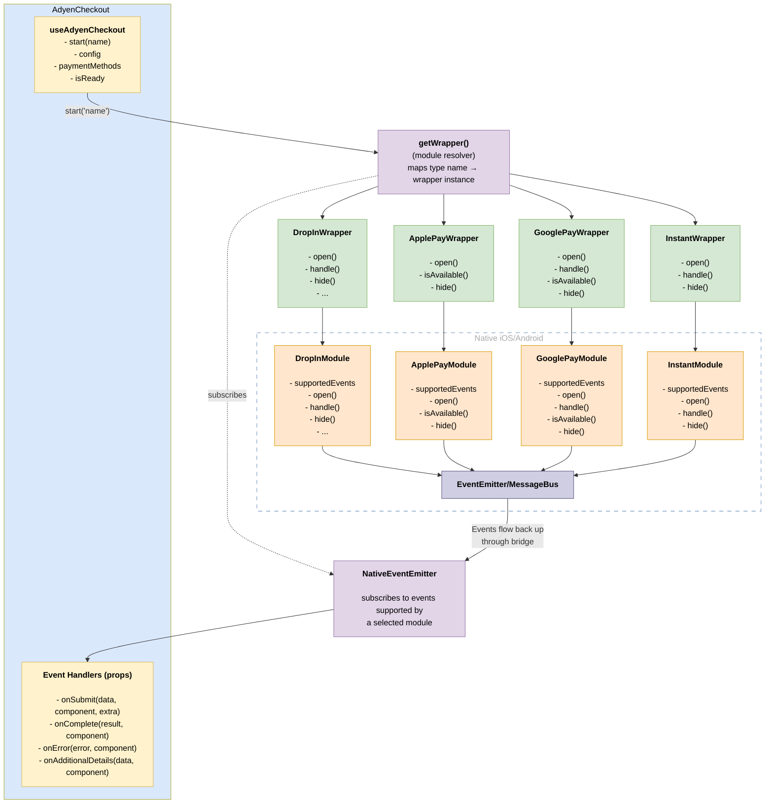
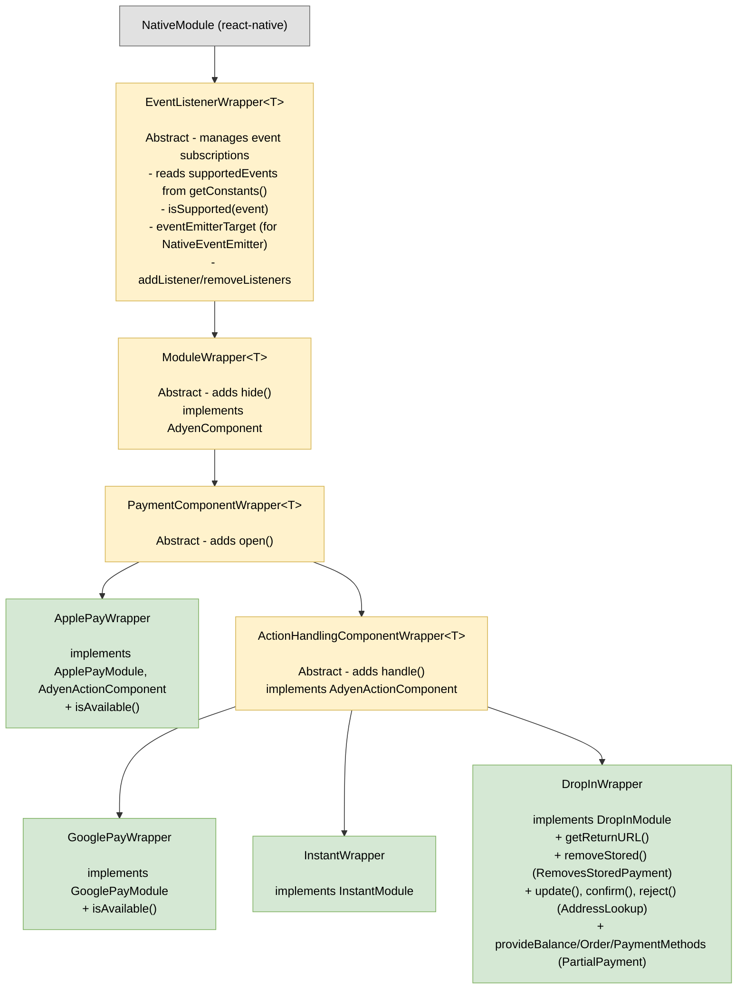
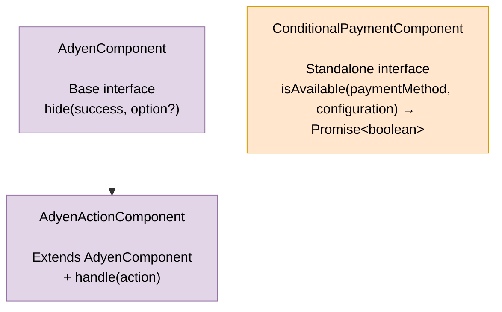
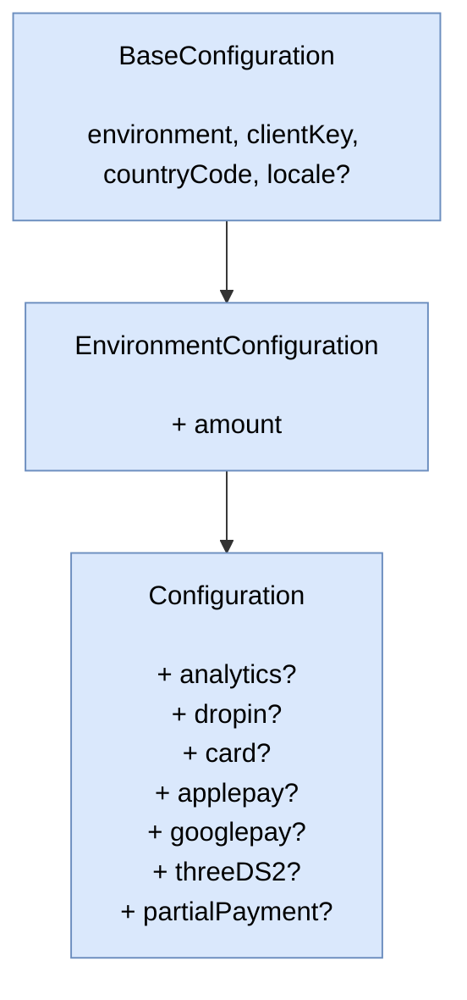
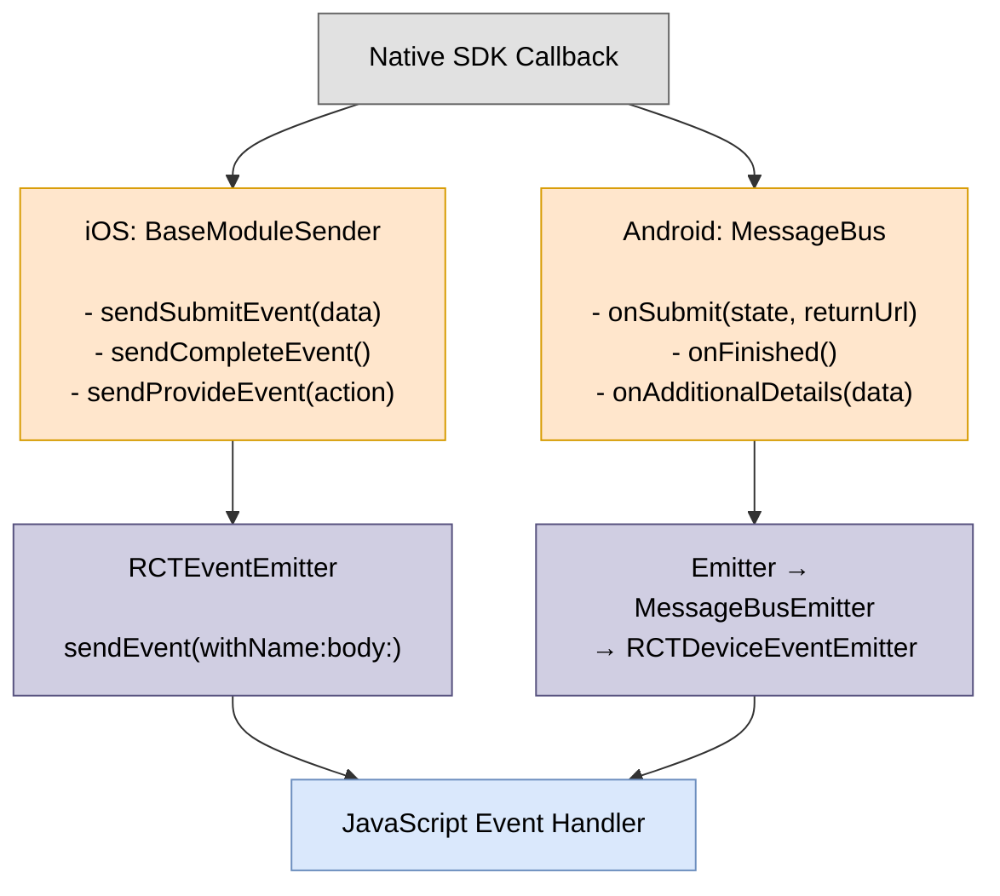
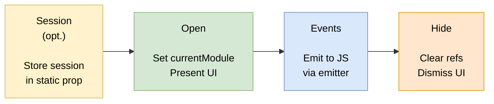
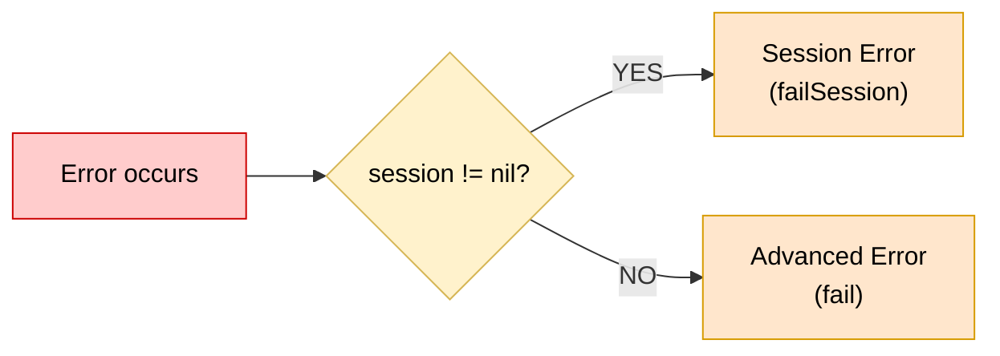

# Architecture

## Data Flow



## Directory Structure

```
src/
├── index.ts                           # Main entry point (barrel exports)
├── components/                        # React components
│   ├── index.ts
│   ├── AdyenCheckout.tsx              # Main checkout component with context provider
│   ├── ApplePayButton.tsx             # Apple Pay button component
│   ├── GooglePayButton.tsx            # Google Pay button component
│   ├── utils.ts                       # Configuration validation utilities
│   └── common/
│       └── Styles.ts                  # Shared styles
├── core/                              # Core types, constants, and configurations
│   ├── index.ts
│   ├── types.ts                       # Payment types and component interfaces
│   ├── constants.ts                   # Event enums, error codes, result codes
│   ├── components.ts                  # Payment method component mappings
│   └── configurations/                # Configuration interfaces
│       ├── index.ts
│       ├── Configuration.ts
│       ├── AddressLookup.ts
│       ├── ApplePayConfiguration.ts
│       ├── CardsConfiguration.ts
│       ├── DropInConfiguration.ts
│       ├── GooglePayConfiguration.ts
│       ├── PartialPaymentConfiguration.ts
│       └── ThreeDSConfiguration.ts
├── hooks/                             # React hooks
│   ├── index.ts
│   └── useAdyenCheckout.ts            # Context hook for checkout state
├── plugin/                            # Expo config plugins
│   ├── withAdyen.ts                           # Main plugin entry
│   ├── withAdyenIos.ts                        # iOS-specific configuration
│   ├── withAdyenAndroid.ts                    # Android-specific configuration
│   └── ...                                    # Platform setup utilities
├── specs/                             # TurboModule specs
│   └── NativePlatformPayView.ts
└── modules/                           # Native module wrappers
    ├── index.ts
    ├── base/                          # Base wrapper classes
    │   ├── EventListenerWrapper.ts            # Abstract base for event handling
    │   ├── ModuleWrapper.ts                   # Abstract base with hide()
    │   ├── PaymentComponentWrapper.ts         # Abstract base with open()
    │   ├── ActionHandlingComponentWrapper.ts  # Abstract base with handle()
    │   ├── ModuleMock.ts                      # Mock for unavailable modules
    │   ├── constants.ts                       # Module-specific constants
    │   ├── getWrapper.ts                      # Factory to resolve payment method wrappers
    │   └── utils.ts                           # Utility functions
    ├── action/                        # Standalone action handler
    │   ├── AdyenAction.ts
    │   └── ActionModuleWrapper.ts
    ├── applepay/                      # Apple Pay module
    │   ├── AdyenApplePay.ts
    │   └── ApplePayWrapper.ts
    ├── cse/                           # Client-side encryption
    │   ├── types.ts
    │   ├── AdyenCSEModule.ts
    │   └── AdyenCSEModuleWrapper.ts
    ├── dropin/                        # Drop-in module
    │   ├── AdyenDropIn.ts
    │   └── DropInWrapper.ts
    ├── googlepay/                     # Google Pay module
    │   ├── AdyenGooglePay.ts
    │   └── GooglePayWrapper.ts
    ├── instant/                       # Instant/redirect payments
    │   ├── AdyenInstant.ts
    │   └── InstantWrapper.ts
    └── session/                       # Session management
        ├── SessionHelperModule.ts
        ├── SessionWrapper.ts
        └── types.ts
```

## Class Hierarchy

### Wrapper Classes

Supported events are read from the native module's `getConstants().supportedEvents` at construction time.



### Standalone Wrappers (outside hierarchy)

These don't inherit from `EventListenerWrapper` as they don't need event subscription management:

```
ActionModuleWrapper                                          # implements ActionModule
    - handle(action, config) → Promise<PaymentDetailsData>
    - hide(success)
    - threeDS2SdkVersion

SessionWrapper                                               # implements SessionHelperModule
    - createSession(session, config) → Promise<SessionContext>
    - hide(success, option?)
    - onComplete(callback) → EmitterSubscription
    - onError(callback) → EmitterSubscription
    - removeAllListeners()

AdyenCSEModuleWrapper                                        # implements AdyenCSEModule
    - encryptCard(card, publicKey)
    - encryptBin(bin, publicKey)
```

## Interface Dependencies

### Core Interfaces (`core/types.ts`)



**Public module interfaces** mirror this structure, extending core interfaces:

- `ApplePayModule` — extends `AdyenActionComponent`, `ConditionalPaymentComponent`
- `GooglePayModule` — extends `AdyenActionComponent`, `ConditionalPaymentComponent`
- `InstantModule` — extends `AdyenActionComponent`
- `DropInModule` — extends `AdyenActionComponent` + partial payment & address lookup methods
- `ActionModule`, `AdyenCSEModule`, `SessionHelperModule` — standalone

### Configuration Hierarchy



## Native Class Hierarchies

### iOS Class Structure

```
RCTEventEmitter (React Native)
    │
    ▼
BaseModule                                           # Base class for all iOS modules
    │   - session: AdyenSession? (static)
    │   - currentModule: BaseModule? (static)
    │   - currentPresenter: UIViewController? (static)
    │   - currentComponent: Component?
    │   - hide(success, event)
    │   - present(component)
    │   - cleanUp()
    │   - sendError(error)
    │
    ├──► SessionHelperModule                         # Session management
    │       - createSession(sessionModel, config)
    │       - SessionErrorDelegate
    │       - AdyenSessionDelegate
    │
    ├──► ActionModule                                # Standalone action handler (Promise-based)
    │       - handle(action, config) → Promise
    │       - hide(success)
    │       - ActionComponentDelegate
    │
    └──► BaseModuleSender                            # Adds event sending helpers
            │   - supportedEvents() → [String]
            │   - constantsToExport() → ["supportedEvents": ...]
            │   - sendSubmitEvent(data)
            │   - sendCompleteEvent()
            │   - sendProvideEvent(actionData)
            │   - PaymentComponentDelegate
            │   - ActionComponentDelegate
            │   - CardComponentDelegate
            │
            ├──► ApplePayModule                      # Apple Pay component
            │       - open(paymentMethods, config)
            │       - isAvailable(paymentMethod, config)
            │
            ├──► BaseActionHandler                   # Adds handle() for actions
            │       │   - actionHandler: AdyenActionComponent?
            │       │   - handle(action)
            │       │
            │       └──► InstantModule               # Instant/redirect payments
            │               - open(paymentMethods, config)
            │
            └──► BaseAddressLookup                   # Adds address lookup support
                    │   - update(results)
                    │   - confirm(success, address)
                    │   - AddressLookupProvider protocol
                    │
                    └──► DropInModule                # Drop-in component
                            - open(paymentMethods, config)
                            - handle(action)
                            - removeStored(success)
                            - getReturnURL()
                            - provideBalance/Order/PaymentMethods
                            - DropInComponentDelegate
                            - StoredPaymentMethodsDelegate
                            - PartialPaymentDelegate
```

### Android Class Structure

```
ReactContextBaseJavaModule (React Native)
    │
    ▼
AppCompatModule                                      # Provides AppCompatActivity access
    │   - appCompatActivity: AppCompatActivity
    │
    ├──► ActionModule                                # Standalone action handler (Promise-based)
    │       - handle(action, config) → Promise
    │       - hide(success)
    │       - ActionComponentCallback
    │
    ▼
BaseModule                                           # Base class for payment modules
    │   - session: CheckoutSession? (companion)
    │   - currentModule: BaseModule? (companion)
    │   - messageBus: MessageBus
    │   - supportedEvents(): List<String> (abstract)
    │   - hide(success, message) (abstract)
    │   - getConstants() → ["supportedEvents": ...]
    │   - cleanup()
    │   - sendError(exception)
    │
    ├──► SessionHelperModule                         # Session management
    │       - createSession(sessionModel, config)
    │       - hide() delegates to currentModule
    │
    ├──► GooglePayModule                             # Google Pay component
    │       - open(paymentMethods, config)
    │       - handle(action)
    │       - isAvailable(paymentMethods, config)
    │
    ├──► InstantModule                               # Instant/redirect payments
    │       - open(paymentMethods, config)
    │       - handle(action)
    │
    └──► DropInModule                                # Drop-in component
            - open(paymentMethods, config)
            - handle(action)
            - removeStored(success)
            - getReturnURL()
            - update/confirm (address lookup)
            - provideBalance/Order/PaymentMethods
```

### Event Emission: iOS BaseModuleSender vs Android MessageBus

Both platforms use a centralized event emission layer that translates native SDK callbacks to JS events:

| Aspect               | iOS (`BaseModuleSender`)                                                       | Android (`MessageBus`)                                         |
| -------------------- | ------------------------------------------------------------------------------ | -------------------------------------------------------------- |
| **Role**             | Base class with event helper methods                                           | Aggregator implementing messenger protocols                    |
| **Inheritance**      | Modules extend `BaseModuleSender`                                              | Modules hold `MessageBus` instance                             |
| **Event helpers**    | `sendSubmitEvent()`, `sendCompleteEvent()`, `sendProvideEvent()`               | `onSubmit()`, `onFinished()`, `onAdditionalDetails()`          |
| **Delegate support** | `PaymentComponentDelegate`, `ActionComponentDelegate`, `CardComponentDelegate` | `SessionMessenger`, `AdvancedMessenger`, `CardMessenger`, etc. |
| **Emission target**  | `sendEvent(withName:body:)` via `RCTEventEmitter`                              | `RCTDeviceEventEmitter.emit()` via `Emitter` interface         |



## Common Native Module Patterns

### Lifecycle Pattern

Both platforms follow a consistent lifecycle for payment components:

1. **Session Setup** (optional) - `SessionHelperModule.createSession()` stores session in static/companion property
2. **Open** - Module sets `currentModule = self/this`, initializes component, presents UI
3. **Events** - Native SDK callbacks are translated to JS events via emitter
4. **Hide** - Cleanup resources, dismiss UI, clear static references



### Static State Management

Both platforms use static/companion properties for cross-module coordination:

| Property           | iOS               | Android            | Purpose                       |
| ------------------ | ----------------- | ------------------ | ----------------------------- |
| `session`          | `static var`      | `companion object` | Shared checkout session       |
| `currentModule`    | `static weak var` | `companion object` | Active module for delegation  |
| `currentPresenter` | `static var`      | N/A                | iOS presenter view controller |

### Error Routing Pattern

Errors are routed differently based on integration type:



### Hide Delegation Pattern

`SessionHelperModule.hide()` delegates to the active component module:

**Android:**

```kotlin
override fun hide(success: Boolean, message: ReadableMap?) {
  currentModule?.hide(success, message)
  cleanup()
}
```

**iOS:**

```swift
override func hide(_ success: NSNumber, event: NSDictionary) {
  super.hide(success, event: event)
  if let activeModule = BaseModule.currentModule {
    activeModule.hide(success, event: event)
  }
}
```

### Event Emission Differences

| Aspect            | iOS                             | Android                           |
| ----------------- | ------------------------------- | --------------------------------- |
| Base class        | `RCTEventEmitter`               | `ReactContextBaseJavaModule`      |
| Emit method       | `sendEvent(withName:body:)`     | `RCTDeviceEventEmitter.emit()`    |
| Event declaration | `supportedEvents() -> [String]` | `supportedEvents(): List<String>` |
| Constants export  | `constantsToExport()`           | `getConstants()`                  |

### Delegate/Callback Pattern

Both platforms translate native SDK delegates to JS events:

**iOS** - Protocol conformance:

```swift
extension DropInModule: PaymentComponentDelegate {
  func didSubmit(_ data: PaymentComponentData, ...) {
    sendSubmitEvent(data: data)
  }
}
```

**Android** - MessageBus delegation:

```kotlin
// SDK callback → MessageBus → Emitter → JS
messageBus.onSubmit(state, returnUrl)  // internally calls emitter.sendEvent()
```

## Event System

Supported events are exposed by native modules via `getConstants()` and read by the JS wrapper at construction:

```typescript
// EventListenerWrapper constructor reads from native module
constructor(nativeModule: T) {
  this.nativeModule = nativeModule;
  const constants = nativeModule.getConstants?.();
  this.supportedEvents = constants?.supportedEvents ?? [];
}

// AdyenCheckout conditionally subscribes based on native support
if (nativeComponent.isSupported(Event.onSubmit)) {
  subscriptions.push(
    eventEmitter.addListener(Event.onSubmit, handler)
  );
}
```

### Native Module Event Declaration

**iOS** - Override `constantsToExport()` in `BaseModule.swift`:

```swift
@objc override func constantsToExport() -> [AnyHashable: Any]! {
  ["supportedEvents": supportedEvents() ?? []]
}
```

**Android** - Override `getConstants()` in `BaseModule.kt`:

```kotlin
override fun getConstants(): MutableMap<String, Any> =
  mutableMapOf("supportedEvents" to supportedEvents())
```

### Event Reference

| Event                          | Description                      |
| ------------------------------ | -------------------------------- |
| `onSubmit`                     | Payment details submitted        |
| `onAdditionalDetails`          | Additional action details needed |
| `onComplete`                   | Payment completed (vouchers)     |
| `onError`                      | Error occurred                   |
| `onDisableStoredPaymentMethod` | Stored payment removal requested |
| `onAddressUpdate`              | Address lookup update            |
| `onAddressConfirm`             | Address confirmed                |
| `onCheckBalance`               | Balance check requested          |
| `onRequestOrder`               | New order requested              |
| `onCancelOrder`                | Order cancelled                  |
| `onBinValue`                   | BIN value changed                |
| `onBinLookup`                  | BIN lookup completed             |

