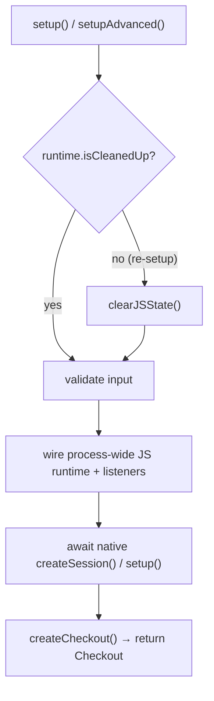

# Architecture

System overview and checkout lifecycle contract for the `@adyen/react-native` v6-alpha bridge.
This document owns the lifecycle and the cross-cutting model. Detailed layer diagrams live in the
two companion documents, and the other concerns are delegated to their canonical authorities:

| Concern                                     | Canonical document                                 |
| ------------------------------------------- | -------------------------------------------------- |
| TypeScript topology, dependencies, runtime  | [js-architecture.md](./js-architecture.md)         |
| iOS/Android class hierarchies and internals | [native-architecture.md](./native-architecture.md) |
| Chronological session/advanced/etc. flows   | [public-api-flows.md](./public-api-flows.md)       |
| Platform/flow capability status             | [FeatureSupport.md](./FeatureSupport.md)           |
| Consumer migration steps                    | [MigrationGuide.md](./MigrationGuide.md)           |

> [!NOTE]
> This document describes current behavior in source. Where current behavior differs from earlier
> intent, the current behavior is documented and its limitations are labeled. Historical proposals
> and bridge guides are in [archive/](./archive/README.md) and are not evidence of current
> behavior.

## Public surface

The public API is defined by `src/index.ts`, the per-layer barrels it re-exports, and the
committed report `etc/api/adyen-react-native.api.md`. The runtime entry points are:

- **`AdyenCheckout`** — a class with only the static `setup()` and `setupAdvanced()` methods. It
  has no public constructor and holds the single active checkout as process-wide state.
- **`Checkout`** — the interface returned by an awaited setup call. It exposes `isAvailable`,
  `requiresUserInteraction`, `submit`, and `invalidate`, and carries `paymentMethods` and
  `configuration`.
- **`AdyenComponent`** — the embedded React view (`AdyenComponentProps` = `{ checkout, type }`).
- **`AdyenDropIn`**, **`AdyenAction`**, **`AdyenCSE`** — module singletons for Drop-in, standalone
  action handling, and client-side encryption.

Internal machinery — the `createCheckout` factory, `CheckoutRuntime`/`CheckoutHost`, the native
module wrappers, `startEventListeners`, the Expo `plugin`, and the Fabric `specs` contract — is not
part of the package-root public API. See [js-architecture.md](./js-architecture.md) for the exact
boundary.

## Checkout lifecycle contract

A `Checkout` is obtainable only by awaiting `AdyenCheckout.setup()` (session flow) or
`AdyenCheckout.setupAdvanced()` (advanced flow). Both are `static async` methods on `AdyenCheckout`
(`src/checkout/AdyenCheckout.ts`). Each returns a handle produced by the internal `createCheckout`
factory (`src/checkout/createCheckout.ts`).

### Setup order

For a clean initial runtime, both entry points follow the same order:

1. **Validate input.** `setup()` calls `checkConfiguration(configuration)`. `setupAdvanced()` calls
   `checkConfiguration(configuration)` then `checkPaymentMethodsResponse(paymentMethods)` — the
   advanced flow is the only path that receives payment methods from the merchant.
2. **Wire process-wide JS runtime state.** The private static `AdyenCheckout.runtime` records the
   configuration and the session or advanced callbacks, sets `isCleanedUp = false` and
   `hasHandledTerminalEvent = false`, points the event-handler refs at the active callbacks, and
   registers the native event listeners (`NativeCheckout.removeAllListeners()` followed by the
   terminal, card, Drop-in, before-submit/submit/additional-details, and Apple Pay subscriptions
   appropriate to the flow).
3. **Invoke native setup.** `setup()` awaits `NativeCheckout.createSession(...)`; `setupAdvanced()`
   awaits `NativeCheckout.setup(paymentMethods, configuration)`.
4. **Create and return the handle.** `createCheckout(paymentMethods, configuration, host)` returns
   the per-call `Checkout` last.

```mermaid
flowchart TD
  A["setup() / setupAdvanced()"] --> B{"runtime.isCleanedUp?"}
  B -->|"no (re-setup)"| C["clearJSState()"]
  B -->|yes| D
  C --> D["validate input"]
  D --> E["wire process-wide JS runtime + listeners"]
  E --> F["await native createSession() / setup()"]
  F --> G["createCheckout() → return Checkout"]
```

The exact chronological ordering, including the native continuation hops, is in
[public-api-flows.md](./public-api-flows.md).

### Re-setup clears JS state without native cleanup

When a setup call runs while a checkout is still active (`runtime.isCleanedUp === false`), the very
first step is `AdyenCheckout.clearJSState()`, which runs before input validation. `clearJSState()`
delegates to `resetState(false)`: it removes the tracked subscription bags, calls
`NativeCheckout.removeAllListeners()`, clears the configuration and callbacks, and re-marks the
runtime as cleaned up — but it deliberately does **not** call the native context cleanup
(`NativeCheckout.cleanup()`). The native side replaces its own state when the new setup call
reaches it.

On the native side, each platform runs a **path-specific** setup preamble: the cancellation it
performs and its order relative to input parsing differ by platform and by session versus advanced
flow. iOS parses or validates its input before it cancels in-flight work; Android session setup
cancels the `SessionBeforeSubmitBridge` and disposes managers before parsing, while Android advanced
setup disposes managers but does **not** cancel that bridge. No preamble tears the context down, and
the shared native checkout state is replaced only if native setup succeeds. See
[native-architecture.md](./native-architecture.md#re-setup-and-failed-replacement) for the
platform-specific preambles and the resulting stale-state behavior.

### Stale handles are not identity-bound

A `Checkout` handle carries no identity of its own. `isAvailable()`,
`requiresUserInteraction()`, and `submit()` consult the process-wide host
(`AdyenCheckout.runtime` via `CheckoutHost.isActive()`); `invalidate()` delegates directly to the
same host. A handle from a previous setup and a handle from the current setup therefore act on the
same global runtime. Consequences:

- After a terminal callback or `invalidate()` has made the runtime inactive, an old handle's
  `submit()` is ignored with a warning, and `isAvailable()`/`requiresUserInteraction()` resolve
  `false`; `invalidate()` stays a silent no-op.
- After a re-setup, the runtime is active again, so an old handle can still act on or invalidate the
  current global state. Handles are not independently invalidated per setup.

### Terminal callbacks and `invalidate()`

- The first terminal event runs the merchant callback exactly once.
  `AdyenCheckout.handleTerminalEvent()` guards on `runtime.hasHandledTerminalEvent`, sets the flag,
  runs the callback, and then performs cleanup in a `finally` path — so cleanup runs even if the
  merchant callback throws, and duplicate terminal events are ignored.
- `checkout.invalidate()` delegates to `AdyenCheckout.cleanup()` for abandoned flows that will not
  reach a terminal callback. `cleanup()` returns early when already cleaned up, so invalidation is
  idempotent.
- Both paths converge on `resetState(true)`, which removes JS subscriptions and listeners, clears
  callback/configuration state, marks the runtime inactive, and — unlike re-setup — calls
  `NativeCheckout.cleanup()` to tear down the native context.

### Setup rejection and failed replacement

`setup()`/`setupAdvanced()` distinguish three rejection points, and during an active re-setup each
leaves observable mixed state because `clearJSState()` has already run:

- **JS validation rejection** (`checkConfiguration` / `checkPaymentMethodsResponse` throws): occurs
  after JS state is cleared but before any native call. JS listeners are gone and existing handles
  are deactivated; no native preamble runs and no new handle is returned.
- **Native input parsing rejection** (native rejects malformed session fields, payment methods, or
  configuration): occurs after the new JS runtime is wired. Its order relative to the native
  cancellation preamble is platform- and path-specific: malformed iOS session fields and advanced
  payment methods reject **before** `cancelPendingOperations()`; Android session parsing rejects
  **after** the old session before-submit bridge is cancelled and managers are disposed; Android
  advanced parsing rejects **after** managers are disposed but **without** cancelling the session
  before-submit bridge.
- **Native SDK setup rejection** (`Checkout.setup(...)` rejects): occurs after the applicable
  preamble. The previous native checkout state remains because native assignment happens only on
  success.

In every native rejection branch no new handle is returned, the previous native `checkoutState`
survives, and an old globally backed handle can still consult or `invalidate()` the resulting mixed
state. See [native-architecture.md](./native-architecture.md#re-setup-and-failed-replacement) for
the per-platform ordering.

### Overlapping setup calls are unsupported

`setup()` and `setupAdvanced()` are `async` and have no lock, queue, or active-call guard. Calling
them concurrently mutates the process-wide JS callbacks/listeners while native state is replaced
asynchronously, so no deterministic isolation is promised. Always `await` one setup before starting
another.

## Presenter model

Three presenters drive the one active checkout:

- the embedded **`<AdyenComponent>`** view;
- the headless **`checkout.submit(type)`** call;
- **Drop-in**, where the platform supports it.

They share the checkout context but differ in native ownership and support (see
[FeatureSupport.md](./FeatureSupport.md)). Mounting and interaction are separate concerns:

- **Mounting** is constrained in TypeScript. `src/components/AdyenComponent.tsx` keeps a
  module-level `activeComponentTypes` set and, in a `useEffect`, throws if a second
  `<AdyenComponent>` of the same `type` is already mounted; the unmount cleanup deletes the type.
  Different types can be mounted together.
- **Interaction** is not guarded checkout-wide by this bridge. There is no cross-presenter in-flight
  submit lock in the TypeScript layer, and none is inferred here. Routing of an in-flight result is
  platform-specific and, on Android, can be ambiguous — see
  [native-architecture.md](./native-architecture.md#continuation-ownership-and-routing).

## Result routing

Submit, additional-details, completion, and error callbacks are configured once per checkout, not
per presenter. Payment payloads carry no presenter identity — there is no `viewId`, `source`, or
other presenter tag in a payment payload, and no route selects a continuation by payload tag. The
`viewId` that appears natively is only a registry key used to find a mounted view at teardown.

The intermediate advanced callbacks are dispatched back to native through a single checkout-level
path:

- `onSubmit` results dispatch to `NativeCheckout.action` / `completion` / `retry`
  (`dispatchSubmitResult` in `src/checkout/AdyenCheckout.ts`);
- `onAdditionalDetails` results dispatch to `NativeCheckout.completion`.

How native resolves the suspended SDK closure differs by platform (checkout-wide callback bridges
on iOS; per-`ComponentManager` continuations selected by `awaitingManager()` on Android). See
[native-architecture.md](./native-architecture.md#continuation-ownership-and-routing).

## Cleanup ownership

JS teardown (`resetState`) always removes the context and Drop-in listener collections and clears
callback/configuration state. Only the terminal/`invalidate()` path additionally calls
`NativeCheckout.cleanup()`; re-setup does not.

Native context cleanup is intentionally asymmetric, and neither platform unmounts React views:

- **iOS** context cleanup cancels context-owned work (cached components, the advanced result sink,
  the before-submit bridge, and the Apple Pay bridges) and clears the checkout and presenter state.
  It does **not** call `ComponentModule.cleanUp()` and does not dispose every mounted proxy.
- **Android** context cleanup cancels the session before-submit bridge, disposes the registered
  component managers, clears the `ComponentModule` consumer registry map, and then clears the
  checkout state. Clearing the map does not itself dispose the consumers, and the mounted
  `DynamicComponentView` is not disposed.

Because of this, a `<AdyenComponent>` that stays mounted across a context cleanup or re-setup
becomes a stale view whose behavior differs by platform. View unmount/recycle cleanup is a separate
path owned by the view managers. The full ownership detail, including the exact fallback value
delivered to each suspended callback, is in
[native-architecture.md](./native-architecture.md#suspended-callback-cleanup-fallbacks).
