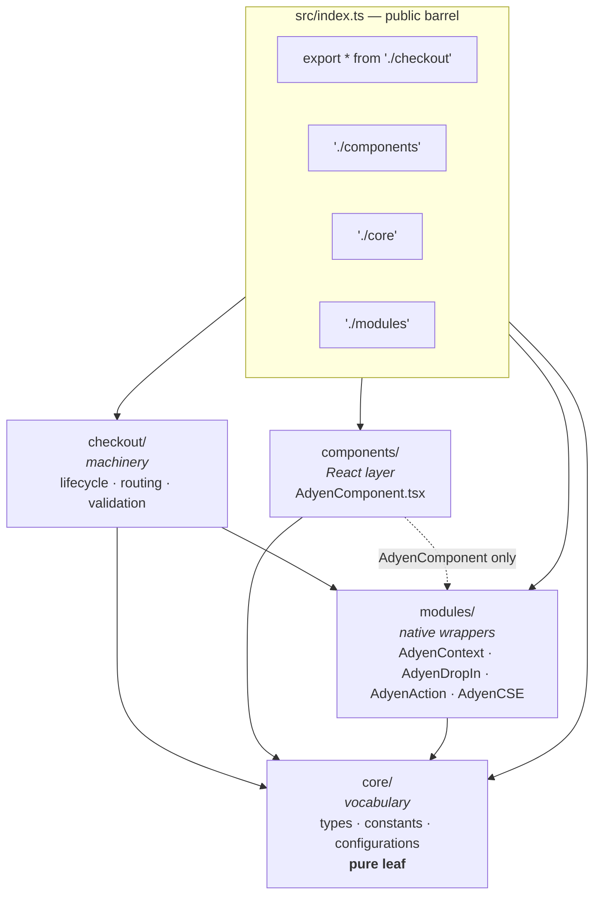
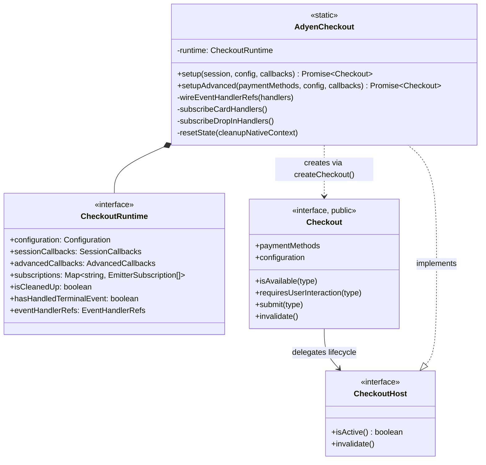
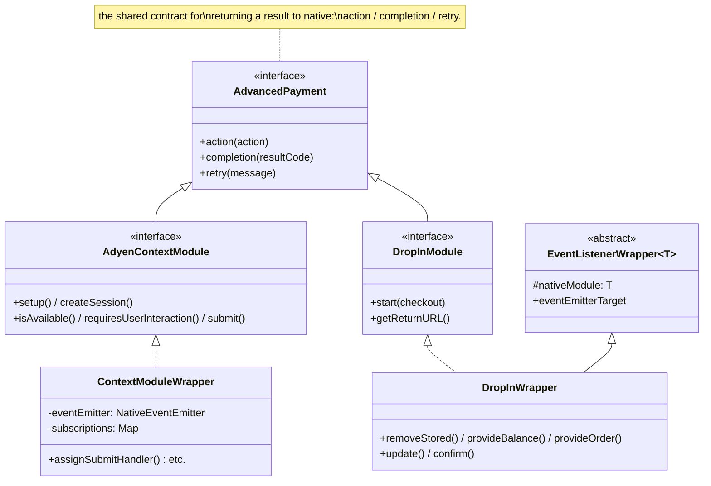
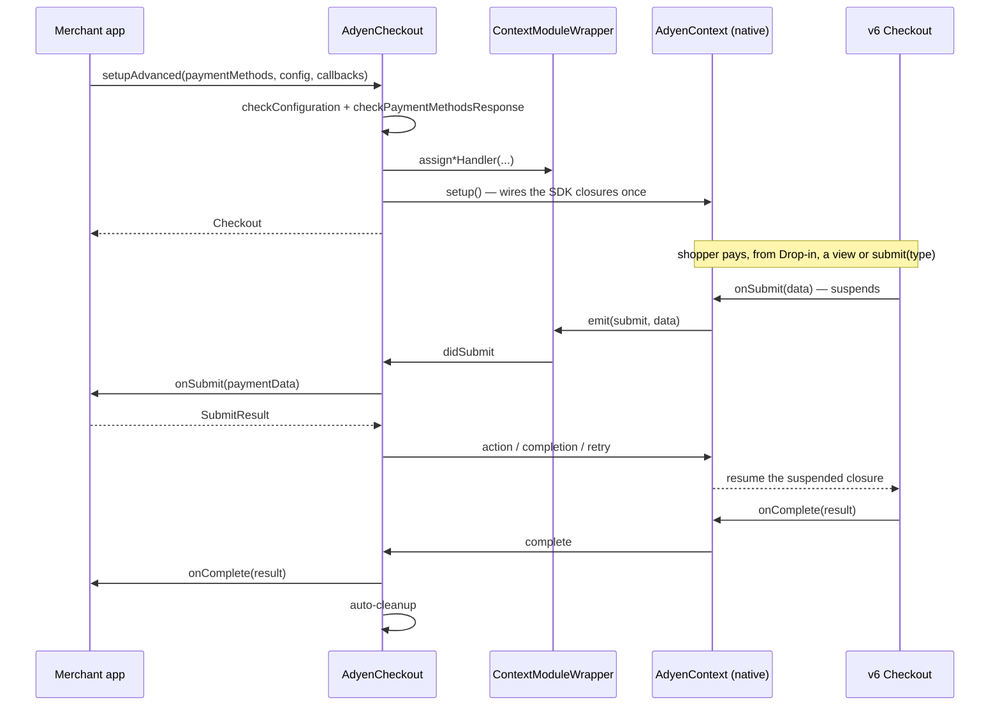
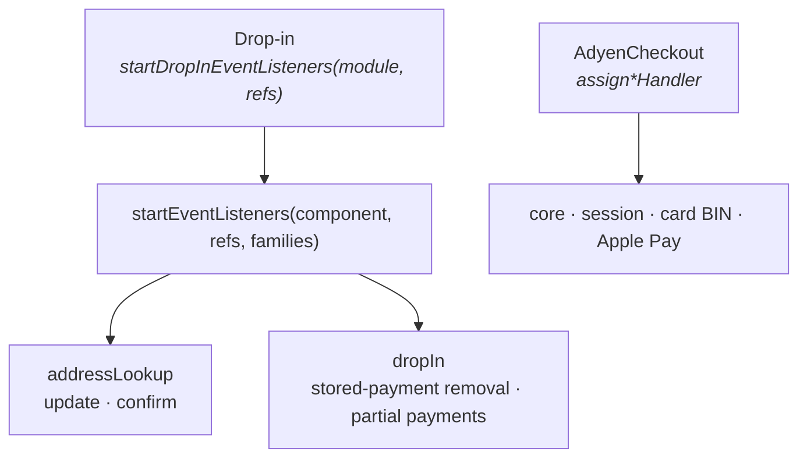
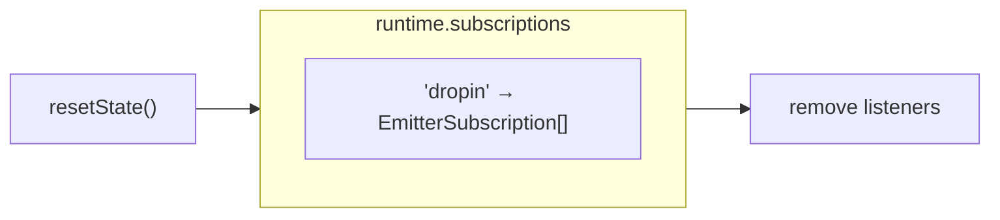

# JS Architecture

Diagrams of the TypeScript layer. For the iOS and Android sides see
[native-architecture.md](./native-architecture.md); for prose on the lifecycle contract see
[Architecture.md](./Architecture.md).

## Module layout

Four top-level folders, with dependencies pointing one way only.

`core` imports nothing from the other three, so the vocabulary can never depend on machinery.
`checkout` is the only folder that reaches into both `core` and `modules`.

> [!NOTE]
> `core/types.ts` is a **publication mechanism**, not a shared types bucket: `core/index.ts` does
> `export * from './types'` and `src/index.ts` does `export * from './core'`, so anything added
> there becomes public API. Internal shapes belong beside their consumer — which is why
> `EventTags`, `CheckoutRuntime` and `CheckoutHost` live in `checkout/types.ts`.

## `src/checkout/`

Two lifetimes worth separating:

| | `Checkout` | `AdyenCheckout` |
| --- | --- | --- |
| Scope | one per `setup()` | process-wide singleton |
| Lifetime | until a terminal event or `invalidate()` | outlives every handle |
| Visibility | public interface | public class, private state |

Once its owner is torn down, every handle method becomes an ignored no-op that warns, and
`invalidate()` a silent one.

## Native module wrappers

Two things are going on: a small **inheritance** ladder for event plumbing, and an **interface**
that is what routing actually depends on. The interface is the important one.

**There is deliberately no shared base *class* between Drop-in and the context flow.** They share
the `AdvancedPayment` interface, and the only duplicated implementation is three one-line
delegations to the native module. Their event models genuinely differ:

| | `ContextModuleWrapper` | `DropInWrapper` |
| --- | --- | --- |
| Emitter | owns its own `NativeEventEmitter` | none — exposes `eventEmitterTarget` |
| Subscriptions | private map, one listener per event, replaced on re-setup | built externally by `startEventListeners` |
| Consumer API | `assign*Handler(cb)` | subscribed via `startDropInEventListeners` |

A common base would have to bridge those two models, or exist purely to hold nine lines of
delegation — which is what the former `ModuleWrapper` did, and why it was removed.

`EventListenerWrapper` now has one subclass, `DropInWrapper`. It stays because
`startDropInEventListeners` needs an `eventEmitterTarget`, not because the hierarchy earns its
keep.

> [!NOTE]
> `ContextModuleWrapper` — the busiest module — is outside the ladder, as are
> `ActionModuleWrapper` and `AdyenCSEWrapper`: promise-based, no events.

## No presenter attribution

Drop-in, an embedded `<AdyenComponent>` and the headless `checkout.submit(type)` all drive the
same checkout, and all emit the **same event names** — delivery is global through
`RCTDeviceEventEmitter` on both platforms, so a per-module emitter does listener bookkeeping and
nothing more.

None of them is identified in the payload, because nothing needs to tell them apart:

- **Delivery** never needed it. `AdyenComponentProps` carries only `checkout` and `type`, so there
  are no per-view merchant callbacks — every event ends at the same handler either way.
- **Results** do not need it either. Only one payment can be in flight, so exactly one native
  closure is suspended and a result has one place to go.

> [!NOTE]
> This replaced a `viewId` / `source` tagging scheme. It existed because each embedded view had its
> own listener set, competing with the context listeners for the same globally-delivered names, so
> identity had to travel inside the payload — and then be stripped before reaching a merchant
> callback, since the additional-details payload *is* the body posted to `/payments/details`.
> Removing the second and third listener set removed the problem instead of routing around it.

## Advanced flow round trip

## Listener families

`startEventListeners` groups events so a caller subscribes only what it owns. Only Drop-in uses it
now; everything else is subscribed through `ContextModuleWrapper.assign*Handler`.

`core` is absent from the Drop-in entry point on purpose: those events arrive on the context
handlers, and subscribing them in both places would invoke merchant callbacks twice. `card` left
too — BIN is configured on the card configuration rather than per presenter, which makes it
checkout-level, so it sits with the other configuration callbacks.

`addressLookup` stays with Drop-in because its result path needs `update` / `confirm`, which only
the Drop-in module exposes. Wiring it checkout-level needs those methods on the context module on
both platforms; on iOS the callbacks are not wired at all yet.

## Subscription bookkeeping

One entry, because Drop-in is the only thing with its own listener bag. Views used to have one
each, keyed `view:<reactTag>`, and teardown had to tell the two kinds apart so it knew which also
needed a native `unsubscribe`. Neither the keys nor that branch are needed now.
