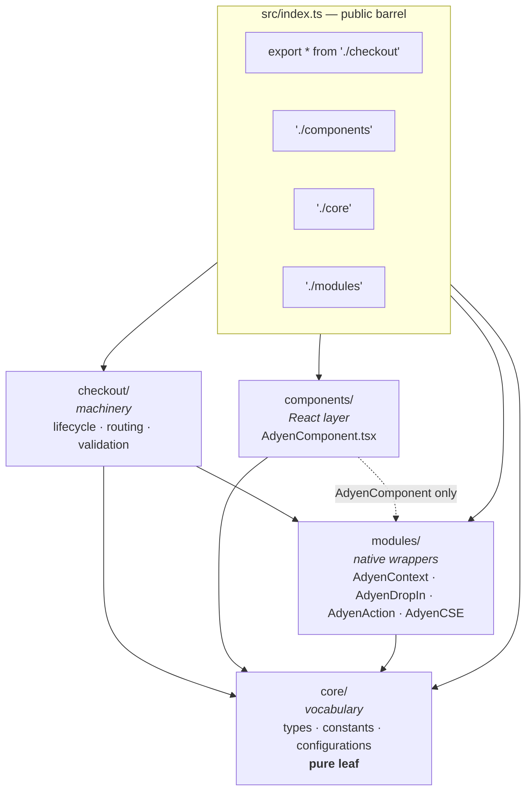
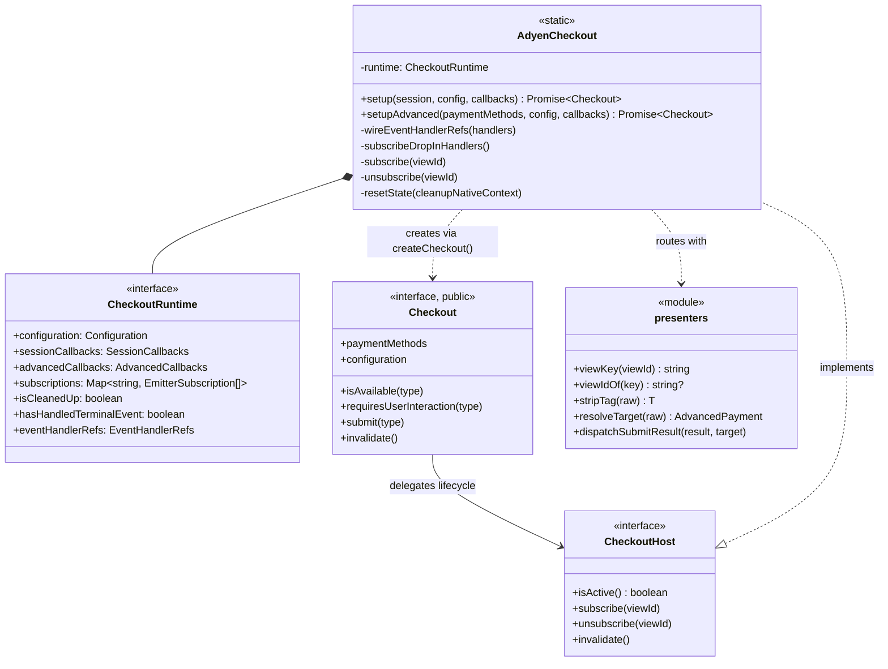
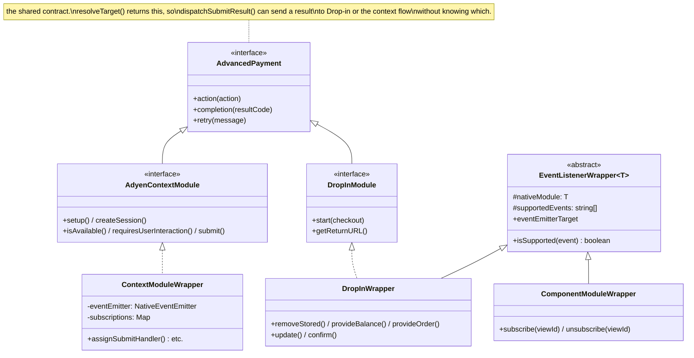
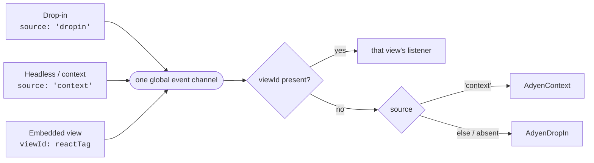
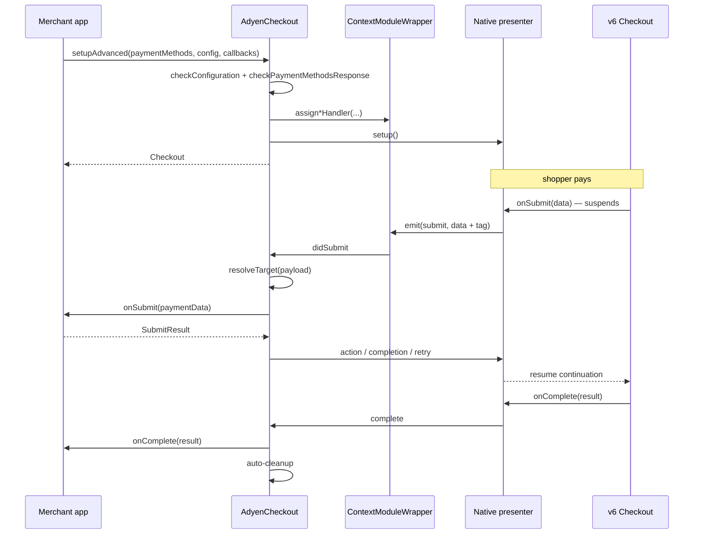
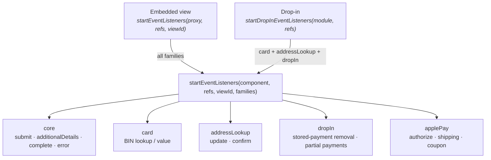
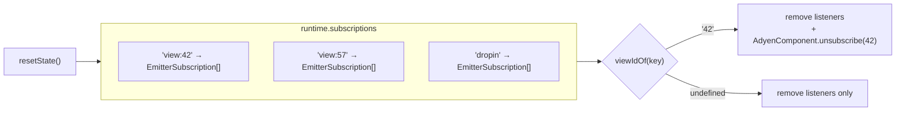

# JS Architecture

Diagrams of the TypeScript layer. For the iOS and Android sides see
[native-architecture.md](./native-architecture.md); for prose on the lifecycle contract see
[Architecture.md](./Architecture.md).

## Module layout

Four top-level folders, with dependencies pointing one way only.

`core` imports nothing from the other three, so the vocabulary can never depend on machinery.
`checkout` is the only folder that reaches into both `core` and `modules`.

> [!NOTE]
> `core/types.ts` is a **publication mechanism**, not a shared types bucket: `core/index.ts` does
> `export * from './types'` and `src/index.ts` does `export * from './core'`, so anything added
> there becomes public API. Internal shapes belong beside their consumer — which is why
> `EventTags`, `CheckoutRuntime` and `CheckoutHost` live in `checkout/types.ts`.

## `src/checkout/`

Two lifetimes worth separating:

| | `Checkout` | `AdyenCheckout` |
| --- | --- | --- |
| Scope | one per `setup()` | process-wide singleton |
| Lifetime | until a terminal event or `invalidate()` | outlives every handle |
| Visibility | public interface | public class, private state |

Once its owner is torn down, every handle method except `unsubscribe` becomes an ignored no-op
that warns — `unsubscribe` is never guarded because views detach *while* tearing down, after
cleanup has already run.

## Native module wrappers

Two things are going on: a small **inheritance** ladder for event plumbing, and an **interface**
that is what routing actually depends on. The interface is the important one.

**There is deliberately no shared base *class* between Drop-in and the context flow.** They share
the `AdvancedPayment` interface, and the only duplicated implementation is three one-line
delegations to the native module. Their event models genuinely differ:

| | `ContextModuleWrapper` | `DropInWrapper` |
| --- | --- | --- |
| Emitter | owns its own `NativeEventEmitter` | none — exposes `eventEmitterTarget` |
| Subscriptions | private map, one listener per event, replaced on re-setup | built externally by `startEventListeners` |
| Consumer API | `assign*Handler(cb)` | `isSupported(event)` |

A common base would have to bridge those two models, or exist purely to hold nine lines of
delegation — which is what the former `ModuleWrapper` did, and why it was removed.

> [!NOTE]
> `ContextModuleWrapper` — the busiest module — is outside the ladder and subscribes
> unconditionally, so the `isSupported` gate only affects the Drop-in and embedded-view paths.
> `ActionModuleWrapper` and `AdyenCSEWrapper` are standalone too: promise-based, no events.
> `ComponentProxy` composes `ComponentModuleWrapper` and scopes every call to one `viewId`.

## Presenter attribution

Every payment event is produced by one of three presenters. They all emit the **same event
names**, because delivery is global through `RCTDeviceEventEmitter` on both platforms — a
per-module emitter does not isolate delivery, it only does listener bookkeeping. Identity
therefore travels inside the payload.

**The rule**, applied identically in `ContextModuleWrapper.subscribe` and `startEventListeners`:

- a listener bound to a view accepts only payloads with that same `viewId`;
- a listener *not* bound to a view accepts only payloads with **no** `viewId`.

Both halves matter. Without the second, an embedded view's events also reach the context
listeners and the merchant `onSubmit` runs twice for one payment.

> [!IMPORTANT]
> The tag is stripped before any merchant callback. This is correctness, not tidiness: the
> additional-details payload *is* the request body posted to `/payments/details`, so a stray
> `source` field would be sent to the API.

> [!NOTE]
> `onBeforeSubmit` is deliberately **never** `viewId`-tagged — the session bridge is
> context-owned and emits untagged even for embedded views. If that changed, the filter above
> would swallow it and the session flow would deadlock on a suspended continuation. Enforced
> only by tests.

## Advanced flow round trip

The loop must close on the presenter that opened it, because each one suspends its own
continuation natively.

## Listener families

`startEventListeners` groups events so a caller subscribes only what it owns.

`core` is excluded from the Drop-in entry point on purpose: those events arrive on the context
listeners and are routed by tag, so subscribing them in both places would invoke merchant
callbacks twice.

> [!NOTE]
> Before families existed, `startEventListeners` was only ever called per `viewId`, so
> stored-payment removal, partial payments and address lookup had **no listener at all** unless
> an embedded view was mounted — the matching Drop-in configuration callbacks never fired.

## Subscription bookkeeping

One map, keyed by presenter, so Drop-in and every view are torn down by the same loop.

The `view:` prefix is what teardown needs: only a view has a native subscription to detach. A
bare `dropin` key in the same namespace would have made teardown call
`AdyenComponent.unsubscribe('dropin')`.
