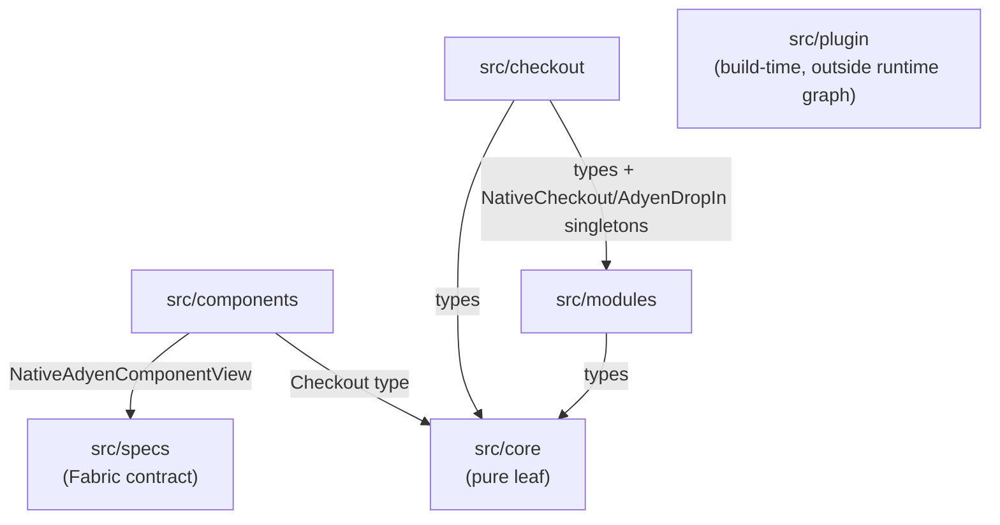
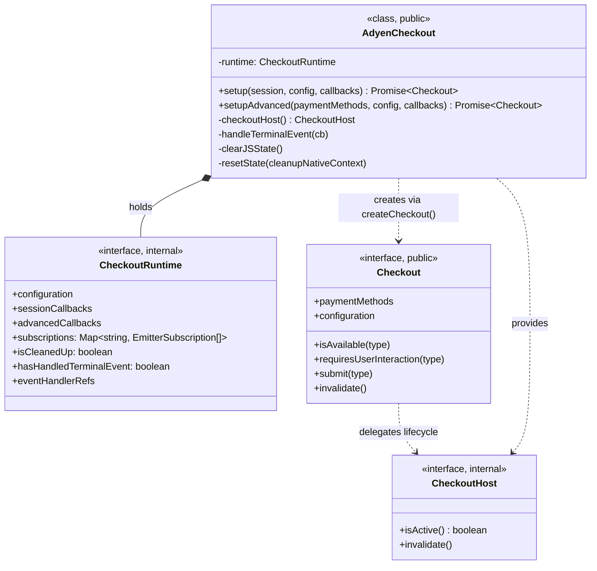
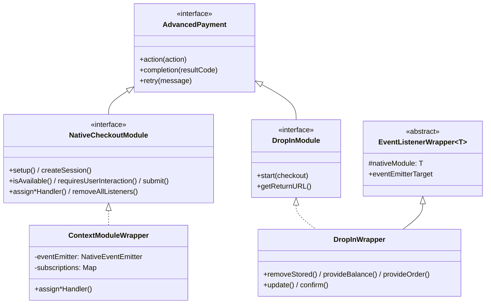
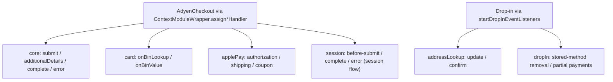

# JS Architecture

TypeScript layer of the SDK: source topology, public boundary, dependency direction, the checkout
runtime, the native module wrappers, and listener/handle ownership. For the lifecycle contract see
[Architecture.md](./Architecture.md); for the native bridges see
[native-architecture.md](./native-architecture.md). Chronological flows live in
[public-api-flows.md](./public-api-flows.md) and capability status in
[FeatureSupport.md](./FeatureSupport.md).

## Source topology

`src/` has six top-level folders. Four are runtime code, one is a build-time tool, and one is a
codegen contract:

| Folder           | Role                                                                                 |
| ---------------- | ------------------------------------------------------------------------------------ |
| `src/core`       | Vocabulary: types, constants, configuration interfaces. Pure leaf.                   |
| `src/checkout`   | Lifecycle machinery: `AdyenCheckout`, `createCheckout`, validation, listener wiring. |
| `src/components` | React layer: the embedded `AdyenComponent` view.                                     |
| `src/modules`    | Native module wrappers and their singletons (context, Drop-in, action, CSE).         |
| `src/plugin`     | Build-time Expo config plugin (runs during `expo prebuild`). Not runtime code.       |
| `src/specs`      | React Native Fabric codegen contract (`NativeAdyenComponentView.ts`).                |

## Public boundary

`src/index.ts` re-exports four barrels — `./checkout`, `./components`, `./core`, `./modules` — and
runs `configureSDKVersion` at import time. It does **not** export `src/plugin` or `src/specs`. The
package-root public API (confirmed against `etc/api/adyen-react-native.api.md`) is:

- `checkout/index.ts` exports only the `AdyenCheckout` class.
- `components/index.ts` exports `AdyenComponent` (and `AdyenComponentProps`).
- `core/index.ts` exports the types, constants, configuration interfaces, and payment-method
  constant arrays.
- `modules/index.ts` exports the singletons `AdyenDropIn`, `AdyenAction`, `AdyenCSE` and their
  public interfaces.

The following are **internal** and are not part of the package-root public API:

- the `createCheckout` factory and the `CheckoutRuntime` / `CheckoutHost` / `EventHandlers` types
  in `checkout/`;
- the wrappers `ContextModuleWrapper`, `DropInWrapper`, `ActionModuleWrapper`, and the internal
  `NativeCheckout` singleton;
- `checkout/utils/startEventListeners` and the other `checkout/utils` helpers;
- the Expo `plugin` helpers;
- the Fabric `specs` component contract.

## Dependency direction

Edges below follow current `import` declarations; each is labeled by what it depends on.

```mermaid
flowchart TD
  CORE["src/core<br/>(pure leaf)"]
  SPECS["src/specs<br/>(Fabric contract)"]
  CHECKOUT["src/checkout"]
  COMPONENTS["src/components"]
  MODULES["src/modules"]
  PLUGIN["src/plugin<br/>(build-time, outside runtime graph)"]

  CHECKOUT -->|"types + NativeCheckout/AdyenDropIn singletons"| MODULES
  CHECKOUT -->|"types"| CORE
  COMPONENTS -->|"Checkout type"| CORE
  COMPONENTS -->|"NativeAdyenComponentView"| SPECS
  MODULES -->|"types"| CORE
```

- **`checkout` → `core`**: `AdyenCheckout.ts` and `createCheckout.ts` import types such as
  `Checkout`, `Configuration`, `SubmitResult`, and `BeforeSubmitResult` from `../core`.
- **`checkout` → `modules`**: `AdyenCheckout.ts` and `createCheckout.ts` import the `NativeCheckout`
  singleton from `../modules/context/ContextModule`, and `AdyenCheckout.ts` imports `AdyenDropIn`
  from `../modules/dropin/AdyenDropIn`; `src/index.ts` imports `configureSDKVersion` from
  `./modules/base/configureSDKVersion`.
- **`components` → `core`**: `AdyenComponent.tsx` imports the `Checkout` type from `../core`.
- **`components` → `specs`**: `AdyenComponent.tsx` imports `NativeAdyenComponentView` from
  `../specs/NativeAdyenComponentView`.
- **`modules` → `core`**: the wrappers import types from `../../core`.
- **`core`** imports nothing from its sibling folders, so the vocabulary never depends on
  machinery. **`plugin`** imports only `@expo/config-plugins` and its own helpers, so it is outside
  the runtime graph. **`specs`** imports only React Native codegen utilities.

> [!NOTE]
> `AdyenComponent.tsx` also references `NativeModules.AdyenComponent` at import time
> (`void NativeModules.AdyenComponent`). This is a dynamic React Native bridge lookup that forces
> the native `AdyenComponent` module to be constructed before the first view mounts. It is a
> runtime bridge access, **not** a `components` → `modules` source-folder import, and is not shown
> as a dependency edge above.

> [!NOTE]
> `core/types.ts` is a publication mechanism, not a shared internal bucket: `core/index.ts` does
> `export * from './types'` and `src/index.ts` does `export * from './core'`, so anything added
> there becomes public API. Internal shapes such as `CheckoutRuntime`, `CheckoutHost`, and
> `EventHandlerRefs` live in `checkout/` instead.

## Checkout runtime

`AdyenCheckout` is a process-wide singleton class. Its private static `runtime` (`CheckoutRuntime`
in `checkout/types.ts`) holds the single active checkout's state; each setup call produces a
`Checkout` handle through `createCheckout`, which delegates lifecycle questions back to the class
through a `CheckoutHost`.

```mermaid
classDiagram
  class AdyenCheckout {
    <<class, public>>
    -runtime: CheckoutRuntime
    +setup(session, config, callbacks) Promise~Checkout~
    +setupAdvanced(paymentMethods, config, callbacks) Promise~Checkout~
    -checkoutHost() CheckoutHost
    -handleTerminalEvent(cb)
    -clearJSState()
    -resetState(cleanupNativeContext)
  }
  class CheckoutRuntime {
    <<interface, internal>>
    +configuration
    +sessionCallbacks
    +advancedCallbacks
    +subscriptions: Map~string, EmitterSubscription[]~
    +isCleanedUp: boolean
    +hasHandledTerminalEvent: boolean
    +eventHandlerRefs
  }
  class Checkout {
    <<interface, public>>
    +paymentMethods
    +configuration
    +isAvailable(type)
    +requiresUserInteraction(type)
    +submit(type)
    +invalidate()
  }
  class CheckoutHost {
    <<interface, internal>>
    +isActive() boolean
    +invalidate()
  }

  AdyenCheckout *-- CheckoutRuntime : holds
  AdyenCheckout ..> Checkout : creates via createCheckout()
  Checkout ..> CheckoutHost : delegates lifecycle
  CheckoutHost <.. AdyenCheckout : provides
```

Two lifetimes are worth separating:

|            | `Checkout`                               | `AdyenCheckout`             |
| ---------- | ---------------------------------------- | --------------------------- |
| Scope      | one per setup call                       | process-wide singleton      |
| Lifetime   | until a terminal event or `invalidate()` | outlives every handle       |
| Visibility | public interface                         | public class, private state |

A handle is not identity-bound: `createCheckout` guards each method with `host.isActive()`, which
reads the process-wide `runtime.isCleanedUp`. Once the runtime is inactive, `submit()` warns and is
ignored and the two query methods resolve `false`; `invalidate()` is a silent, idempotent no-op.
After a re-setup the runtime is active again, so an older handle can still act on the current global
state — see the stale-handle rules in [Architecture.md](./Architecture.md#stale-handles-are-not-identity-bound).

## Native module wrappers

Two things coexist: a small **inheritance** ladder for event plumbing, and the **interfaces** that
routing actually depends on.

```mermaid
classDiagram
  class AdvancedPayment {
    <<interface>>
    +action(action)
    +completion(resultCode)
    +retry(message)
  }
  class NativeCheckoutModule {
    <<interface>>
    +setup() / createSession()
    +isAvailable() / requiresUserInteraction() / submit()
    +assign*Handler() / removeAllListeners()
  }
  class DropInModule {
    <<interface>>
    +start(checkout)
    +getReturnURL()
  }
  class EventListenerWrapper~T~ {
    <<abstract>>
    #nativeModule: T
    +eventEmitterTarget
  }
  class ContextModuleWrapper {
    -eventEmitter: NativeEventEmitter
    -subscriptions: Map
    +assign*Handler()
  }
  class DropInWrapper {
    +removeStored() / provideBalance() / provideOrder()
    +update() / confirm()
  }

  AdvancedPayment <|-- NativeCheckoutModule
  AdvancedPayment <|-- DropInModule
  NativeCheckoutModule <|.. ContextModuleWrapper
  DropInModule <|.. DropInWrapper
  EventListenerWrapper <|-- DropInWrapper
```

- `NativeCheckout` (an instance of `ContextModuleWrapper`) implements `NativeCheckoutModule` and is
  the one wrapper `AdyenCheckout` calls for setup, headless methods, and every context event
  subscription. It owns its own `NativeEventEmitter` and a private `Map` of one subscription per
  event, replaced on re-`setup()` so listeners never accumulate.
- `AdyenDropIn` (an instance of `DropInWrapper`) implements `DropInModule` and extends
  `EventListenerWrapper`, which only exposes `eventEmitterTarget`. Its listeners are built
  externally by `startDropInEventListeners`.
- `AdyenAction` (`ActionModuleWrapper`) and `AdyenCSE` (`AdyenCSEModuleWrapper`) are promise-based
  and outside the event ladder.

`AdvancedPayment` is the shared contract for returning a result to native — `action` / `completion`
/ `retry` — implemented by both the context and Drop-in wrappers. There is deliberately no shared
base _class_ between them, because their event models differ: `ContextModuleWrapper` owns and
replaces its subscriptions internally, while `DropInWrapper` exposes an emitter target for
`startEventListeners` to subscribe.

## Listener ownership

`startEventListeners(component, refs, families)` (`checkout/utils/startEventListeners.ts`) groups
events into families — `core`, `card`, `addressLookup`, `dropIn`, `applePay` — so a caller
subscribes only what it owns.

```mermaid
flowchart TD
  CTX["AdyenCheckout via ContextModuleWrapper.assign*Handler"]
  CTX --> CORE["core: submit / additionalDetails / complete / error"]
  CTX --> CARD["card: onBinLookup / onBinValue"]
  CTX --> AP["applePay: authorization / shipping / coupon"]
  CTX --> SESS["session: before-submit / complete / error (session flow)"]

  DROPIN["Drop-in via startDropInEventListeners"] --> AL["addressLookup: update / confirm"]
  DROPIN --> DI["dropIn: stored-method removal / partial payments"]
```

- The context handlers own core, card (BIN), Apple Pay, and the session terminal/before-submit
  events. `AdyenCheckout.subscribeCardHandlers()` subscribes BIN through the context wrapper because
  BIN is configured on the card configuration, making it checkout-level rather than per presenter.
- `startDropInEventListeners` subscribes only the `addressLookup` and `dropIn` families
  (`DROP_IN_FAMILIES`). `core` and `card` are excluded on purpose: those events already arrive on
  the context handlers, so subscribing them here too would invoke merchant callbacks twice.
- The embedded `<AdyenComponent>` subscribes to **no** payment events. It renders the native view
  and reads only `checkout` and `type` from its props; every event and result travels through the
  checkout's own context listeners.

### Subscription bookkeeping

`runtime.subscriptions` is a `Map<string, EmitterSubscription[]>` with a single entry keyed
`DROP_IN_KEY` (`'dropin'`). `subscribeDropInHandlers()` removes the previous bag before replacing
it, so a re-setup cannot leave two Drop-in bags listening. Teardown (`resetState`) removes every
subscription in every bag, clears the map, and calls `NativeCheckout.removeAllListeners()` to drop
the context listeners as well.
