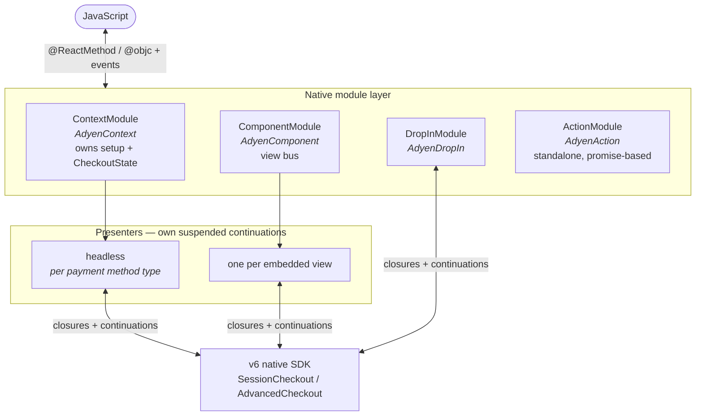
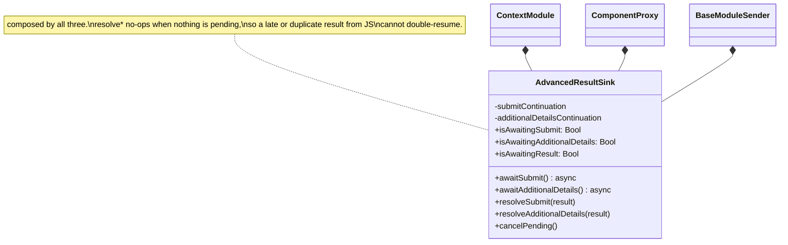
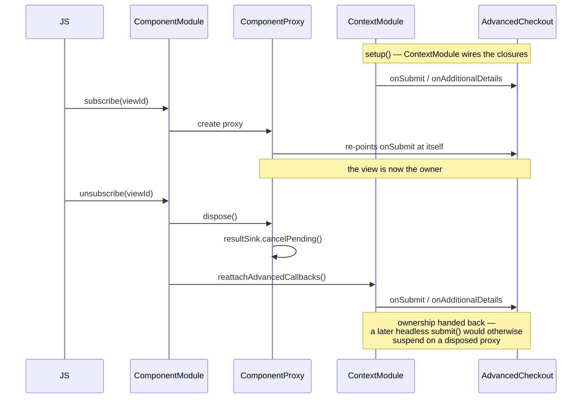
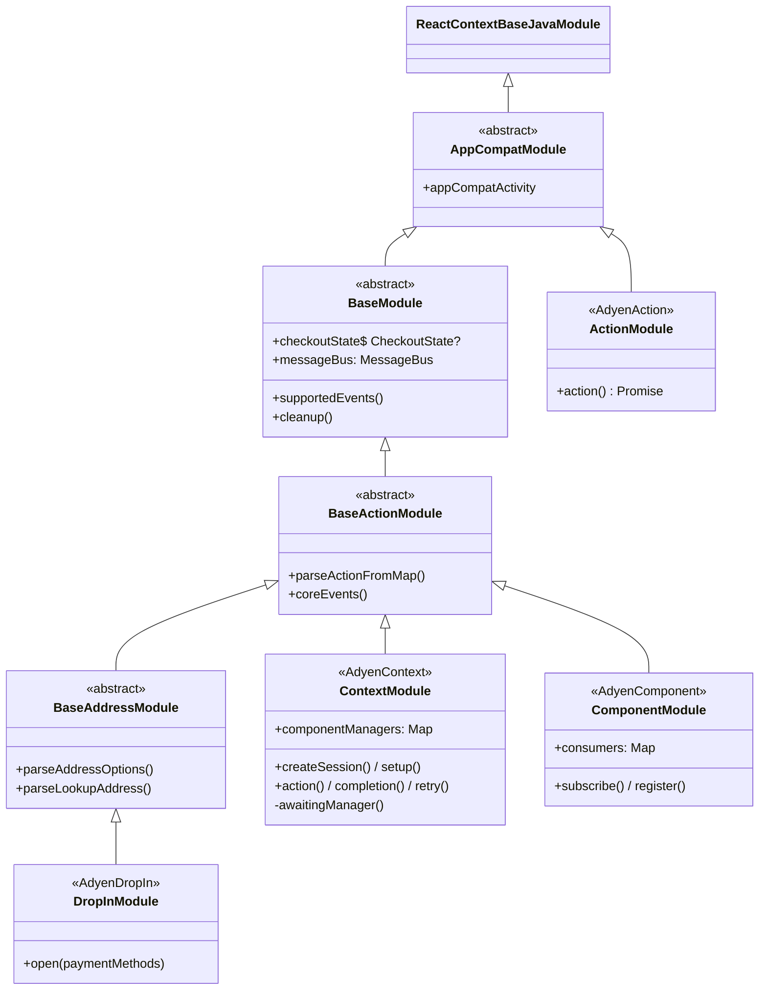
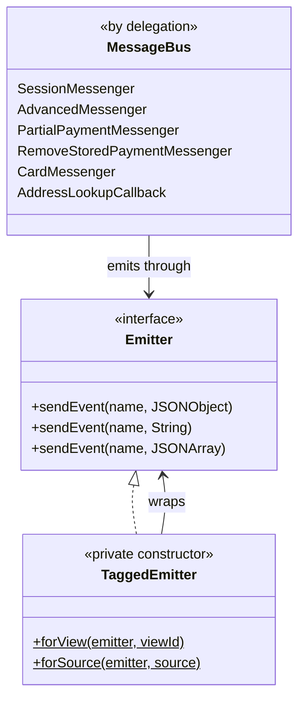
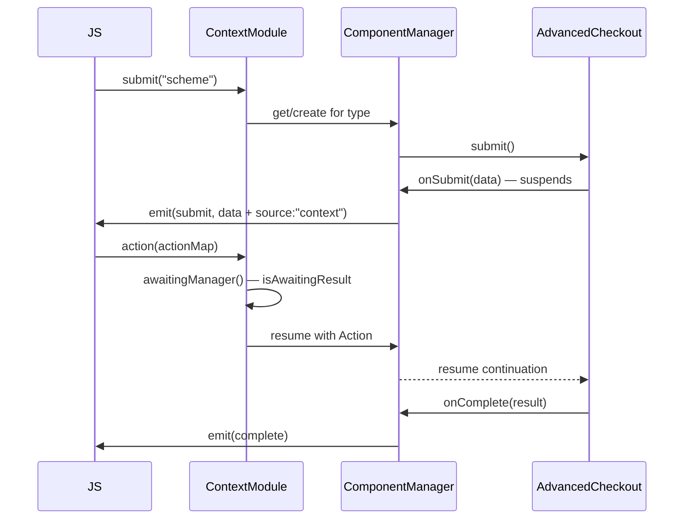

# Native Architecture

Diagrams of the iOS and Android bridges. For the TypeScript side see
[js-architecture.md](./js-architecture.md); for prose on the lifecycle contract see
[Architecture.md](./Architecture.md).

## The shape both platforms share

`ContextModule` is the lifecycle owner on both platforms: it performs `setup()` / `createSession()`
and holds the static `CheckoutState`. Drop-in and embedded views read that shared state rather than
creating their own checkout.

## iOS class hierarchy

> [!IMPORTANT]
> `ContextModule` extends `BaseModule` **directly**, not the sender ladder. It cannot inherit
> `BaseModuleSender`, because that class declares its own continuations which would collide with
> the ones `ContextModule` must own. That collision is why the continuations were extracted into
> `AdvancedResultSink` and are now *composed* rather than inherited.

## `AdvancedResultSink`

The v6 SDK drives the advanced flow with `async` closures: `onSubmit` and `onAdditionalDetails`
suspend until the merchant answers through JS. Each presenter needs its own pair, so a result
resumes the presenter that opened the request.

`cancelPending()` settles anything still suspended with the SDK's error result, so a torn-down
flow ends terminally instead of looking like a shopper-initiated retry.

## Callback ownership on iOS

The advanced closures live on the **one** shared `AdvancedCheckout`, so whoever wires them last
owns emission. There is room for exactly one owner at a time — which is why presenters are
sequential rather than parallel.

> [!NOTE]
> Unsubscribing the last view does **not** tear the checkout down. Teardown belongs to a terminal
> event or `invalidate()`. Doing it on unmount used to nil `checkoutState`, which broke a headless
> `submit()` afterwards and left JS believing the checkout was still active.

## Android class hierarchy

> [!NOTE]
> The two platforms differ here on purpose. On Android `ContextModule` and `ComponentModule` both
> extend `BaseActionModule`; on iOS `ContextModule` extends `BaseModule` and `ComponentModule`
> extends `BaseAddressModule`. Each ladder reflects what that platform's module actually needs.

## Android messaging

`MessageBus` is composition by Kotlin delegation rather than a god object: each concern is a small
`*Messenger` interface with its own `*MessengerImpl`, and the bus simply delegates.

### Why the two factories treat scalars differently

`TaggedEmitter` has three `sendEvent` overloads, and the factories diverge on the scalar ones:

| | `String` payload | `JSONArray` payload |
| --- | --- | --- |
| `forView` | boxed as `{viewId, value}` | boxed as `{viewId, data}` |
| `forSource` | passed through, untagged | passed through, untagged |

The asymmetry is what makes the Drop-in bus taggable at all. `onBinValue` and address lookup emit
scalars that JS reads directly; boxing them for a source tag would silently reshape those
payloads. Neither carries a result that needs routing, so leaving them untagged costs nothing.

## Presenter equivalence

The same three responsibilities, named differently per platform:

| | Android `ComponentManager` | iOS `ComponentProxy` |
| --- | --- | --- |
| Suspended continuations | `submitContinuation`, `additionalDetailsContinuation` | `AdvancedResultSink` |
| "Is a result pending?" | `isAwaitingResult` | `resultSink.isAwaitingResult` |
| Identity-tagged emitter | injected `MessageBus` | `taggedBody()` via `ComponentModule` |
| Extra callback wiring | `additionalCallbacks: CheckoutCallbacks.() -> Unit` | closures on the shared checkout |

## Headless submit on Android

`ContextModule` keeps one `ComponentManager` per payment method type and routes a JS result to
whichever one is actually waiting — only one payment can be mid-flight.

> [!NOTE]
> `completion()` falls back to `cleanup()` **only** when nothing is pending. That fallback is what
> the session flow relies on, so it cannot simply be replaced by resuming the continuation.

## Event identity summary

| Presenter | Tag | Android | iOS |
| --- | --- | --- | --- |
| Embedded view | `viewId` | `TaggedEmitter.forView` | `ComponentProxy.taggedBody()` |
| Headless / context | `source: "context"` | context-tagged `MessageBus` | `ContextModule.taggedBody()` |
| Drop-in | `source: "dropin"` | Drop-in-tagged `MessageBus` | untagged while Drop-in is unsupported |

Keep `EventSource` on both platforms and the presenter ids in `src/checkout/constants.ts` in sync.

> [!NOTE]
> v6 has **no Drop-in yet** on either platform: Android has only `com.adyen.checkout.dropin.old`,
> and iOS `AdyenDropIn` reports `notSupported`. When the v6 Drop-in lands it is expected to reuse
> the same `CheckoutConfiguration` and callbacks, so it should slot in as another presenter rather
> than a new subsystem.
