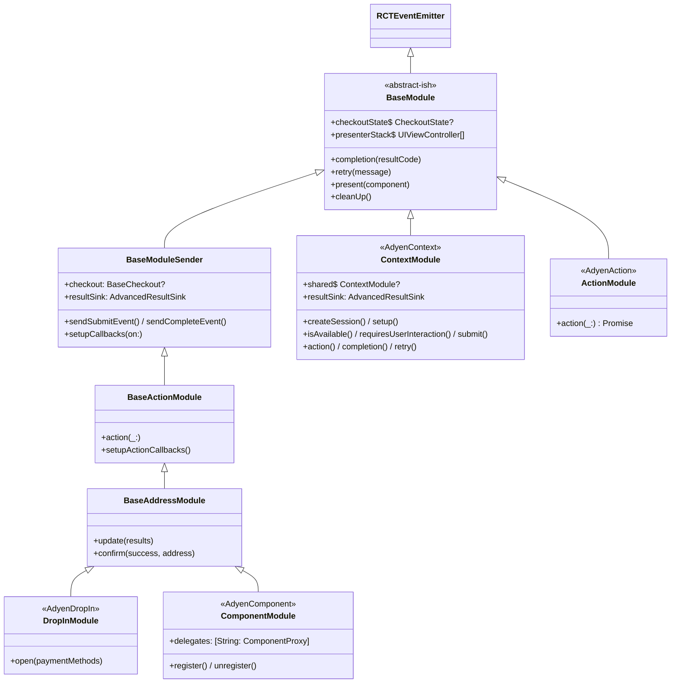
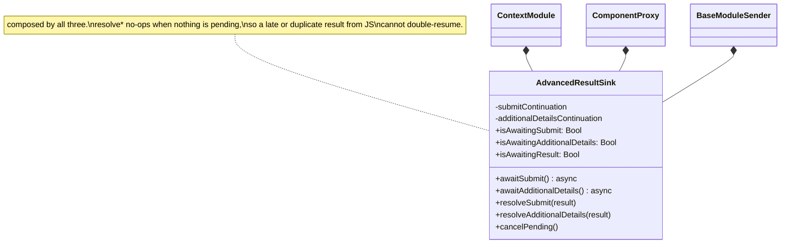
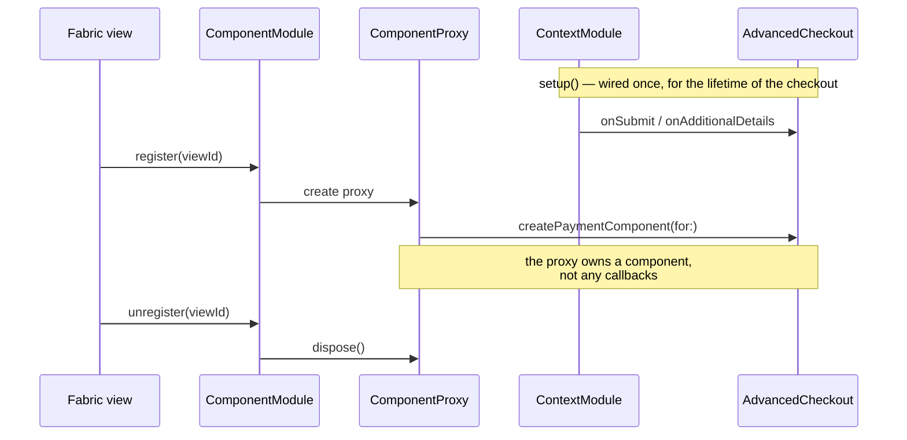
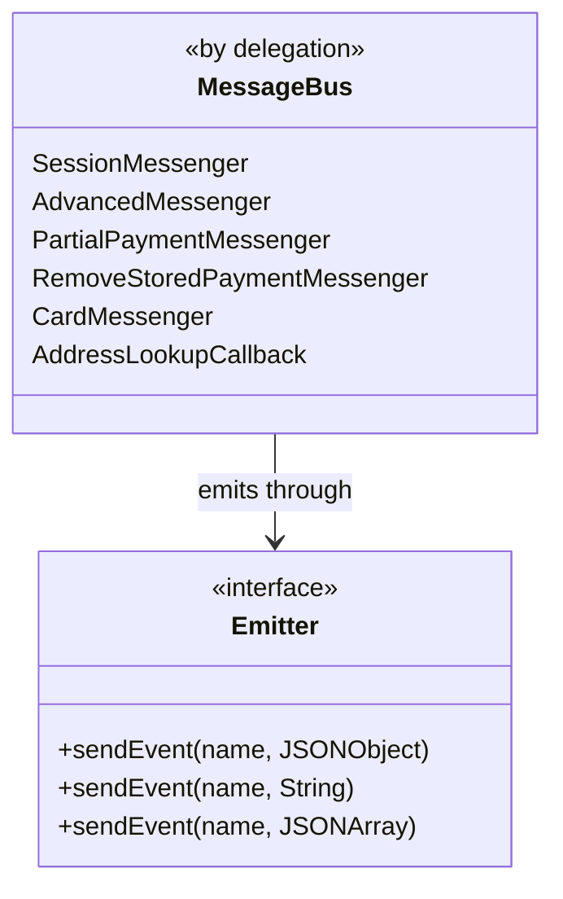
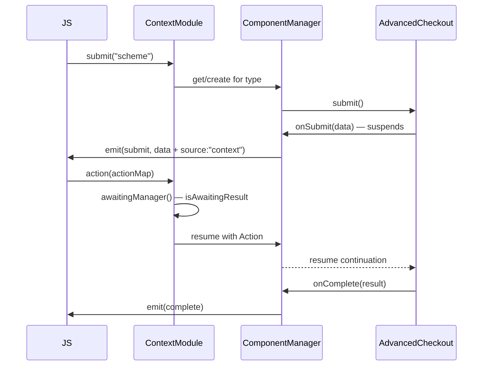

# Native Architecture

Diagrams of the iOS and Android bridges. For the TypeScript side see
[js-architecture.md](./js-architecture.md); for prose on the lifecycle contract see
[Architecture.md](./Architecture.md).

## The shape both platforms share


`ContextModule` is the lifecycle owner on both platforms: it performs `setup()` / `createSession()`
and holds the static `CheckoutState`. Drop-in and embedded views read that shared state rather than
creating their own checkout.

## iOS class hierarchy



> [!IMPORTANT]
> `ContextModule` extends `BaseModule` **directly**, not the sender ladder. It cannot inherit
> `BaseModuleSender`, because that class declares its own continuations which would collide with
> the ones `ContextModule` must own. That collision is why the continuations were extracted into
> `AdvancedResultSink` and are now *composed* rather than inherited.

## `AdvancedResultSink`

The v6 SDK drives the advanced flow with `async` closures: `onSubmit` and `onAdditionalDetails`
suspend until the merchant answers through JS. Each presenter needs its own pair, so a result
resumes the presenter that opened the request.



`cancelPending()` settles anything still suspended with the SDK's error result, so a torn-down
flow ends terminally instead of looking like a shopper-initiated retry.

## Callback ownership on iOS

The advanced closures live on **one** callback store per checkout:

```swift
package final class AdvancedCheckoutCallbackStore {
    package var onSubmit: SubmitHandler?          // one slot for the whole checkout
    package var onAdditionalDetails: AdditionalDetailsHandler?
}
```

`ContextModule` wires them once, at setup, and nothing re-points them.



> [!NOTE]
> The migration had three call sites writing to that single slot — `ContextModule` at setup, every
> `ComponentProxy` on `makeViewController`, and a reattach on dispose — simulating per-component
> ownership on an API that does not offer it. Whichever proxy mounted last owned every submit.
> That is what `viewId` tagging, `resolveTarget` and `reattachAdvancedCallbacks` were all
> compensating for.

> [!NOTE]
> Unsubscribing the last view does **not** tear the checkout down. Teardown belongs to a terminal
> event or `invalidate()`. Doing it on unmount used to nil `checkoutState`, which broke a headless
> `submit()` afterwards and left JS believing the checkout was still active.

## Android class hierarchy


> [!NOTE]
> The two platforms differ here on purpose. On Android `ContextModule` and `ComponentModule` both
> extend `BaseActionModule`; on iOS `ContextModule` extends `BaseModule` and `ComponentModule`
> extends `BaseAddressModule`. Each ladder reflects what that platform's module actually needs.

## Android messaging



`MessageBus` is composition by Kotlin delegation rather than a god object: each concern is a small
`*Messenger` interface with its own `*MessengerImpl`, and the bus simply delegates.

There is one bus. A `TaggedEmitter` used to wrap it to stamp a `viewId` or a `source` onto every
payload, with an awkward asymmetry — the view factory boxed scalar payloads as `{viewId, value}`
while the source factory passed them through, because boxing `onBinValue` and address lookup would
have reshaped payloads JS reads directly. Nothing needs a tag now.

## Where the platforms genuinely differ

The two SDKs offer different callback shapes, so the bridge lands differently:

| | Android | iOS |
| --- | --- | --- |
| Callback scope | constructor arguments per `CheckoutController` | one store per checkout |
| Who holds them | each `ComponentManager` | `ContextModule`, wired once |
| Finding the suspended one | `awaitingManager()` over the registered managers | the single `AdvancedResultSink` |
| Concurrent submits | `AtomicBoolean canSubmit` per controller, ignores the second | one `submitTask`, a second cancels the first |

The consequence worth knowing: Android's SDK would allow one in-flight submit *per payment method*,
while iOS allows one per checkout. The bridge exposes the narrower contract on both, so behaviour
does not diverge by platform.

## Headless submit on Android

`ContextModule` keeps one `ComponentManager` per payment method type and routes a JS result to
whichever one is actually waiting — only one payment can be mid-flight.



> [!NOTE]
> `completion()` falls back to `cleanup()` **only** when nothing is pending. That fallback is what
> the session flow relies on, so it cannot simply be replaced by resuming the continuation.

## Event identity summary

| Presenter | Emits through (Android) | Emits through (iOS) |
| --- | --- | --- |
| Embedded view | the shared `MessageBus` | `ContextModule` |
| Headless / context | the shared `MessageBus` | `ContextModule` |
| Drop-in | the shared `MessageBus` | n/a while Drop-in is unsupported |

No identity travels in a payload on either platform. Nothing to keep in sync.

> [!NOTE]
> v6 has **no Drop-in yet** on either platform: Android has only `com.adyen.checkout.dropin.old`,
> and iOS `AdyenDropIn` reports `notSupported`. When the v6 Drop-in lands it is expected to reuse
> the same `CheckoutConfiguration` and callbacks, so it should slot in as another presenter rather
> than a new subsystem.
