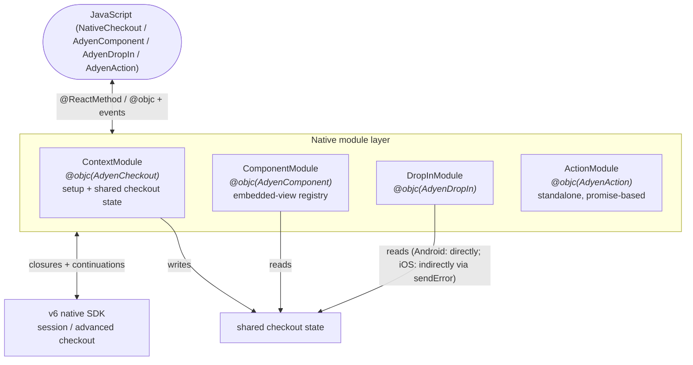
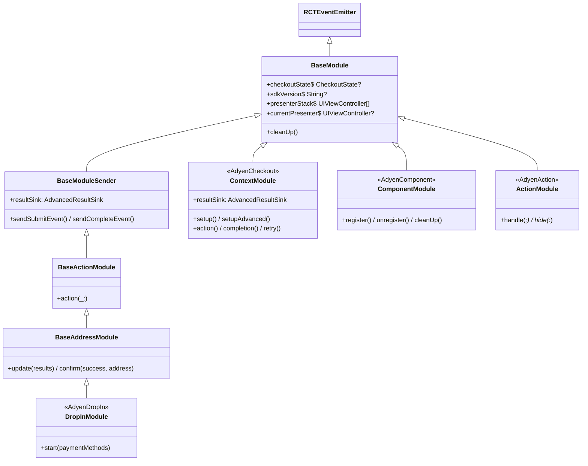
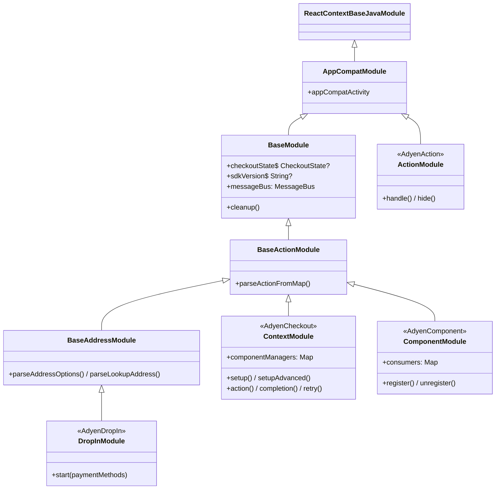
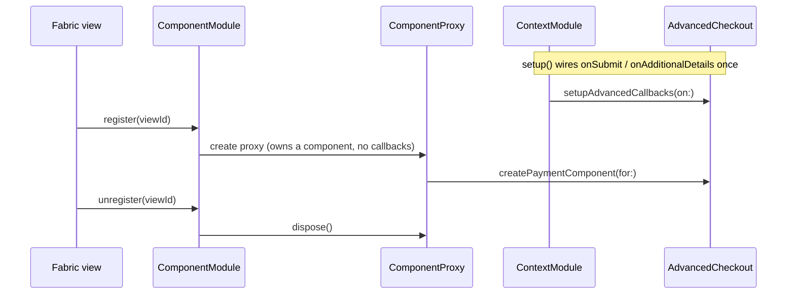
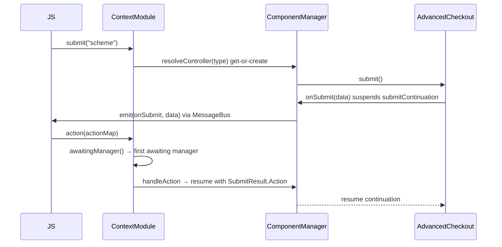

# Native Architecture

The iOS and Android bridges: exact class hierarchies, shared state, callback suspension, event
production, embedded views, headless presentation, and cleanup. For the lifecycle contract see
[Architecture.md](./Architecture.md); for the TypeScript layer see
[js-architecture.md](./js-architecture.md). Chronological flows live in
[public-api-flows.md](./public-api-flows.md) and capability status in
[FeatureSupport.md](./FeatureSupport.md).

## The shape both platforms share


```mermaid
flowchart TB
  JS(["JavaScript (NativeCheckout / AdyenComponent / AdyenDropIn / AdyenAction)"])

  subgraph N["Native module layer"]
    CTX["ContextModule<br/><i>@objc(AdyenCheckout)</i><br/>setup + shared checkout state"]
    CPM["ComponentModule<br/><i>@objc(AdyenComponent)</i><br/>embedded-view registry"]
    DIM["DropInModule<br/><i>@objc(AdyenDropIn)</i>"]
    ACT["ActionModule<br/><i>@objc(AdyenAction)</i><br/>standalone, promise-based"]
  end

  SDK["v6 native SDK<br/>session / advanced checkout"]

  JS <-->|"@ReactMethod / @objc + events"| N
  CTX -->|writes| STATE["shared checkout state"]
  CPM -->|reads| STATE
  DIM -->|"reads (Android: directly; iOS: indirectly via sendError)"| STATE
  N <-->|"closures + continuations"| SDK
```

`ContextModule` is the lifecycle owner on both platforms: it performs setup and holds the shared
checkout state that presenters read. Reading is asymmetric for Drop-in: the Android `DropInModule`
reads `BaseModule.checkoutState` **directly** (its `configurationJSON`/`isSession` in `start()`, plus
`completion()`/`retry()`), whereas the iOS `DropInModule` stub returns `notSupported` from
`start()`/`action()` and never reads the state to present Drop-in. The iOS path is not entirely
state-free, though: both `start()` and `action()` call the inherited `BaseModuleSender.sendError`,
which evaluates `BaseModule.checkoutState?.isSession` to choose the session (`failSession`) versus
advanced (`fail`) error event (`ios/Components/Base/BaseModuleSender.swift`). So iOS reads the shared
state **indirectly**, only to route the error, not to drive presentation. The class ladders below are
intentionally different between the platforms.

## iOS class hierarchy


```mermaid
classDiagram
  class RCTEventEmitter
  class BaseModule {
    +checkoutState$ CheckoutState?
    +sdkVersion$ String?
    +presenterStack$ UIViewController[]
    +currentPresenter$ UIViewController?
    +cleanUp()
  }
  class BaseModuleSender {
    +resultSink: AdvancedResultSink
    +sendSubmitEvent() / sendCompleteEvent()
  }
  class BaseActionModule {
    +action(_:)
  }
  class BaseAddressModule {
    +update(results) / confirm(success, address)
  }
  class ContextModule {
    <<AdyenCheckout>>
    +resultSink: AdvancedResultSink
    +setup() / setupAdvanced()
    +action() / completion() / retry()
  }
  class ComponentModule {
    <<AdyenComponent>>
    +register() / unregister() / cleanUp()
  }
  class DropInModule {
    <<AdyenDropIn>>
    +start(paymentMethods)
  }
  class ActionModule {
    <<AdyenAction>>
    +handle(_:) / hide(_:)
  }

  RCTEventEmitter <|-- BaseModule
  BaseModule <|-- ContextModule
  BaseModule <|-- ComponentModule
  BaseModule <|-- ActionModule
  BaseModule <|-- BaseModuleSender
  BaseModuleSender <|-- BaseActionModule
  BaseActionModule <|-- BaseAddressModule
  BaseAddressModule <|-- DropInModule
```

Exact Swift declarations:

- `internal class BaseModule: RCTEventEmitter` (`ios/Components/Base/BaseModule.swift`)
- `internal final class ContextModule: BaseModule` — `@objc(AdyenCheckout)` (`ios/Components/ContextModule.swift`)
- `internal final class ComponentModule: BaseModule` — `@objc(AdyenComponent)` (`ios/Components/ComponentModule.swift`)
- `internal final class ActionModule: BaseModule` — `@objc(AdyenAction)` (`ios/CSE/ActionModule.swift`)
- `internal class BaseModuleSender: BaseModule` (`ios/Components/Base/BaseModuleSender.swift`)
- `internal class BaseActionModule: BaseModuleSender` (`ios/Components/Base/BaseActionModule.swift`)
- `internal class BaseAddressModule: BaseActionModule` (`ios/Components/Base/BaseAddressModule.swift`)
- `internal final class DropInModule: BaseAddressModule` — `@objc(AdyenDropIn)` (`ios/Components/DropIn/DropInModule.swift`)

> [!IMPORTANT]
> `ContextModule` and `ComponentModule` extend `BaseModule` **directly**. Neither is on the
> `BaseModuleSender` → `BaseActionModule` → `BaseAddressModule` → `DropInModule` ladder. The
> standalone `ActionModule` also extends `BaseModule` directly. The continuations for the advanced
> flow are composed via `AdvancedResultSink` rather than inherited from `BaseModuleSender`.

## Android class hierarchy


```mermaid
classDiagram
  class ReactContextBaseJavaModule
  class AppCompatModule {
    +appCompatActivity
  }
  class BaseModule {
    +checkoutState$ CheckoutState?
    +sdkVersion$ String?
    +messageBus: MessageBus
    +cleanup()
  }
  class BaseActionModule {
    +parseActionFromMap()
  }
  class BaseAddressModule {
    +parseAddressOptions() / parseLookupAddress()
  }
  class ContextModule {
    <<AdyenCheckout>>
    +componentManagers: Map
    +setup() / setupAdvanced()
    +action() / completion() / retry()
  }
  class ComponentModule {
    <<AdyenComponent>>
    +consumers: Map
    +register() / unregister()
  }
  class DropInModule {
    <<AdyenDropIn>>
    +start(paymentMethods)
  }
  class ActionModule {
    <<AdyenAction>>
    +handle() / hide()
  }

  ReactContextBaseJavaModule <|-- AppCompatModule
  AppCompatModule <|-- BaseModule
  AppCompatModule <|-- ActionModule
  BaseModule <|-- BaseActionModule
  BaseActionModule <|-- ContextModule
  BaseActionModule <|-- ComponentModule
  BaseActionModule <|-- BaseAddressModule
  BaseAddressModule <|-- DropInModule
```

Exact Kotlin declarations:

- `abstract class AppCompatModule(...) : ReactContextBaseJavaModule(reactContext)` (`android/src/main/java/com/adyenreactnativesdk/component/base/AppCompatModule.kt`)
- `abstract class BaseModule(..., val messageBus: MessageBus) : AppCompatModule(reactContext)` (`android/src/main/java/com/adyenreactnativesdk/component/base/BaseModule.kt`)
- `abstract class BaseActionModule(...) : BaseModule(reactContext, messageBus)` (`android/src/main/java/com/adyenreactnativesdk/component/base/BaseActionModule.kt`)
- `abstract class BaseAddressModule(...) : BaseActionModule(reactContext, messageBus)` (`android/src/main/java/com/adyenreactnativesdk/component/base/BaseAddressModule.kt`)
- `class ContextModule(...) : BaseActionModule(reactContext, messageBus)` (`android/src/main/java/com/adyenreactnativesdk/component/ContextModule.kt`)
- `class ComponentModule(...) : BaseActionModule(context, messageBus)` (`android/src/main/java/com/adyenreactnativesdk/component/ComponentModule.kt`)
- `class DropInModule(...) : BaseAddressModule(reactContext, messageBus)` (`android/src/main/java/com/adyenreactnativesdk/component/dropin/DropInModule.kt`)
- `class ActionModule(...) : AppCompatModule(reactContext)` (`android/src/main/java/com/adyenreactnativesdk/cse/ActionModule.kt`)

> [!IMPORTANT]
> The platforms differ on purpose. On Android, `ContextModule` and `ComponentModule` **both** extend
> `BaseActionModule`, `BaseAddressModule` extends `BaseActionModule`, and `DropInModule` extends
> `BaseAddressModule`. The standalone `ActionModule` extends `AppCompatModule` directly, so it has
> no `MessageBus` and does not participate in the shared checkout-state cleanup path. On iOS the
> corresponding modules sit at different points of a different ladder (see above).

## Shared state and presentation ownership

Both platforms keep the active checkout in process-wide state on `BaseModule`, written by context
setup and read by the presenters:

- **iOS**: `internal static var checkoutState: CheckoutState?`. Written in `ContextModule` session
  and advanced setup (`BaseModule.checkoutState = CheckoutState(...)`); read by
  `isAvailable`/`requiresUserInteraction`/`submit`, `sendError`, and the embedded proxy; cleared to
  `nil` in `BaseModule.cleanUp`.
- **Android**: `@Volatile internal var checkoutState: CheckoutState?` in the `BaseModule` companion
  object. Written in `ContextModule.setupSessionAsync`/`setupAdvancedAsync`; read the same way;
  cleared to `null` in `BaseModule.cleanup`.

Presentation ownership is asymmetric. Only **iOS** keeps a presenter stack on `BaseModule`:
`internal static var presenterStack: [UIViewController]` with the computed
`internal static var currentPresenter: UIViewController? { presenterStack.last }`. **Android has no
presenter stack**; it routes results through a map of component managers keyed by payment-method
type (below).

## Continuation ownership and routing

The v6 SDK drives the advanced flow with `async` closures (`onSubmit`, `onAdditionalDetails`) that
suspend until the merchant answers through JS. The two platforms own that suspension differently.

### iOS — one checkout-wide result sink

`ContextModule` wires the SDK closures **once**, at setup, in `setupAdvancedCallbacks(on:)`; nothing
re-points them afterward. Suspension goes through the checkout-wide `AdvancedResultSink`, which
composes one `CallbackBridge` per callback kind:

- `awaitSubmit`/`awaitAdditionalDetails` suspend on a single continuation slot;
- `resolveSubmit`/`resolveAdditionalDetails` resume it, and a `resolve` when nothing is pending is a
  no-op, so a late or duplicate result from JS cannot double-resume;
- a second suspension of the same callback kind supersedes the first, resuming the earlier
  continuation with the SDK error result before installing the new one.

Embedded proxies do **not** rewire callbacks. `ComponentProxy` owns a payment component
(`createPaymentComponent(for:)`) and nothing more; it never touches the checkout's closures. JS
`action`/`completion`/`retry` reach `ContextModule`, which resolves the applicable pending sink.


```mermaid
sequenceDiagram
  participant View as Fabric view
  participant CM as ComponentModule
  participant CP as ComponentProxy
  participant CTX as ContextModule
  participant SDK as AdvancedCheckout

  Note over CTX,SDK: setup() wires onSubmit / onAdditionalDetails once
  CTX->>SDK: setupAdvancedCallbacks(on:)
  View->>CM: register(viewId)
  CM->>CP: create proxy (owns a component, no callbacks)
  CP->>SDK: createPaymentComponent(for:)
  View->>CM: unregister(viewId)
  CM->>CP: dispose()
```

### Android — per-manager continuations selected by lookup

Each `ComponentManager` (`android/src/main/java/com/adyenreactnativesdk/component/base/ComponentManager.kt`) owns its own `CheckoutController`
and its own `submitContinuation` / `additionalDetailsContinuation` (both via
`suspendCancellableCoroutine`). `ContextModule` keeps a `componentManagers: MutableMap<String,
ComponentManager>` keyed by payment-method type, and routes an incoming continuation command to the
first manager reporting it awaits a result:

```kotlin
private fun awaitingManager(): ComponentManager? =
  componentManagers.values.firstOrNull { it.isAwaitingResult }
```

`action`/`completion`/`retry` take only the payload — no presenter identity — and target whatever
`awaitingManager()` returns. `completion()` falls back to `cleanup()` when nothing is pending, which
preserves the session-flow behavior.


```mermaid
sequenceDiagram
  participant JS
  participant CTX as ContextModule
  participant CMG as ComponentManager
  participant SDK as AdvancedCheckout

  JS->>CTX: submit("scheme")
  CTX->>CMG: resolveController(type) get-or-create
  CMG->>SDK: submit()
  SDK->>CMG: onSubmit(data) suspends submitContinuation
  CMG->>JS: emit(onSubmit, data) via MessageBus
  JS->>CTX: action(actionMap)
  CTX->>CTX: awaitingManager() → first awaiting manager
  CTX->>CMG: handleAction → resume with SubmitResult.Action
  CMG-->>SDK: resume continuation
```

### Concurrent-routing ambiguity

The manager map is keyed by payment-method type, and continuation commands carry no presenter
identity, so routing can be ambiguous:

- On **Android**, multiple managers can await simultaneously; `awaitingManager()` selects the first
  awaiting map entry, and a same-type headless and embedded manager can replace one another in the
  map because registration is keyed by type (`getOrPut` / `registerManager` overwrite by type).
- On **iOS**, a second suspension of the same callback kind supersedes the first with the SDK error
  result (see the sink behavior above). No uniqueness guarantee is inferred from comments.

## Suspended callback cleanup fallbacks

Re-setup and terminal/`invalidate()` cleanup settle every still-suspended callback with an exact
fallback value so a cancelled flow ends terminally instead of hanging or looking like a fresh retry.

| Callback                              | iOS fallback on cancel/reset                           | Android fallback on cancel/reset                                    |
| ------------------------------------- | ------------------------------------------------------ | ------------------------------------------------------------------- |
| Advanced `onSubmit`                   | `errorSubmitResult` (`SubmitResult.completion(error)`) | `SubmitResult.Retry(null)` (on manager `dispose()`)                 |
| Advanced `onAdditionalDetails`        | `errorAdditionalDetailsResult` (completion, error)     | `AdditionalDetailsResult.Completion(ERROR)`                         |
| Session `onBeforeSubmit`              | `beforeSubmitBridge.resolve(.abort)`                   | `SessionBeforeSubmitBridge.cancel()` → `BeforeSubmitResult.Abort()` |
| Apple Pay authorization (iOS only)    | `.init(status: .failure, errors: nil)`                 | n/a                                                                 |
| Apple Pay shipping-contact (iOS only) | update with current summary items                      | n/a                                                                 |
| Apple Pay shipping-method (iOS only)  | update with current summary items                      | n/a                                                                 |
| Apple Pay coupon-code (iOS only)      | update with current summary items                      | n/a                                                                 |

On iOS these are driven from `ContextModule.cancelPendingOperations()`
(`resultSink.cancelPending()`, `beforeSubmitBridge.resolve(.abort)`, `cancelApplePayCallbacks()`).
On Android the advanced fallbacks come from `ComponentManager.dispose()` and the before-submit
fallback from `SessionBeforeSubmitBridge.cancel()`.

During **re-setup** these fallbacks fire only where the implementation calls them. On iOS
`cancelPendingOperations()` runs only after the session fields or advanced payment methods have
already parsed successfully, so malformed native input rejects before any suspended callback is
cancelled. On Android, session re-setup cancels the old `SessionBeforeSubmitBridge` and disposes the
managers, whereas advanced re-setup disposes the manager continuations but leaves the old session
before-submit bridge pending.

## Event production

Both platforms translate native SDK callbacks into JS events, but the ownership differs.

- **iOS**: modules that emit inherit event helpers. `BaseModuleSender` exposes `sendSubmitEvent` /
  `sendCompleteEvent` / `sendProvideEvent`, and `ContextModule` emits its own events through
  `RCTEventEmitter.sendEvent(withName:body:)`. `ComponentModule.supportedEvents()` returns `[]` — it
  emits nothing; every event the JS side subscribes to arrives through `ContextModule`.
- **Android**: there is **one** React Native event channel (`RCTDeviceEventEmitter`, keyed by event
  name) but **multiple** `MessageBus` producers emitting through it. `MessageBus`
  (`android/src/main/java/com/adyenreactnativesdk/util/messaging/MessageBus.kt`) is composition by Kotlin `by` delegation over the small
  `SessionMessenger` / `AdvancedMessenger` / `PartialPaymentMessenger` /
  `RemoveStoredPaymentMessenger` / `CardMessenger` / `AddressLookupCallback` interfaces. A
  package-level bus is created in `AdyenPaymentPackage` and shared by `ContextModule`,
  `ComponentModule`, and `DropInModule`; each embedded view constructs its **own** per-view
  `MessageBus` in `AdyenComponentViewState.renderView`. Both bus objects emit through the same
  underlying channel.

No payment event payload carries presenter identity on either platform. Submit/details/complete
bodies contain only SDK payment data (for example Android `SubmitData` puts `paymentData` and
`extra`; iOS `sendSubmitEvent` emits the `SubmitData` json). The `viewId` exists only as a native
registry key.

## Embedded views

An embedded `<AdyenComponent>` renders a native Fabric view that reads the shared checkout state and
builds the SDK component directly. Each view registers under its React tag so teardown can find it:

- **iOS**: `ADYAdyenComponentView` derives `viewId` from `self.tag`, calls
  `ComponentModule.register(viewId:)` to obtain a `ComponentProxy`, and on `prepareForRecycle` calls
  `proxy.dispose()` which `unregister`s the view. `ComponentModule` keeps
  `delegates: [String: ComponentProxy]`.
- **Android**: `AdyenComponentViewState` registers the view in `ComponentModule` (`consumers:
MutableMap<String, ComponentContract>` keyed by reactTag) and registers its `ComponentManager` in
  `ContextModule`'s routing map. Unmount (`onDropViewInstance` → `dispose`) disposes the view's
  compose child, unregisters both registrations, and disposes that view's own `ComponentManager`.

Unmounting a view disposes only that view's native registration/controller; it does not tear down
the checkout. The mounting constraint (one view per payment-method type) is enforced in TypeScript —
see [js-architecture.md](./js-architecture.md#listener-ownership) and the presenter model in
[Architecture.md](./Architecture.md#presenter-model).

## Headless submit and presentation

- **Android**: `requiresUserInteraction(type)` builds and caches a controller via
  `resolveController(type)` (get-or-put into the manager map) and reports whether it needs UI;
  `submit(type)` reuses or creates that controller and presents an auto-submit `CheckoutFragment`
  as an action host, so a resulting action (redirect/3DS) has somewhere to render even with no
  `<AdyenComponent>` mounted. The fragment is hidden terminally. A shopper closing it maps to
  `ModuleException.Canceled()` plus `unregisterManager(type)` (which disposes the manager). Apple Pay
  is unavailable on Android. Google Pay first requires a matching payment method, then calls the TODO
  `android/src/main/java/com/adyenreactnativesdk/component/googlepay/GooglePayAvailability.kt` helper,
  which currently returns `true` unconditionally rather than checking device capability.
- **iOS**: `submit(type)` submits a cached payment component and presents action UI through the
  module's presentation delegate and the `presenterStack` only when the SDK requests it. Google Pay
  is unavailable on iOS; Apple Pay runs a PassKit availability check.

Full availability and capability status is in [FeatureSupport.md](./FeatureSupport.md).

## Standalone action

`AdyenAction.handle(action, configuration)` is a generated standalone Action TurboModule with no
`AdyenCheckout` handle. It owns one identity-bound operation at a time and rejects overlap with
`actionBusy`; it does not interact with the checkout coordinator:

- **iOS** (`ios/CSE/ActionModule.swift`): sets up an `ActionOnlyCheckout` with
  `presentationDelegate: self` and calls `checkout.handle(action:)`; UI appears only if the SDK
  requests presentation. `onAdditionalDetails` resolves its owning JS promise with details JSON;
  `onComplete` resolves with a result-code object; `onFailure` rejects. `hide()` cancels the active
  operation, rejects it with `cancelled`, dismisses only Action-owned UI, and resolves after cleanup.
- **Android** (`android/src/main/java/com/adyenreactnativesdk/cse/ActionModule.kt`): sets up the checkout and presents a `CheckoutFragment`
  explicitly. `onAdditionalDetails` resolves its owning promise with details and otherwise the flow
  rejects (no `onComplete` result-code resolution). `hide()` dismisses the Action-owned fragment,
  rejects the active promise with `cancelled`, and releases the controller.

Host loss and React-context destruction follow the same cancellation cleanup. Late callbacks check
the action operation identity and cannot settle a replacement or completed action.

## Re-setup and failed replacement

Re-setup runs a **path-specific** native preamble that cancels in-flight work **without** tearing
the context down, and replaces shared state only on success. The cancellation performed and its
order relative to input parsing differ by platform and by flow:

- **iOS**: both native setup entry points parse or validate their input **before** entering the
  main-actor task that cancels in-flight work. `setup` rejects malformed session fields
  (`id`/`sessionData`) before the task, and `setupAdvanced` rejects malformed payment methods
  (`parsePaymentMethods`) before the task — so a native input-parsing failure happens **before**
  `cancelPendingOperations()`. Once inside the task, both call `cancelPendingOperations()` —
  clearing cached components, cancelling the result sink, the before-submit bridge, and the Apple
  Pay bridges — but **not** `cleanUp()`, so `checkoutState` and the presenter stack are retained. A
  new `CheckoutState` is assigned only after `Checkout.setup(...)` succeeds; if it rejects, the
  previous `checkoutState` remains.
- **Android**: the two paths differ. `setupSessionAsync` cancels the session before-submit bridge
  (`sessionBeforeSubmitBridge?.cancel()`) and disposes+clears the component managers, **then** parses
  the session response and configuration. `setupAdvancedAsync` disposes+clears the component managers
  and **then** parses the payment methods and configuration, but does **not** cancel the session
  before-submit bridge. Neither path clears the `ComponentModule` consumer registry or
  `checkoutState`, and the new `CheckoutState` is assigned only after `Checkout.setup(...)` succeeds.

Because JS re-setup runs `clearJSState()` before validation and native assignment happens only on
success, a rejected replacement leaves observable mixed state that an old globally backed handle can
still consult or `invalidate()`. See [Architecture.md](./Architecture.md#setup-rejection-and-failed-replacement).

## Cleanup asymmetry and mounted-view survival

Native context cleanup is not a React view unmount and does not reconstruct views for a replacement
checkout:

- **iOS** `ContextModule` cleanup runs `cancelPendingOperations()` then `cleanUp()`, which sets
  `checkoutState = nil` and clears/dismisses the presenter stack. It does **not** call
  `ComponentModule.cleanUp()` and does not dispose the registered proxies, so mounted proxies survive
  context cleanup.
- **Android** `ContextModule.cleanup()` cancels the session before-submit bridge, disposes the
  registered component managers, clears the `componentManagers` map, calls
  `ComponentModule.clearConsumers()`, then clears `checkoutState`. Clearing the consumer map does not
  itself dispose the consumers, and the mounted `DynamicComponentView` is not disposed.

A `<AdyenComponent>` left mounted across a context cleanup or re-setup therefore becomes a
platform-specific stale view. View unmount/recycle cleanup is a separate path owned by the view
managers (`onDropViewInstance` on Android, `prepareForRecycle` on iOS).

## Drop-in

Drop-in support is intentionally uneven; the authority is [FeatureSupport.md](./FeatureSupport.md).
Every branch is shaped by one fact: React Native routes native events **by name** through the global
`RCTDeviceEventEmitter`, so an error a Drop-in module emits reaches any listener subscribed to that
event name — including the checkout terminal error listener wired by `ContextModuleWrapper` — even
though the Drop-in-specific JS subscriptions omit `core`.

- **iOS** `DropInModule.start(_:)` and `action(_:)` emit `ModuleException.notSupported` rather than
  presenting. The inherited `BaseModuleSender.sendError` emits `failSession` (session) or `fail`
  (advanced) — the same event names `ContextModuleWrapper` subscribes to for the terminal error
  callback. So the merchant `onError` runs through `handleTerminalEvent` and `performAutoCleanup()`
  tears down the context; no presentation occurs.
- **Android session** Drop-in emits an explicit `"Drop-in session flow not yet supported in v6
alpha"` error after the background task has already started. `BaseModule.sendError` routes it
  through `messageBus.onSessionException` to the session error event, which the same global channel
  delivers to the checkout terminal error listener, so the merchant `onError` and context cleanup
  run — but that cleanup does **not** finish the Drop-in background task.
- **Android advanced** Drop-in is legacy-backed: `DropInModule.start` converts to
  `com.adyen.checkout.dropin.old` types and launches through `dropin.old.DropIn.startPayment` with an
  `AdvancedCheckoutService`. Its compatibility configuration builder forwards only environment,
  client key, locale, and amount. The merchant answers `onSubmit`/`onAdditionalDetails` through the
  advanced handlers, which dispatch through `NativeCheckout` to **`ContextModule`**, not
  `DropInModule`. `ContextModule` finds no awaiting `ComponentManager` (Drop-in registers none), so
  `action` logs "No pending payment is awaiting an action" and `retry` no-ops — both stall the
  legacy service — while `completion` falls through to `ContextModule.cleanup()`, tearing down the
  checkout context without sending the legacy service result or finishing the Drop-in background
  task. Only a direct call to `DropInModule.completion()`/`retry()` sends the legacy
  `DropInServiceResult` and calls `cleanup()` + `stopBackgroundService()` (finishing the task, though
  without nulling the retained `advancedService`); direct `DropInModule.action()` sends a result but
  does not finish the task. See
  [FeatureSupport.md](./FeatureSupport.md#legacy-drop-in-limitations) and
  [public-api-flows.md](./public-api-flows.md#android-advanced-drop-in-legacy-backed).
