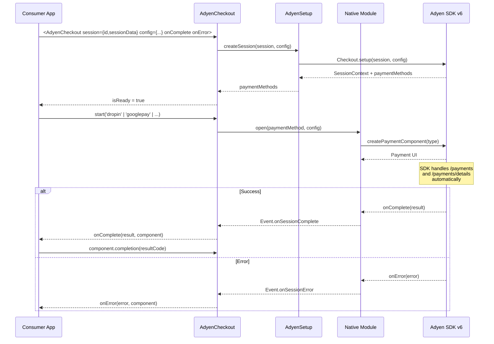
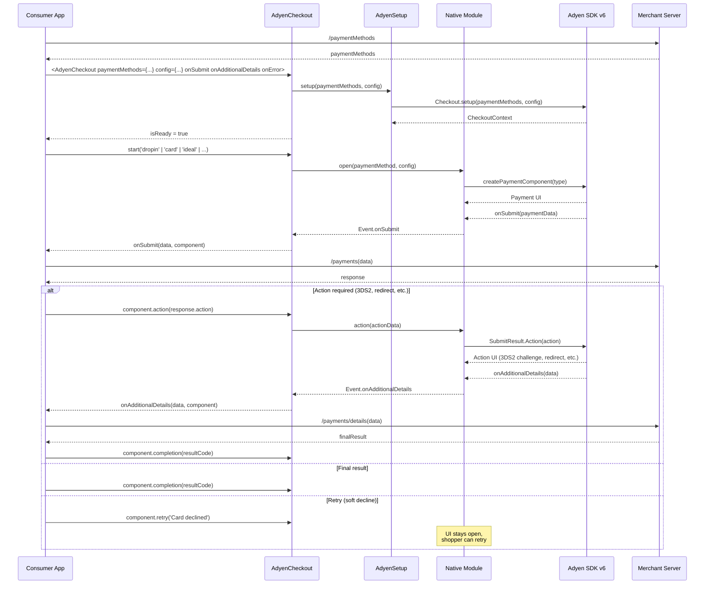
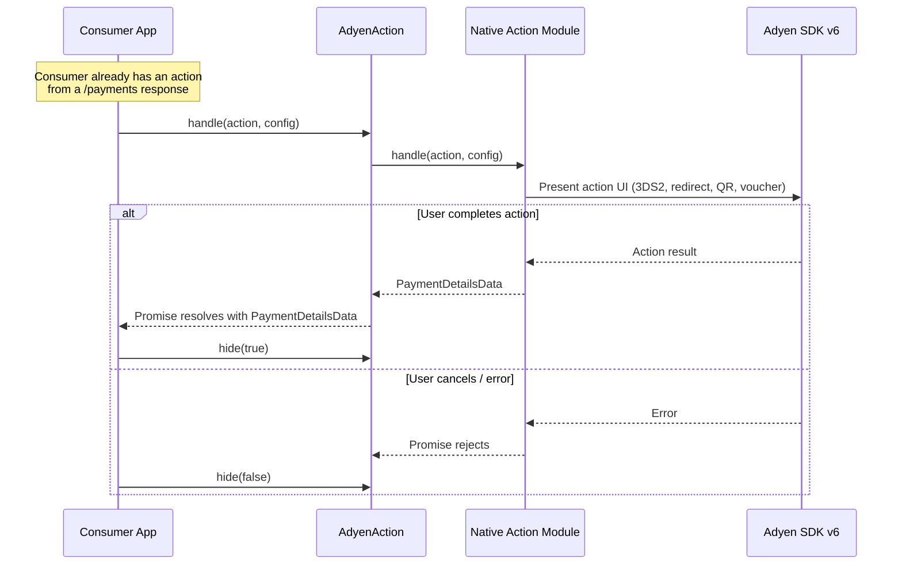
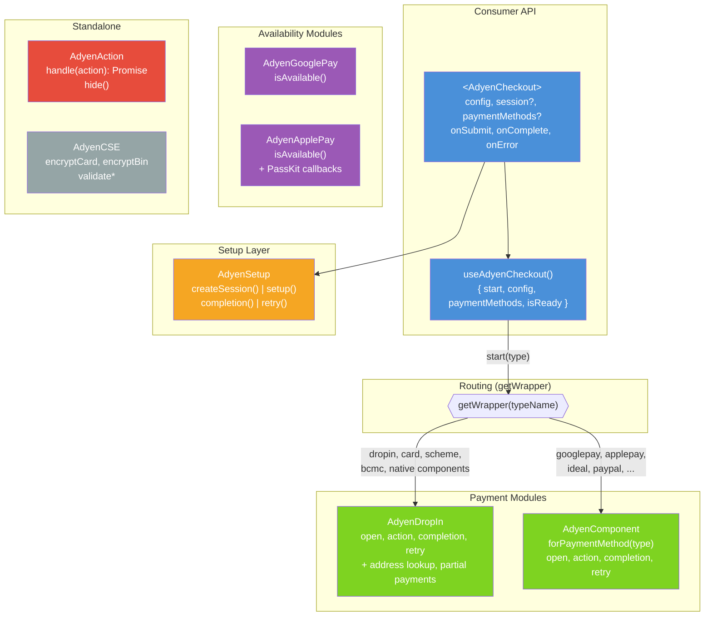

# React Native SDK v6 - Public API Flows

## Sessions Flow

```mermaid
sequenceDiagram
    participant App as Consumer App
    participant AC as AdyenCheckout
    participant Setup as AdyenSetup
    participant Native as Native Module
    participant SDK as Adyen SDK v6

    App->>AC: <AdyenCheckout session={id,sessionData} config={...} onComplete onError>
    AC->>Setup: createSession(session, config)
    Setup->>SDK: Checkout.setup(session, config)
    SDK-->>Setup: SessionContext + paymentMethods
    Setup-->>AC: paymentMethods
    AC-->>App: isReady = true

    App->>AC: start('dropin' | 'googlepay' | ...)
    AC->>Native: open(paymentMethod, config)
    Native->>SDK: createPaymentComponent(type)
    SDK-->>Native: Payment UI

    Note over SDK: SDK handles /payments<br/>and /payments/details<br/>automatically

    alt Success
        SDK-->>Native: onComplete(result)
        Native-->>AC: Event.onSessionComplete
        AC-->>App: onComplete(result, component)
        App->>AC: component.completion(resultCode)
    else Error
        SDK-->>Native: onError(error)
        Native-->>AC: Event.onSessionError
        AC-->>App: onError(error, component)
    end
```

## Advanced Flow

```mermaid
sequenceDiagram
    participant App as Consumer App
    participant AC as AdyenCheckout
    participant Setup as AdyenSetup
    participant Native as Native Module
    participant SDK as Adyen SDK v6
    participant Server as Merchant Server

    App->>Server: /paymentMethods
    Server-->>App: paymentMethods

    App->>AC: <AdyenCheckout paymentMethods={...} config={...} onSubmit onAdditionalDetails onError>
    AC->>Setup: setup(paymentMethods, config)
    Setup->>SDK: Checkout.setup(paymentMethods, config)
    SDK-->>Setup: CheckoutContext
    AC-->>App: isReady = true

    App->>AC: start('dropin' | 'card' | 'ideal' | ...)
    AC->>Native: open(paymentMethod, config)
    Native->>SDK: createPaymentComponent(type)
    SDK-->>Native: Payment UI

    SDK-->>Native: onSubmit(paymentData)
    Native-->>AC: Event.onSubmit
    AC-->>App: onSubmit(data, component)

    App->>Server: /payments(data)
    Server-->>App: response

    alt Action required (3DS2, redirect, etc.)
        App->>AC: component.action(response.action)
        AC->>Native: action(actionData)
        Native->>SDK: SubmitResult.Action(action)
        SDK-->>Native: Action UI (3DS2 challenge, redirect, etc.)
        SDK-->>Native: onAdditionalDetails(data)
        Native-->>AC: Event.onAdditionalDetails
        AC-->>App: onAdditionalDetails(data, component)
        App->>Server: /payments/details(data)
        Server-->>App: finalResult
        App->>AC: component.completion(resultCode)
    else Final result
        App->>AC: component.completion(resultCode)
    else Retry (soft decline)
        App->>AC: component.retry('Card declined')
        Note over Native: UI stays open,<br/>shopper can retry
    end
```

## Actions Flow (Standalone)

```mermaid
sequenceDiagram
    participant App as Consumer App
    participant Action as AdyenAction
    participant Native as Native Action Module
    participant SDK as Adyen SDK v6

    Note over App: Consumer already has an action<br/>from a /payments response

    App->>Action: handle(action, config)
    Action->>Native: handle(action, config)
    Native->>SDK: Present action UI (3DS2, redirect, QR, voucher)

    alt User completes action
        SDK-->>Native: Action result
        Native-->>Action: PaymentDetailsData
        Action-->>App: Promise resolves with PaymentDetailsData
        App->>Action: hide(true)
    else User cancels / error
        SDK-->>Native: Error
        Native-->>Action: Promise rejects
        App->>Action: hide(false)
    end
```

## Module Architecture

```mermaid
graph TB
    subgraph "Consumer API"
        AC["&lt;AdyenCheckout&gt;<br/>config, session?, paymentMethods?<br/>onSubmit, onComplete, onError"]
        Hook["useAdyenCheckout()<br/>{ start, config, paymentMethods, isReady }"]
    end

    subgraph "Setup Layer"
        Setup["AdyenSetup<br/>createSession() | setup()<br/>completion() | retry()"]
    end

    subgraph "Payment Modules"
        DropIn["AdyenDropIn<br/>open, action, completion, retry<br/>+ address lookup, partial payments"]
        Component["AdyenComponent<br/>forPaymentMethod(type)<br/>open, action, completion, retry"]
    end

    subgraph "Availability Modules"
        GooglePay["AdyenGooglePay<br/>isAvailable()"]
        ApplePay["AdyenApplePay<br/>isAvailable()<br/>+ PassKit callbacks"]
    end

    subgraph "Standalone"
        ActionMod["AdyenAction<br/>handle(action): Promise<br/>hide()"]
        CSE["AdyenCSE<br/>encryptCard, encryptBin<br/>validate*"]
    end

    subgraph "Routing (getWrapper)"
        Router{{"getWrapper(typeName)"}}
    end

    AC --> Hook
    AC --> Setup
    Hook -->|"start(type)"| Router
    Router -->|"dropin, card, scheme,<br/>bcmc, native components"| DropIn
    Router -->|"googlepay, applepay,<br/>ideal, paypal, ..."| Component

    style AC fill:#4a90d9,color:#fff
    style Hook fill:#4a90d9,color:#fff
    style Setup fill:#f5a623,color:#fff
    style DropIn fill:#7ed321,color:#fff
    style Component fill:#7ed321,color:#fff
    style GooglePay fill:#9b59b6,color:#fff
    style ApplePay fill:#9b59b6,color:#fff
    style ActionMod fill:#e74c3c,color:#fff
    style CSE fill:#95a5a6,color:#fff
```
