# Public API Flows

Chronological sequences for the `@adyen/react-native` v6-alpha bridge: setup, the session and
advanced presenters, embedded and headless submission, Drop-in, and the standalone action. This
document owns chronology only. For the lifecycle contract see [Architecture.md](./Architecture.md),
for the TypeScript layer [js-architecture.md](./js-architecture.md), for the native bridges
[native-architecture.md](./native-architecture.md), and for capability status
[FeatureSupport.md](./FeatureSupport.md).

> [!NOTE]
> These sequences describe current behavior in source. Unsupported and legacy-backed branches end
> at the outcome they actually reach today, not at an intended design. Every platform/presenter
> status used here matches [FeatureSupport.md](./FeatureSupport.md); the diagrams do not depict a
> successful flow for a path that is unsupported.

## Participants

| Alias     | Real object                                                                                                                     |
| --------- | ------------------------------------------------------------------------------------------------------------------------------- |
| App       | The merchant's React code                                                                                                       |
| AC        | `AdyenCheckout` static class (`src/checkout/AdyenCheckout.ts`)                                                                  |
| NC        | `NativeCheckout` = `ContextModuleWrapper` (`src/modules/context/ContextModuleWrapper.ts`)                                       |
| Ctx       | Native `ContextModule` (`@objc(AdyenCheckout)` / `android/src/main/java/com/adyenreactnativesdk/component/ContextModule.kt`)    |
| Mgr       | Android `ComponentManager` (`android/src/main/java/com/adyenreactnativesdk/component/base/ComponentManager.kt`)                 |
| Sink      | iOS `AdvancedResultSink` (`ios/Components/Base/AdvancedResultSink.swift`)                                                       |
| SDK       | The v6 native checkout SDK                                                                                                      |
| Server    | The merchant's payments backend                                                                                                 |
| DropInMod | Native `DropInModule` (`@objc(AdyenDropIn)` / `android/src/main/java/com/adyenreactnativesdk/component/dropin/DropInModule.kt`) |
| ActionMod | Native `ActionModule` (`@objc(AdyenAction)` / `android/src/main/java/com/adyenreactnativesdk/cse/ActionModule.kt`)              |

## Setup

### Session setup

For a clean initial runtime, `AdyenCheckout.setup(session, configuration, callbacks)` validates
before it mutates any state, wires the process-wide JS runtime and native listeners **before**
`NativeCheckout.createSession`, lets native setup resolve the payment methods, and creates the
`Checkout` handle last.

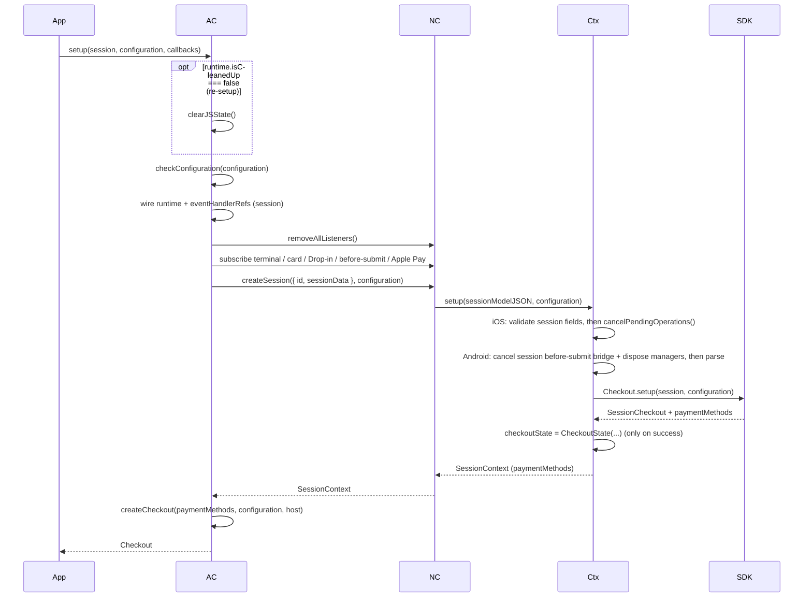

Source order: `checkConfiguration` runs first (`src/checkout/AdyenCheckout.ts`, `setup`), then the
runtime fields, `wireEventHandlerRefs`, `NativeCheckout.removeAllListeners()`, the session terminal
/ card / Drop-in / before-submit / Apple Pay subscriptions, then `await
NativeCheckout.createSession(...)`, and finally `createCheckout(...)`. `createSession` maps to
`ContextNativeModule.setup` (`ContextModuleWrapper.createSession`), whose native body assigns
`BaseModule.checkoutState` only after `Checkout.setup(...)` succeeds
(`ContextModule.setupSessionAsync` on Android; `ContextModule.setup` on iOS). The native preamble is
path-specific: iOS validates the session fields (`id`/`sessionData`) before it calls
`cancelPendingOperations()`, so malformed session input rejects before cancellation, whereas Android
`setupSessionAsync` cancels the old `SessionBeforeSubmitBridge` and disposes managers **before**
parsing the session/configuration input. No presenter or merchant payment callback runs before the
handle returns.

### Advanced setup

`AdyenCheckout.setupAdvanced(paymentMethods, configuration, callbacks)` validates both the
configuration and the merchant-supplied payment-methods response before touching state, wires the
runtime and listeners before `NativeCheckout.setup`, and returns the handle last.

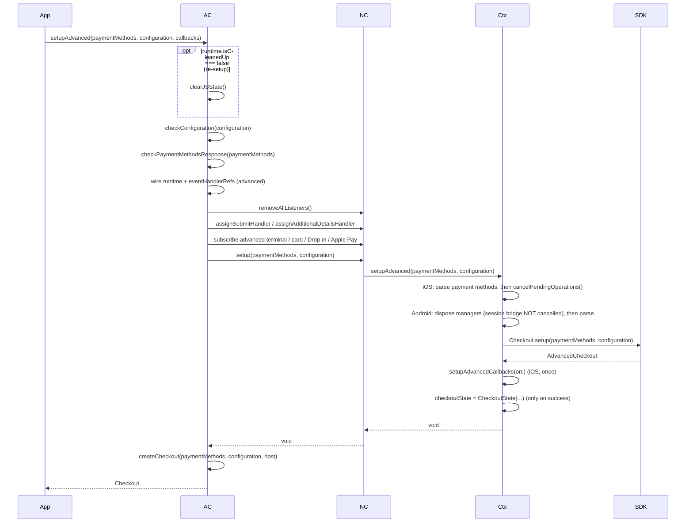

Source order: `checkConfiguration` then `checkPaymentMethodsResponse` (the advanced flow is the only
entry point that receives payment methods from the merchant), then the runtime fields and
`wireEventHandlerRefs`, then `NativeCheckout.removeAllListeners()`, `assignSubmitHandler`,
`assignAdditionalDetailsHandler`, the advanced terminal / card / Drop-in / Apple Pay subscriptions,
then `await NativeCheckout.setup(...)` (which maps to `ContextNativeModule.setupAdvanced` through
`ContextModuleWrapper.setup`), and finally `createCheckout(...)`. On iOS the advanced closures are
wired exactly once in `setupAdvancedCallbacks(on:)`; on both platforms `checkoutState` is assigned
only when `Checkout.setup(...)` succeeds. The native preamble is path-specific: iOS parses the
payment methods before it calls `cancelPendingOperations()`, so malformed payment methods reject
before cancellation, whereas Android `setupAdvancedAsync` disposes managers **before** parsing and
does **not** cancel the existing `SessionBeforeSubmitBridge`.

### Re-setup

When a setup call runs while a checkout is still active (`runtime.isCleanedUp === false`), the very
first step is `clearJSState()` — before any validation. It removes JS subscriptions and listeners
and clears callbacks/configuration but deliberately does **not** call `NativeCheckout.cleanup()`;
the native side replaces its own state when the new setup reaches it. See the failed-setup section
below for what a rejection leaves behind, and
[Architecture.md](./Architecture.md#re-setup-clears-js-state-without-native-cleanup) for the
contract.

### Failed setup and mixed state

During an active re-setup, `setup()`/`setupAdvanced()` have three distinct rejection points — JS
validation, native input parsing, and native SDK setup — and each leaves observable mixed state
because `clearJSState()` has already run and native state is replaced only on success.

```mermaid
sequenceDiagram
  participant App
  participant AC
  participant NC
  participant Ctx
  participant SDK

  App->>AC: setup() / setupAdvanced() while active
  AC->>AC: clearJSState() (listeners gone, old handle deactivated)
  alt JS validation rejection
    AC->>AC: checkConfiguration / checkPaymentMethodsResponse throws
    AC-->>App: rejects (no native call, no new handle)
    Note over Ctx,SDK: native checkoutState untouched; no preamble ran
  else native input parsing rejection
    AC->>AC: wire new runtime + listeners
    AC->>NC: createSession() / setup()
    NC->>Ctx: setup / setupAdvanced
    Note over Ctx: iOS parses session fields / payment methods BEFORE cancelPendingOperations()
    Note over Ctx: Android session cancels bridge + disposes managers, advanced disposes managers (no bridge cancel), THEN parses
    Ctx-->>NC: reject (malformed input)
    NC-->>AC: reject
    AC-->>App: rejects (no new handle)
    Note over Ctx,SDK: previous checkoutState remains (assigned only on success)
  else native SDK setup rejection
    AC->>AC: wire new runtime + listeners
    AC->>NC: createSession() / setup()
    NC->>Ctx: setup / setupAdvanced
    Ctx->>Ctx: preamble (per platform/path above)
    Ctx->>SDK: Checkout.setup(...)
    SDK-->>Ctx: Result.Error / throws
    Ctx-->>NC: reject
    NC-->>AC: reject
    AC-->>App: rejects (no new handle)
    Note over Ctx,SDK: previous checkoutState remains (assigned only on success)
  end
  Note over App,Ctx: an old globally backed handle can still consult<br/>or invalidate() the resulting mixed state
```

JS validation rejection happens after `clearJSState()` and before any native call, so JS listeners
are gone and existing handles are deactivated but no native preamble runs. The two native branches
differ by platform and path. iOS parses the session fields or advanced payment methods **before**
`cancelPendingOperations()`, so a native input-parsing rejection precedes cancellation. Android
session setup cancels the old `SessionBeforeSubmitBridge` and disposes managers before parsing;
Android advanced setup disposes managers before parsing but does **not** cancel that bridge. A later
native SDK setup rejection happens after the applicable preamble. Because native assignment only
happens on success, every native rejection branch leaves the previous `checkoutState` in place and
returns no new handle. An older handle reads the process-wide host, so it can still `isAvailable()`,
`submit()`, or `invalidate()` against the mixed state — see
[Architecture.md](./Architecture.md#setup-rejection-and-failed-replacement).

## Session flow

Session support covers the embedded `<AdyenComponent>` and headless `checkout.submit(type)`
presenters (see [FeatureSupport.md](./FeatureSupport.md)). The native **session** checkout owns
`/payments` and `/payments/details`; the merchant does not run those calls in the session flow.

### Before-submit

The only session callback that suspends native work is the optional `onBeforeSubmit`. Native
suspends on a continuation and emits the event before JS runs; JS awaits the optional callback,
defaults its absence to `BeforeSubmitResult.proceed(data)`, and forwards the result through
`provideBeforeSubmitResult`. Native then continues with proceed or abort before the SDK submits.

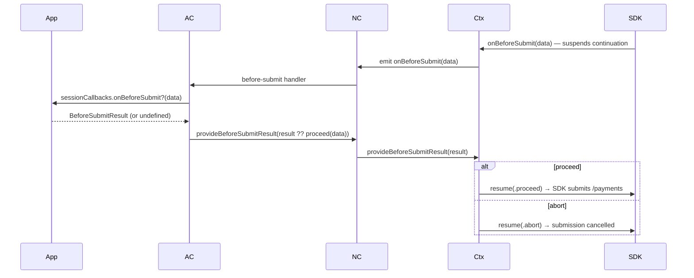

Source: the session `assignBeforeSubmitHandler` in `AdyenCheckout.setup` awaits
`sessionCallbacks?.onBeforeSubmit?.(data)` and calls `NativeCheckout.provideBeforeSubmitResult(result
?? BeforeSubmitResult.proceed(data))`. Native suspension is
`ContextModule.awaitBeforeSubmitResult` through `beforeSubmitBridge` (iOS) and
`SessionBeforeSubmitBridge.onBeforeSubmit` (Android); `provide` resumes the continuation. If the
merchant `onBeforeSubmit` throws or rejects, JS sends no result, so the before-submit continuation
stays pending until cancellation delivers its fallback (`abort`) — see
[native-architecture.md](./native-architecture.md#suspended-callback-cleanup-fallbacks).

### Session terminal

Session success delivers exactly one `onComplete(SessionsResult)` and session failure exactly one
`onError(AdyenError)` through the session error event. In both cases cleanup follows the callback
even if it throws.

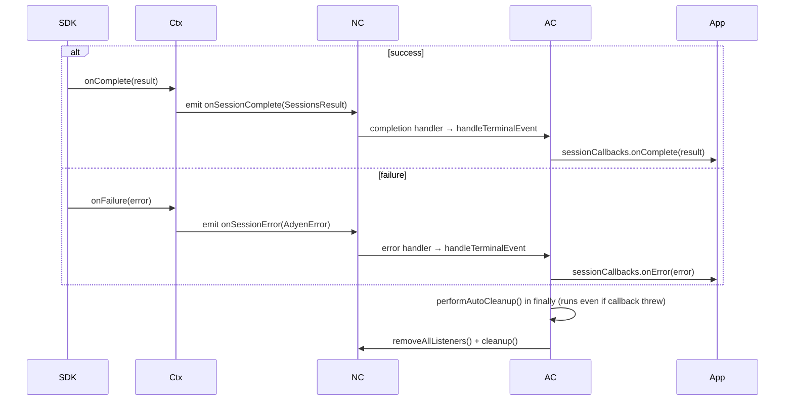

Source: `subscribeSessionTerminalHandlers` routes `assignCompletionHandler`
(`Event.onSessionComplete`) and `assignErrorHandler` (`Event.onSessionError`) through
`handleTerminalEvent`, which guards `hasHandledTerminalEvent`, runs the callback, then calls
`performAutoCleanup()` in a `finally`. The advanced error event and any duplicate or pre-callback
cleanup are not part of this path.

## Advanced flow

Advanced support covers the v6 context/embedded/headless presenters. Android **legacy Drop-in** is a
separate implementation with its own result/task lifecycle and is excluded here (see the Drop-in
section).

### Submit

Native `onSubmit` suspends before the event is emitted. The wrapper adds the configured `returnUrl`
only if the payload lacks one, and the merchant `onSubmit` performs `/payments`. The returned
`SubmitResult` dispatches to native `action`, `completion`, or `retry`, which resolves the suspended
submit continuation.

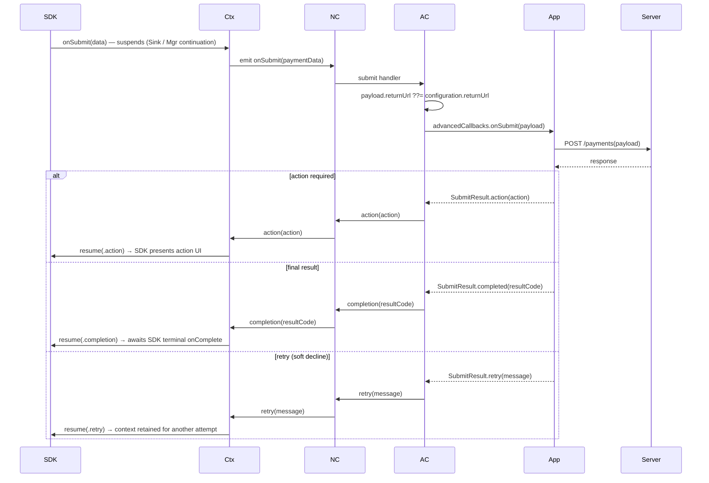

Source: `assignSubmitHandler` in `setupAdvanced` builds `{ ...paymentData, returnUrl:
paymentData.returnUrl ?? configuration.returnUrl }`, awaits `advancedCallbacks?.onSubmit(payload)`,
and — only if a result is returned — calls `dispatchSubmitResult`, which maps `action`/`completed`/
`retry` to `NativeCheckout.action`/`completion`/`retry`. Native resumes the suspended continuation:
`ContextModule.action/completion/retry` on the awaiting `AdvancedResultSink` (iOS) or the
`awaitingManager()` continuation (Android). None of the three branches is a direct SDK server call
and none triggers premature JS cleanup. `completed` awaits the SDK's later terminal `onComplete`;
`retry` retains the checkout context for another attempt.

### Additional details

If the merchant returned an action, the SDK later invokes `onAdditionalDetails`, which suspends
before its event is emitted. The merchant performs `/payments/details` and the completed result
dispatches to native `completion`, resolving that continuation before the later terminal callback.

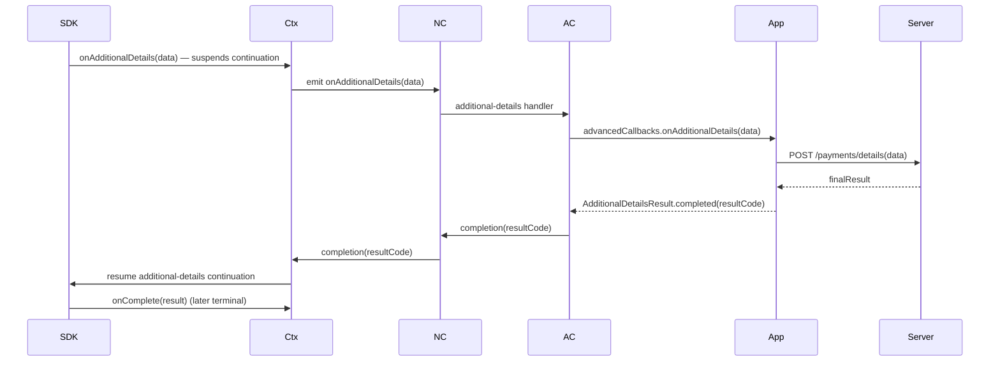

Source: `assignAdditionalDetailsHandler` awaits `advancedCallbacks?.onAdditionalDetails(data)` and,
only if a result is returned, calls `NativeCheckout.completion(result.resultCode)`. On iOS a bare
`completion` resolves `resultSink.additionalDetails` when it is the awaiting bridge; on Android
`ComponentManager.completion` resumes `additionalDetailsContinuation` when no submit is pending.

### Missing or rejected intermediate result

If the advanced `onSubmit` or `onAdditionalDetails` callback returns no result, throws, or rejects,
no fallback native command is sent and the continuation stays pending until cancellation. The same
holds for a session `onBeforeSubmit` that throws or rejects.

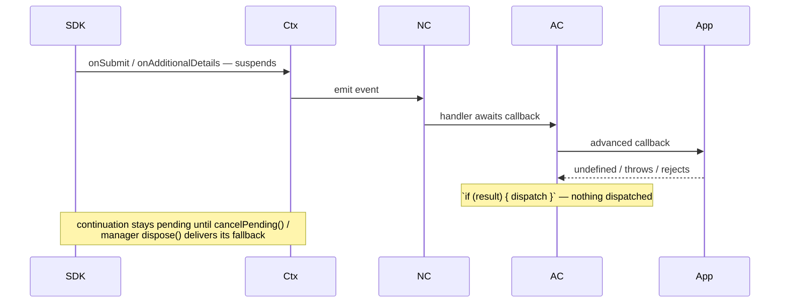

Source: both advanced handlers guard on `if (result)` before dispatching, so an absent, thrown, or
rejected result sends nothing. The suspended continuation is only settled later by re-setup or
terminal/`invalidate()` cleanup, which delivers the platform-specific fallback value documented in
[native-architecture.md](./native-architecture.md#suspended-callback-cleanup-fallbacks).

### Advanced terminal and abandonment

Advanced success and failure each deliver exactly one terminal merchant callback, followed — even if
the callback throws — by listener/subscription removal, native context cleanup, callback/config
clearing, and deactivation.

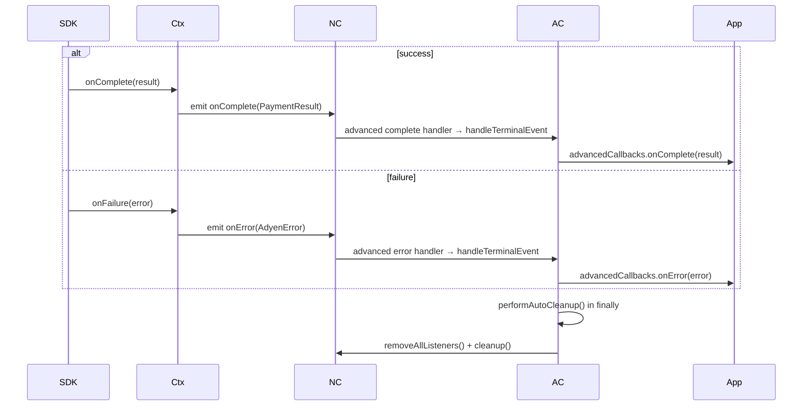

When a flow is abandoned and no terminal callback will fire, the consumer calls
`checkout.invalidate()`.

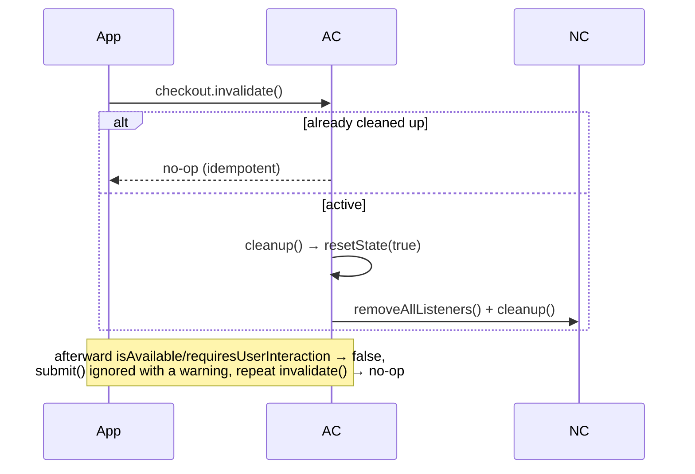

Source: `subscribeAdvancedTerminalHandlers` routes `assignAdvancedCompleteHandler` (`Event.onComplete`)
and `assignAdvancedErrorHandler` (`Event.onError`) through `handleTerminalEvent`. `invalidate()`
delegates to `host.invalidate()` → `AdyenCheckout.cleanup()`, which returns early when already
cleaned up; both terminal and invalidate paths converge on `resetState(true)`, the only path that
calls `NativeCheckout.cleanup()`. After teardown, `createCheckout`'s `isActive()` guard warns and
ignores `submit()` and resolves the query methods to `false`.

## Embedded component

An embedded flow starts with a `Checkout` that already exists. `<AdyenComponent>` renders the native
Fabric view first and then, in a `useEffect`, applies the process-wide `activeComponentTypes`
duplicate check. There is no pre-mount native-creation guard, and no checkout-wide interaction
guarantee for a same-type duplicate.

```mermaid
sequenceDiagram
  participant App
  participant View as AdyenComponent
  participant Ctx
  participant Mgr
  participant SDK

  App->>View: render <AdyenComponent checkout type />
  View->>View: commit NativeAdyenComponentView
  View->>View: useEffect: throw if activeComponentTypes.has(type), else add
  Note over View,Ctx: native view registers with ComponentModule + routing
  alt Android
    View->>Ctx: registerManager(type, ComponentManager)
    Note over Mgr: pre-emission suspension; emits via its own MessageBus;<br/>action/completion/retry routed by awaitingManager()
  else iOS
    Note over Ctx,SDK: setup-time checkout-wide closures + one AdvancedResultSink;<br/>ComponentProxy owns a component, wires no callbacks
  end
  App->>View: unmount
  View->>Ctx: dispose view registration/controller only (checkout untouched)
```

Source: `AdyenComponent.tsx` returns the `<NativeAdyenComponentView>` and the duplicate guard lives
in a `useEffect` that throws on a mounted same-`type` view and deletes the type on unmount — so the
check is process-wide, not checkout-bound, and runs after commit. On Android
`AdyenComponentViewState.renderView` builds a per-view `MessageBus`, registers the view's
`ComponentManager` with `ContextModule.registerManager(type, manager)`, and the manager suspends
before emitting (`ComponentManager.advancedCallbacks`); routing uses `awaitingManager()`. On iOS the
advanced closures are wired once at setup and `ComponentProxy` only owns a payment component
(`createPaymentComponent(for:)`) — it wires no callbacks and carries no presenter tag. Unmount
(`dispose` on Android, `prepareForRecycle`/`proxy.dispose()` on iOS) disposes only that view's native
registration and controller; the checkout is untouched. The routing detail is in
[native-architecture.md](./native-architecture.md#continuation-ownership-and-routing).

## Headless submit

Headless submission drives the one active checkout with no `<AdyenComponent>` mounted. Availability
is `false` when there is no checkout; unknown or absent types fail during controller creation; Apple
Pay is unavailable on Android and Google Pay on iOS. On Android, Google Pay is `false` without a
matching payment method; with one, the current TODO availability helper returns `true`
unconditionally rather than checking the device.

```mermaid
sequenceDiagram
  participant App
  participant Chk as Checkout
  participant NC as NativeCheckout (ContextModuleWrapper)
  participant Ctx as ContextModule (native)
  participant SDK

  Note over Chk: createCheckout guards isAvailable(), requiresUserInteraction(), and submit() with isActive();<br/>inactive → queries resolve false, submit is an ignored no-op

  App->>Chk: checkout.isAvailable(type)
  alt no active checkout
    Chk-->>App: false
  else active
    Chk->>NC: NativeCheckout.isAvailable(type)
    NC->>Ctx: this.nativeModule.isAvailable(type)
    Note over Ctx: Apple Pay → false on Android; Google Pay → false on iOS;<br/>Android Google Pay: matching method required, then TODO helper → true
    Ctx-->>App: boolean
  end

  App->>Chk: checkout.requiresUserInteraction(type)
  Chk->>NC: NativeCheckout.requiresUserInteraction(type)
  NC->>Ctx: this.nativeModule.requiresUserInteraction(type)
  Ctx->>Ctx: resolveController(type) get-or-create + cache
  alt unknown / absent type
    Ctx-->>App: reject (NoPaymentMethod / invalidPaymentMethods)
  else resolved
    Ctx-->>App: controller.requiresUserInteraction()
  end

  App->>Chk: checkout.submit(type)
  Chk->>NC: NativeCheckout.submit(type)
  NC->>Ctx: this.nativeModule.submit(type) — reuse or create cached controller
  alt Android
    Ctx->>Ctx: CheckoutFragment.show(autoSubmit = true) as action host
    Ctx->>SDK: controller.submit()
    Note over Ctx: fragment hidden terminally (onTerminal);<br/>shopper closes it → Canceled() + unregisterManager(type)
  else iOS
    Ctx->>SDK: component.submit()
    Note over Ctx,SDK: action UI presented via presentation delegate +<br/>presenterStack only when the SDK requests it
  end
```

Source: `createCheckout` guards `isAvailable()`, `requiresUserInteraction()`, and `submit()` with
`isActive()` before they delegate to the `NativeCheckout` singleton — which is `new
ContextModuleWrapper(NativeModules.AdyenCheckout)` — whose
`isAvailable`/`requiresUserInteraction`/`submit` methods forward to `this.nativeModule`, the native
`ContextModule`. `createCheckout` returns `false` from `isAvailable`/`requiresUserInteraction` when
the host is inactive. In contrast, `invalidate()` calls `host.invalidate()` directly; the host cleanup
is idempotent, so repeated or late invalidation is a silent no-op. On Android
`ContextModule.isAvailable` resolves `false` for `applepay`, runs
`GooglePayAvailability.isAvailable` for Google Pay keys only after `hasPaymentMethod` succeeds.
That helper is currently a TODO stub returning `true` unconditionally, not a device-capability check;
otherwise it checks `hasPaymentMethod`;
`requiresUserInteraction` rejects `NoPaymentMethod` when `resolveController` returns null; `submit`
presents an auto-submit `CheckoutFragment` (`CheckoutFragment.show(autoSubmit = true)`) as an action
host, `onTerminal` hides it, and `onCancelled` maps to `ModuleException.Canceled()` plus
`unregisterManager(type)` (which disposes the manager). On iOS `isAvailable` resolves `false` for
Google Pay and gates Apple Pay on `PKPaymentAuthorizationViewController.canMakePayments()`;
`submit` calls `resolveComponent(...).submit()` and presents through the module's presentation
delegate and `presenterStack` only when the SDK requests it — there is no invented fragment. The
generic v6 continuation retention above does not apply to legacy Drop-in.

## Drop-in

Drop-in support is uneven; [FeatureSupport.md](./FeatureSupport.md) is the authority. Each branch
below ends at the outcome it reaches today.

### iOS Drop-in (session and advanced) — unsupported

```mermaid
sequenceDiagram
  participant App
  participant DropIn as AdyenDropIn
  participant DropInMod
  participant NC
  participant AC

  App->>DropIn: start(checkout)
  DropIn->>DropInMod: start(paymentMethods)
  DropInMod->>DropInMod: sendError(ModuleException.notSupported) → emits fail / failSession
  Note over DropInMod,NC: emitted on the global RCTDeviceEventEmitter, keyed by event name
  NC->>AC: terminal error handler → handleTerminalEvent
  AC->>App: callbacks.onError(notSupported)
  AC->>AC: performAutoCleanup() → NativeCheckout.cleanup()
  Note over App,AC: no presentation; merchant onError runs and context cleanup follows
```

Source: iOS `DropInModule.start(_:)` and `action(_:)` call `sendError(error:
ModuleException.notSupported)` and never present. The inherited `BaseModuleSender.sendError` emits
`failSession` (session) or `fail` (advanced). Although `AdyenCheckout`'s Drop-in subscriptions
(`startDropInEventListeners`) subscribe only the `addressLookup` and `dropIn` families — not `core` —
React Native routes native events **by name** through the global `RCTDeviceEventEmitter`, so the
checkout terminal error listener wired by `ContextModuleWrapper` (`assignErrorHandler` /
`assignAdvancedErrorHandler`) receives the error, runs the merchant `onError` through
`handleTerminalEvent`, and `performAutoCleanup()` tears down the context. No presentation occurs.

### Android session Drop-in — unsupported

```mermaid
sequenceDiagram
  participant App
  participant DropIn as AdyenDropIn
  participant DropInMod
  participant NC
  participant AC

  App->>DropIn: start(checkout)
  DropIn->>DropInMod: start(paymentMethods)
  DropInMod->>DropInMod: parse payment methods + build old configuration
  DropInMod->>DropInMod: startBackgroundService() — task started
  DropInMod->>DropInMod: sendError("Drop-in session flow not yet supported in v6 alpha")
  Note over DropInMod,NC: messageBus.onSessionException → session error event on the global channel
  NC->>AC: terminal error handler → handleTerminalEvent
  AC->>App: callbacks.onError(...)
  AC->>AC: performAutoCleanup() → NativeCheckout.cleanup() (ContextModule.cleanup)
  Note over DropInMod: launcher never presented; the background task is NOT finished by that cleanup
```

Source: `DropInModule.start` calls `startBackgroundService()` and then, when
`checkoutState?.isSession == true`, calls `sendError(ModuleException.Unknown("Drop-in session flow not
yet supported in v6 alpha"))` before any launcher presentation. `BaseModule.sendError` routes it
through `messageBus.onSessionException` to the session error event, which the global
`RCTDeviceEventEmitter` delivers to the checkout terminal error listener, so the merchant `onError`
runs and `ContextModule.cleanup()` tears down the context. That cleanup disposes managers and clears
checkout state but does **not** finish the Drop-in background task.

### Android advanced Drop-in legacy-backed

Android advanced Drop-in alone is legacy-backed: it converts to `com.adyen.checkout.dropin.old`
types and launches through `dropin.old.DropIn.startPayment` with an `AdvancedCheckoutService`. Its
compatibility configuration builder forwards only environment, client key, locale, and amount.

```mermaid
sequenceDiagram
  participant App
  participant DropIn as AdyenDropIn
  participant DropInMod
  participant Service as AdvancedCheckoutService
  participant AC
  participant Ctx
  participant Server

  App->>DropIn: start(checkout)
  DropIn->>DropInMod: start(paymentMethods)
  DropInMod->>DropInMod: buildOldCheckoutConfiguration (env, clientKey, locale, amount only)
  DropInMod->>DropInMod: startBackgroundService() — task started
  DropInMod->>DropInMod: dropin.old.DropIn.startPayment(..., AdvancedCheckoutService)
  Service->>AC: emit onSubmit / onAdditionalDetails via MessageBus
  AC->>Server: /payments or /payments/details
  Server-->>AC: response
  Note over AC: dispatchSubmitResult / details → NativeCheckout, i.e. ContextModule (NOT DropInModule)
  alt completion
    AC->>Ctx: completion(resultCode)
    Ctx->>Ctx: awaitingManager() = null → cleanup()
    Note over Ctx,Service: context torn down; legacy service NOT resolved, task NOT finished
  else action
    AC->>Ctx: action(actionMap)
    Ctx->>Ctx: awaitingManager() = null → logs "No pending payment is awaiting an action"
    Note over Ctx,Service: legacy service stalls (no result sent)
  else retry
    AC->>Ctx: retry(message)
    Ctx->>Ctx: awaitingManager() = null → no-op
    Note over Ctx,Service: legacy service stalls (no result sent)
  end
```

Only a direct call to the Drop-in module methods resolves the legacy service:

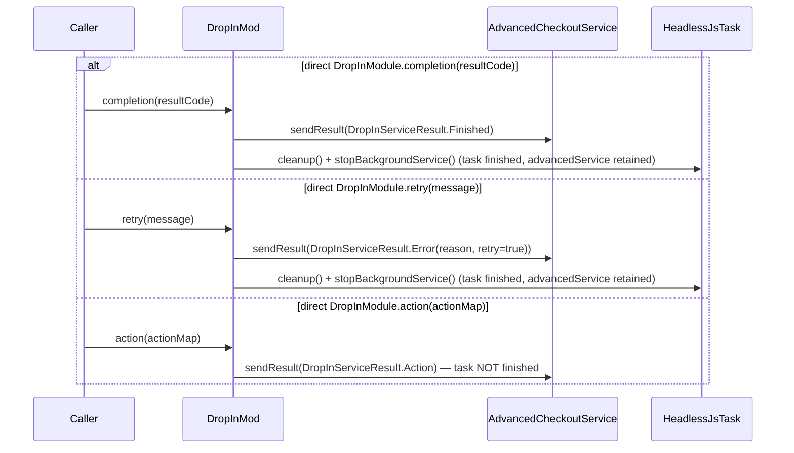

Source: `DropInModule.start` builds the old `CheckoutConfiguration` via
`buildOldCheckoutConfiguration` (which forwards only `environment`, `clientKey`, `shopperLocale`, and
`amount`), calls `startBackgroundService()`, then `startPayment(..., AdvancedCheckoutService::class.java)`.
`AdvancedCheckoutService` relays SDK callbacks to the shared `MessageBus`, and the merchant answers
through `AdyenCheckout`'s advanced handlers. Those results dispatch through `NativeCheckout`
(`dispatchSubmitResult` and the additional-details handler) to **`ContextModule`**, not `DropInModule`.
`ContextModule` finds no awaiting `ComponentManager` — Drop-in registers none — so `action` logs
"No pending payment is awaiting an action" and `retry` no-ops (both stall the legacy service), while
`completion` falls through to `ContextModule.cleanup()`, which disposes managers, clears consumers,
and clears `checkoutState` without sending the legacy `DropInServiceResult` or finishing the Drop-in
background task. Only a direct call to `DropInModule.completion()`/`retry()` sends the legacy
`DropInServiceResult.Finished`/`Error` and calls `cleanup()` + `stopBackgroundService()` — finishing
the task, though without nulling the retained `advancedService`; direct `DropInModule.action()` sends
`DropInServiceResult.Action` but does not finish the task.

### Legacy Drop-in task termination

Because `start()` begins the background task before the session unsupported guard and before the
old-launcher callbacks run, only a **direct** call to `DropInModule.completion()`/`retry()` finishes
that task. Normal return-based results never reach `DropInModule` — they route to `ContextModule`.

```mermaid
sequenceDiagram
  participant AC
  participant Ctx as ContextModule
  participant DropInMod
  participant Task as HeadlessJsTask
  participant Launcher as dropin.old launcher
  participant Handler as DropInCallbackHandler
  participant Bus as MessageBus

  DropInMod->>Task: startBackgroundService() (before session guard)
  alt session flow
    DropInMod->>DropInMod: sendError(unsupported) → global terminal error + context cleanup
    Note over Ctx,Task: context cleanup runs but the task is NOT finished
  else advanced flow
    DropInMod->>Launcher: startPayment(..., AdvancedCheckoutService)
    Launcher-->>Handler: cancellation / error / final-result callback
    Handler->>Bus: onException (cancel/error) / onFinished (final result)
    Bus-->>AC: global didFailCallback / didCompleteCallback event
    AC->>AC: merchant onError / onComplete (terminal)
    AC->>Ctx: handleTerminalEvent → context cleanup
    Note over DropInMod,Task: task still NOT finished (no stopBackgroundService())
    Note over AC,Ctx: normal return results route AC → ContextModule (not DropInMod)
    AC->>Ctx: action / retry → stall; completion → cleanup() (task NOT finished)
    Note over DropInMod: only DIRECT DropInModule.completion()/retry() → stopBackgroundService()
  end
```

Source: `startBackgroundService()` runs before the `isSession` branch in `start`. The old launcher's
terminal callbacks are globally observed: `DropInCallbackHandler.onDropInResult` maps
`CancelledByUser`/`Error`/null to `MessageBus.onException` and `Finished` to `MessageBus.onFinished`
(`DropInCallbackHandler.kt`). `AdvancedMessengerImpl` sends `onException` to `EventName.ERROR`
(`didFailCallback`) and `onFinished` to `EventName.COMPLETE_VOUCHER` (`didCompleteCallback`), the
same global events `ContextModuleWrapper` subscribes to for the advanced terminal callbacks. So a
launcher cancellation or error invokes the merchant `onError`, a final result invokes the merchant
`onComplete`, and either terminal callback runs `handleTerminalEvent` → context cleanup — yet none of
these paths calls `stopBackgroundService()`, so the Drop-in task still leaks. Normal advanced
return-based results dispatch through `NativeCheckout`/`ContextModule`, so `action`/`retry` do not
resolve the legacy service and `completion` reaches `ContextModule.cleanup()` (disposing managers and
clearing checkout state) without touching the Drop-in `taskId`. Only a direct
`DropInModule.completion()`/`retry()` call sends its legacy service result, clears checkout state, and
finishes the task.

## Standalone action

`AdyenAction.handle(action, configuration)` runs an action-only generated TurboModule with no
`AdyenCheckout` handle. It parses inputs, creates action-only native state, handles the action, and
settles only the promise owned by that invocation. A details result precedes the merchant's
`/payments/details`. `AdyenAction.hide()` is asynchronous and cancels the active action.

On pinned Android `6.0.0-alpha.1`, standalone `RedirectAction` is not a supported standalone
Action kind. It rejects asynchronously with `unsupportedCapability` before setup or presentation:
the published SDK provides no safe per-operation return-correlation hook. The rejection creates no
route, UI, browser launch, or retained Action owner and leaves the opaque provider URL unchanged.
The flow below applies to iOS and supported non-redirect Android Action kinds.

Standalone Action uses a **reject-overlap** policy on both platforms. While an action is active, a
second `handle` rejects with `actionBusy`; it never replaces the first operation. `hide()`, native
failure, host loss, and React context destruction reject the active `handle` promise once with
`cancelled` where applicable and release only Action-owned UI, controller, callbacks, and
references. They never read or mutate the checkout coordinator or an active payment operation.

```mermaid
sequenceDiagram
  participant App
  participant Action as AdyenAction
  participant ActionMod
  participant SDK
  participant Server

  App->>Action: handle(action, configuration)
  Action->>ActionMod: handle(action, configuration)
  ActionMod->>ActionMod: parse action + configuration
  alt parse / setup rejection
    ActionMod-->>App: promise rejects (no UI/state created — no hide() needed)
  else setup success
    ActionMod->>SDK: Checkout.setup(...) → handle(action)
    Note over ActionMod,SDK: Android presents CheckoutFragment explicitly;<br/>iOS presents UI only if handle(action:) requests it via delegate
    alt additional details
      SDK->>ActionMod: onAdditionalDetails(data)
      ActionMod-->>App: promise resolves with details
      App->>Server: POST /payments/details(data)
      Server-->>App: finalResult
      App->>Action: await hide()
    else iOS onComplete
      SDK->>ActionMod: onComplete(result)
      ActionMod-->>App: promise resolves with result-code object (iOS only)
      App->>Action: await hide()
    else failure after presentation
      SDK->>ActionMod: onFailure(error)
      ActionMod-->>App: promise rejects
      App->>Action: await hide()
    end
  end
```

Source: `ActionModuleWrapper` serializes action/configuration across the generated boundary and
parses only its own response. Native `handle` parses before reserving an operation, so parse/setup
failure creates no UI and needs no cleanup. After successful `Checkout.setup`, Android
(`android/src/main/java/com/adyenreactnativesdk/cse/ActionModule.kt`) presents its own
`CheckoutFragment`, while iOS (`ios/CSE/ActionModule.swift`) presents only when
`checkout.handle(action:)` requests it through the Action-owned presentation delegate.
`onAdditionalDetails` resolves that operation's promise with details on both platforms; iOS can
also resolve an `onComplete` result-code object. Late callbacks are ignored after cancellation,
completion, or host cleanup.

## Concurrent continuation ambiguity (Android)

On Android, embedded and headless managers can coexist and await results simultaneously. Because
continuation commands (`action`/`completion`/`retry`) carry no presenter identity, `awaitingManager()`
routes to the first awaiting entry in the type-keyed map; the flow makes no promise of deterministic
presenter routing.

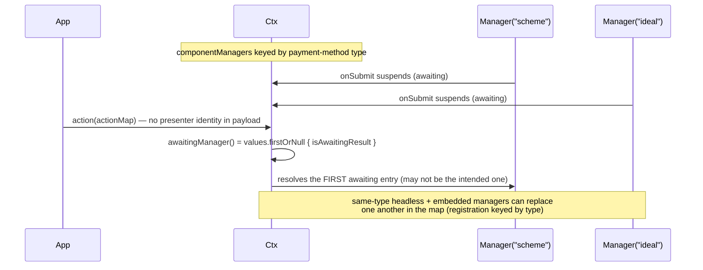

Source: `ContextModule.awaitingManager()` is `componentManagers.values.firstOrNull { it.isAwaitingResult
}`, and `action`/`completion`/`retry` carry only their payload. Registration is keyed by type
(`registerManager`, `resolveController`'s `getOrPut`), so a same-type headless and embedded manager
overwrite each other in the routing map. On iOS the analogous case is a second suspension of the same
callback kind superseding the first with the SDK error result (`AdvancedResultSink` / `CallbackBridge`).
See [native-architecture.md](./native-architecture.md#concurrent-routing-ambiguity) and
[FeatureSupport.md](./FeatureSupport.md).
