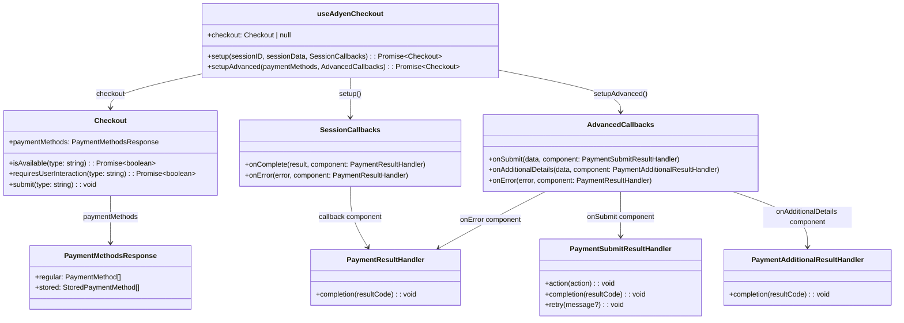
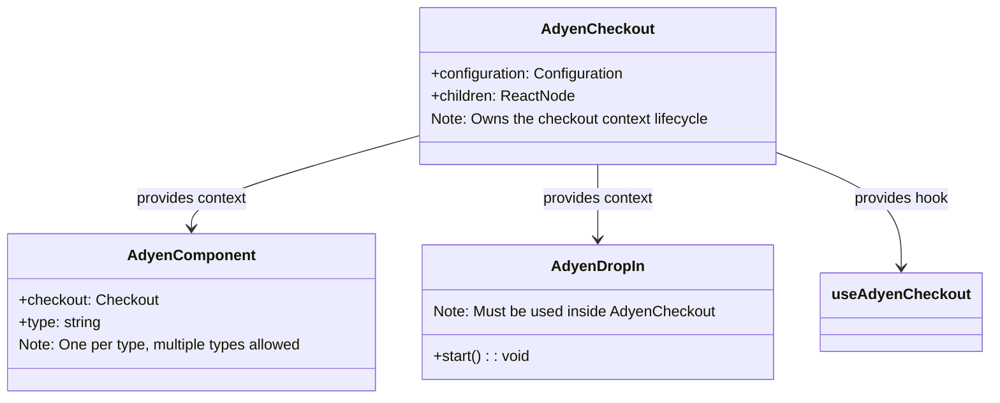
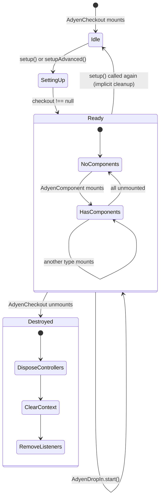
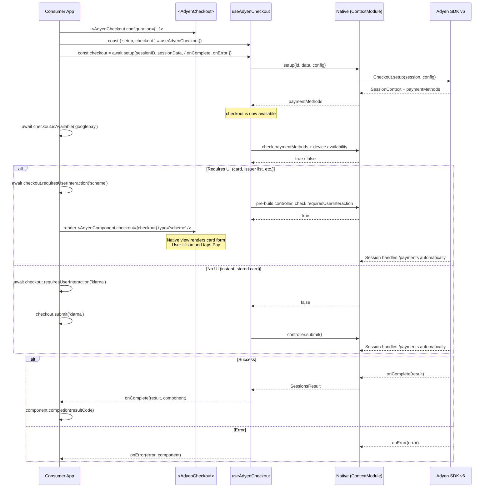
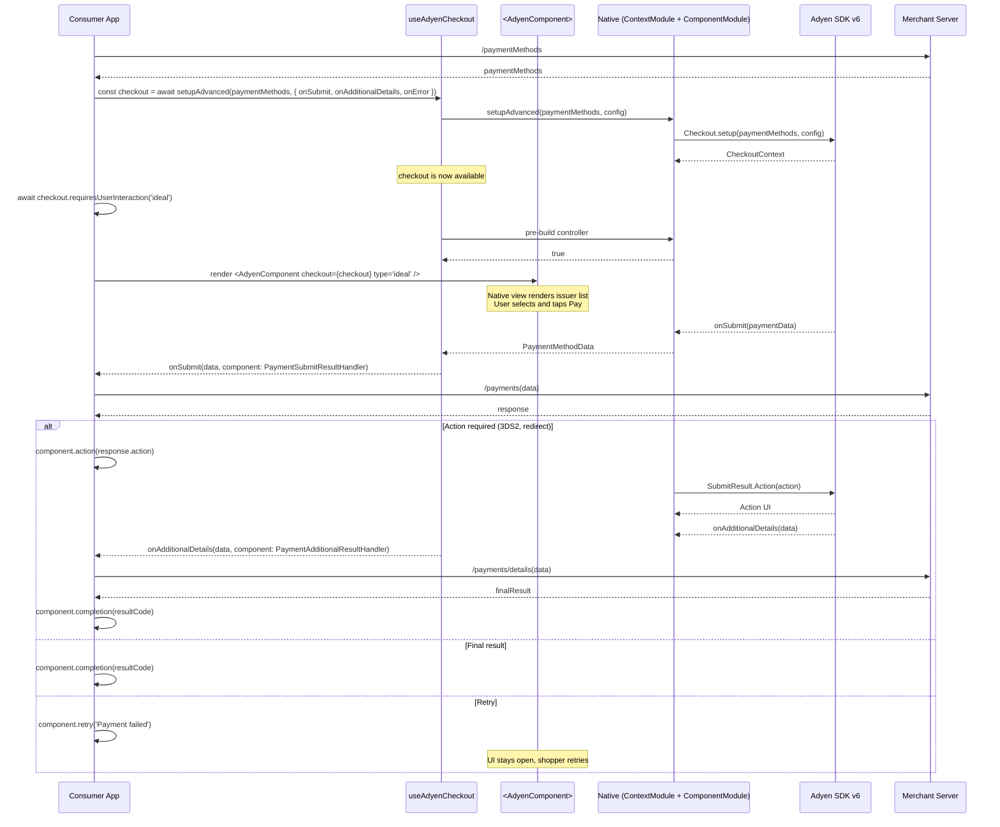
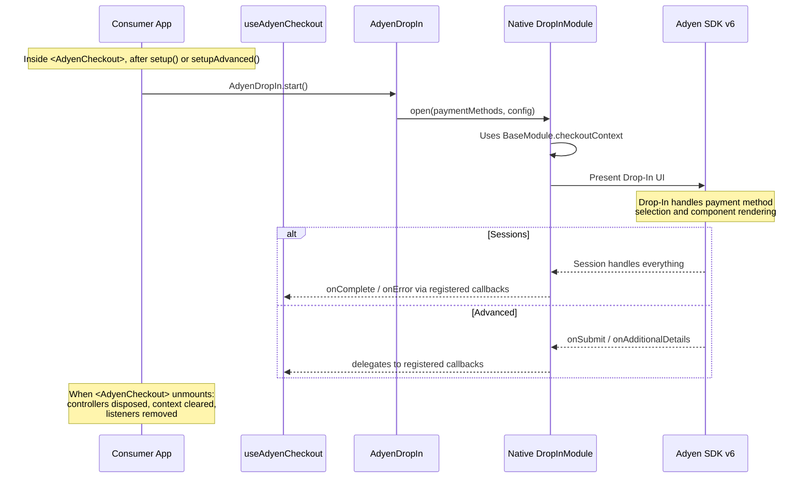
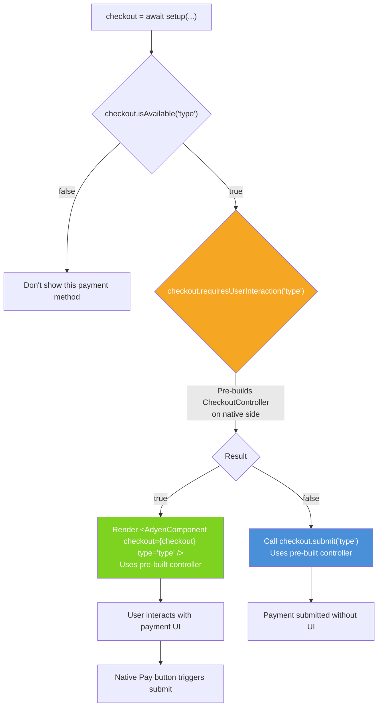

# React Native SDK v6 — Public API Proposal

## Hook API Surface



## Components & Lifecycle



## Context Lifecycle



**`<AdyenComponent>` mount/unmount behavior:**

| Event | What happens | checkoutContext affected? |
|-------|-------------|--------------------------|
| `<AdyenComponent>` **mounts** | Attaches event listeners, uses pre-built controller | No |
| `<AdyenComponent>` **unmounts** | Removes its listeners, disposes its controller | No |
| `<AdyenCheckout>` **unmounts** | Disposes ALL controllers, clears context, removes all listeners | **Yes — full teardown** |

> **Lifecycle invariant:** `BaseModule.checkoutContext` is owned by the `<AdyenCheckout>` provider.
> When the provider unmounts, native cleanup (`ContextModule.cleanup()`) tears down all controllers,
> clears the checkout context, and removes listeners. No checkout state survives the provider.
>
> Calling `setup()` or `setupAdvanced()` again implicitly cleans up the previous context first.
> `ContextModule.cleanup()` is internal; not exposed on the public hook API.
>
> **`<AdyenComponent>` unmount** only removes that component's event listeners and disposes its
> controller. It does NOT affect `BaseModule.checkoutContext` or other components.

## Sessions Flow



## Advanced Flow



## Drop-In Flow

> **Drop-In must be used inside `<AdyenCheckout>`** and relies on the shared checkout context
> created by `setup()` or `setupAdvanced()`. It uses `BaseModule.checkoutContext` which is
> tied to the `<AdyenCheckout>` lifecycle.



## `requiresUserInteraction` + Controller Pre-build



## Multiple Components Example

```
✅ Allowed — different types:

<AdyenCheckout configuration={config}>
  <AdyenComponent checkout={checkout} type="scheme" />      ← Card form
  <AdyenComponent checkout={checkout} type="applepay" />     ← Apple Pay button
  <AdyenComponent checkout={checkout} type="googlepay" />    ← Google Pay button
  <AdyenComponent checkout={checkout} type="ideal" />        ← Issuer list
</AdyenCheckout>

❌ Not allowed — duplicate type:

<AdyenCheckout configuration={config}>
  <AdyenComponent checkout={checkout} type="scheme" />
  <AdyenComponent checkout={checkout} type="scheme" />       ← Error: duplicate
</AdyenCheckout>
```

## Native Module Architecture

```
Native modules (renamed):
├── ContextModule (AdyenContext)         — lifecycle, controllers, headless APIs
│   ├─ setup(sessionID, sessionData, config)
│   ├─ setupAdvanced(paymentMethods, config)
│   ├─ cleanup()
│   ├─ isAvailable(type)
│   ├─ requiresUserInteraction(type)
│   ├─ submit(type)
│   └─ controllers: Map<type, CheckoutController>
│
├── ComponentModule (AdyenComponent)     — view event bus (renamed from EmbeddedComponentBusModule)
│   ├─ subscribe(viewId) / unsubscribe(viewId)
│   └─ action(viewId) / completion(viewId) / retry(viewId)
│
├── DropInModule (AdyenDropIn)           — modal Drop-In
│   └─ start() → uses BaseModule.checkoutContext
│
├── AdyenAction                          — standalone action handling (kept)
└── AdyenCSE                             — encryption/validation (kept)
```

## Module Simplification

```
Before (v5/current v6 alpha):
├── AdyenDropIn          (open, action, completion, retry)
├── AdyenComponent       (forPaymentMethod, open, action, completion, retry)  ← ELIMINATED
├── AdyenGooglePay       (isAvailable)                    ← REMOVED
├── AdyenApplePay        (isAvailable, provide* callbacks) ← REMOVED (callbacks → config)
├── AdyenAction          (handle, hide)                    ← Keep
├── AdyenCSE             (encrypt, validate)               ← Keep
├── CardView             (native view, card only)          ← REMOVED
├── ApplePayButton       (native view)                     ← REMOVED
├── GooglePayButton      (native view)                     ← REMOVED
├── SetupModule          (createSession, setup)             ← RENAMED to ContextModule
├── EmbeddedComponentBusModule  (viewId routing)            ← RENAMED to ComponentModule

After (proposal):
├── <AdyenCheckout>      (configuration, context provider)
├── <AdyenComponent>     (checkout, type — generic native view for ANY payment method)
├── useAdyenCheckout     (setup, setupAdvanced, checkout)
│   └── Checkout         (paymentMethods, isAvailable, requiresUserInteraction, submit)
├── AdyenDropIn          (start)
├── AdyenAction          (handle, hide — standalone escape hatch)
├── AdyenCSE             (encrypt, validate)
```
