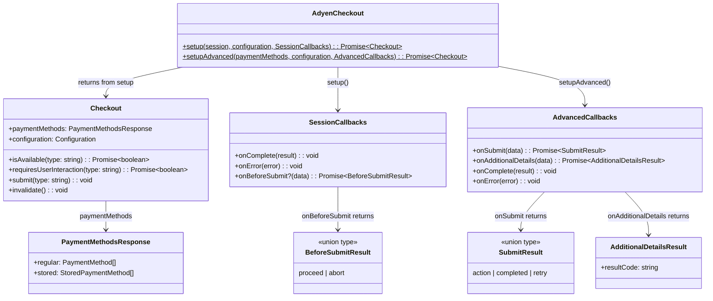
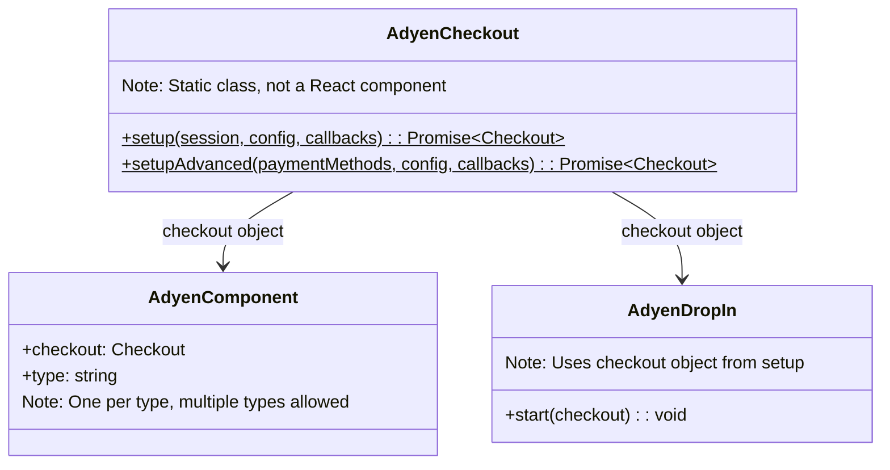
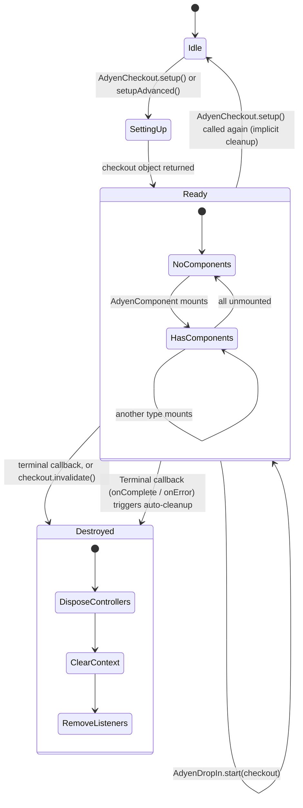
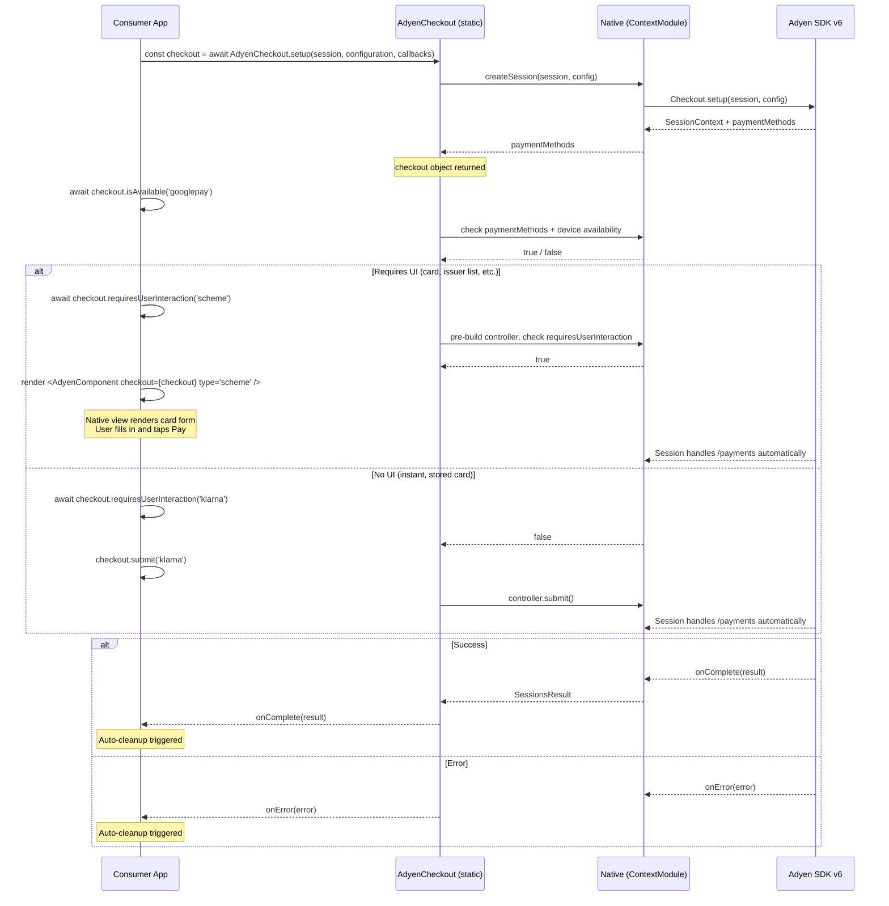
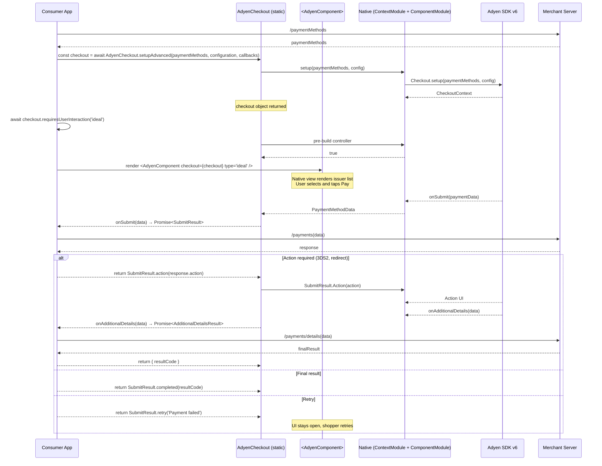
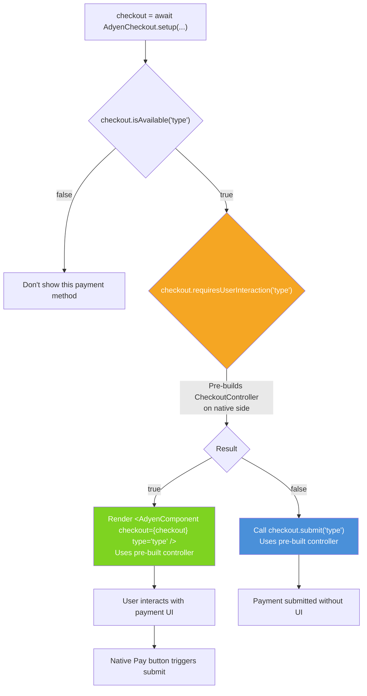

# React Native SDK v6 — Public API (Implemented)

> This document reflects the final implemented API of the v6 alpha, not the original proposal.

## Static API Surface



## Components & Lifecycle



## Checkout Lifecycle



**`<AdyenComponent>` mount/unmount behavior:**

| Event | What happens | checkoutState affected? |
|-------|-------------|--------------------------|
| `<AdyenComponent>` **mounts** | Builds its payment component from the shared checkout; registers natively so teardown can find it | No |
| `<AdyenComponent>` **unmounts** | Disposes its component | No |
| **Terminal callback** fires | Auto-cleanup: disposes every component, clears state, removes listeners | **Yes — full teardown** |
| `checkout.invalidate()` called | Same as above, for a flow the shopper abandoned | **Yes — full teardown** |

> **Lifecycle invariant:** `BaseModule.checkoutState` is managed by the `AdyenCheckout` static class.
> Terminal callbacks (`onComplete`, `onError`) trigger cleanup automatically, and
> `checkout.invalidate()` does the same for an abandoned flow. No checkout state survives cleanup.
>
> Calling `AdyenCheckout.setup()` or `setupAdvanced()` again clears the JS-side state; native
> replaces its own when it receives the new setup call.
>
> **`<AdyenComponent>` unmount** disposes only that view's payment component. It does not affect
> `checkoutState` or any other view — a view going away must not end the checkout, or a headless
> `submit()` afterwards would have no context to run in.

## Sessions Flow



## Advanced Flow



## Drop-In Flow

> **Drop-In** relies on the shared checkout context created by `AdyenCheckout.setup()` or
> `AdyenCheckout.setupAdvanced()`. It uses `BaseModule.checkoutContext` which is tied to
> the checkout object's lifecycle.

```mermaid
sequenceDiagram
    participant App as Consumer App
    participant AC as AdyenCheckout (static)
    participant DropIn as AdyenDropIn
    participant Native as Native DropInModule
    participant SDK as Adyen SDK v6

    Note over App: After AdyenCheckout.setup() or setupAdvanced()

    App->>DropIn: AdyenDropIn.start(checkout)
    DropIn->>Native: open(checkout.paymentMethods)
    Native->>Native: Uses BaseModule.checkoutContext
    Native->>SDK: Present Drop-In UI

    Note over SDK: Drop-In handles payment method<br/>selection and component rendering

    alt Sessions
        SDK-->>Native: Session handles everything
        Native-->>AC: onComplete / onError via registered callbacks
    else Advanced
        SDK-->>Native: onSubmit / onAdditionalDetails
        Native-->>AC: delegates to registered callbacks
    end

    Note over App: Auto-cleanup on terminal callbacks;<br/>checkout.invalidate() for an abandoned flow
```

## `requiresUserInteraction` + Controller Pre-build



## Multiple Components Example

```
Allowed — different types:

<AdyenComponent checkout={checkout} type="scheme" />      — Card form
<AdyenComponent checkout={checkout} type="applepay" />     — Apple Pay button
<AdyenComponent checkout={checkout} type="googlepay" />    — Google Pay button
<AdyenComponent checkout={checkout} type="ideal" />        — Issuer list

Not allowed — duplicate type:

<AdyenComponent checkout={checkout} type="scheme" />
<AdyenComponent checkout={checkout} type="scheme" />       — Error: duplicate
```

## Native Module Architecture

```
Native modules:
├── ContextModule (AdyenCheckout)        — lifecycle, callbacks, events, headless APIs
│   ├─ createSession(session, config)        (session flow setup)
│   ├─ setup(paymentMethods, config)         (advanced flow setup)
│   ├─ cleanup()
│   ├─ isAvailable(type)
│   ├─ requiresUserInteraction(type)
│   ├─ submit(type)
│   ├─ action(action) / completion(resultCode) / retry(message)
│   ├─ the only emitter — every event reaches JS through this module
│   └─ componentManagers: Map<type, ComponentManager>   (Android)
│
├── ComponentModule (AdyenComponent)     — registry of mounted views, native-only
│   └─ register(viewId) / unregister(viewId), disposed on cleanup
│
├── DropInModule (AdyenDropIn)           — modal Drop-In
│   ├─ open(paymentMethods) → uses BaseModule.checkoutContext
│   ├─ action / completion / retry
│   └─ getReturnURL()
│
├── AdyenAction                          — standalone action handling (kept)
└── AdyenCSE                             — encryption/validation (kept)
```

## Module Simplification

```
Before (v5):
├── AdyenDropIn          (open, action, completion, retry)
├── AdyenGooglePay       (isAvailable)                    — standalone module
├── AdyenApplePay        (isAvailable, provide* callbacks) — standalone module
├── AdyenInstant         (open, action, completion, retry) — standalone module
├── AdyenAction          (handle, hide)                    — standalone
├── AdyenCSE             (encrypt, validate)               — standalone
├── CardView             (native view, card only)
├── ApplePayButton       (native view)
├── GooglePayButton      (native view)
├── SetupModule          (createSession, setup)
├── EmbeddedComponentBusModule  (viewId routing)

After (v6 — implemented):
├── AdyenCheckout        (static class: setup, setupAdvanced)
│   └── Checkout         (paymentMethods, configuration, isAvailable, requiresUserInteraction, submit, invalidate)
├── <AdyenComponent>     (checkout, type — generic native view for ANY payment method)
├── AdyenDropIn          (start(checkout))
├── AdyenAction          (handle, hide — standalone escape hatch)
├── AdyenCSE             (encrypt, validate)
│
│ Native modules (internal):
├── ContextModule        (createSession, setup, cleanup, isAvailable, requiresUserInteraction, submit,
│                         action, completion, retry — and the only event emitter)
├── ComponentModule      (register / unregister — native-only registry, for teardown)
├── DropInModule         (open, action, completion, retry)
├── ActionModule         (action, hide)
└── AdyenCSEModule       (encrypt, validate)
```
